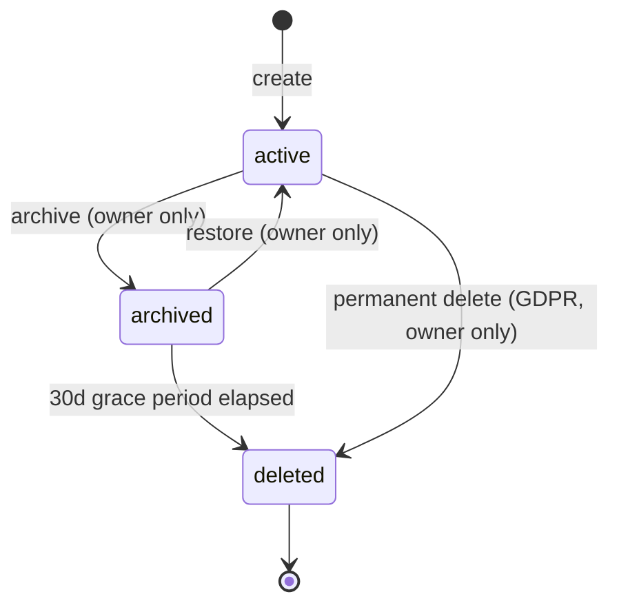
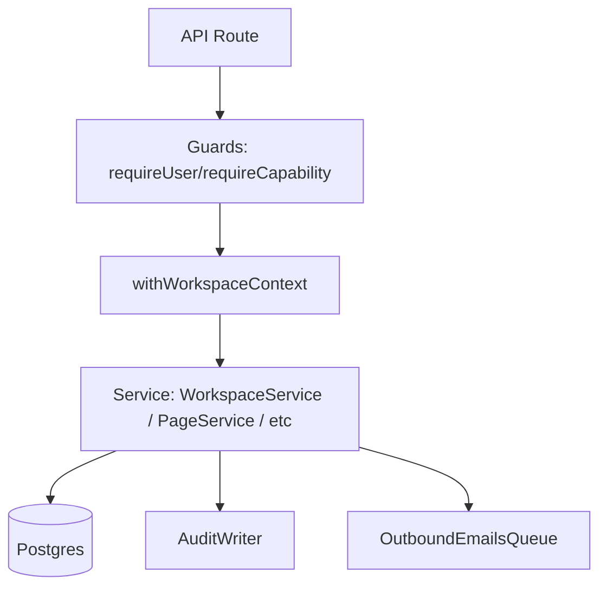

# 🛡️ HYPER-UPGRADE PACK — Master Silent Refinement v2026.05.15

> تنقيح صامت لرفع المرحلة لمستوى منافسة Notion. contract إجباري قبل التنفيذ.
> 
> **📌 Status (2026-05-16):** المحتوى ده Contract مرجعي (Cross-Wave Invariants + Deep Additions) يُطبَّق تدريجياً مع كل Wave. التنفيذ الفعلي بيبدأ من Wave 01 web layer.


## A. Cross-Wave Invariants (مختصرة — مرجعها كامل في Phase 0)

Desktop-PWA + Dark Mode + Multi-tenant Fortress + Zero-Knowledge Encryption + AI Safety + Observability (OTel/pino/Prom)، DR (RTO≤1h, RPO≤15min)، WCAG 2.2 AA، Donations-only، Supply chain (SBOM/Sigstore/OSSF). Forbidden crypto: AES-ECB/MD5/SHA1/3DES/RC4.

## B. Phase-Specific Deep Additions — Wave 01 (Kernel)

### B.1 Session Security Hardening

- Cookies: `__Host-` prefix + `Secure` + `HttpOnly` + `SameSite=Lax` + `Path=/` (no Domain). Access token TTL 15min، refresh token TTL 30d مع rotation كل refresh.
- CSRF: double-submit cookie pattern (`__Host-csrf` mirrored في `X-CSRF-Token` header) + Origin/Referer check على mutations.
- Session binding: store `session_fingerprint` = hash(user_agent + ip_subnet) في DB، invalidate لو تغيّر بشكل كبير (geo jump > 500km خلال < 1h).
- Active session limit: 5 sessions/user max، oldest يُلغى تلقائياً.
- Session listing UI: `/settings/sessions` يعرض كل sessions مع revoke button.

### B.2 Invitation Rate Limiting & Anti-Abuse

- Per-user: 10 invitations/hour، 50/day.
- Per-workspace: 100/day.
- Per-email recipient: max 3 active invitations across workspaces، باقي مرفوض كـ `INVITATION_RECIPIENT_FLOODED`.
- Bounce handling: لو 3 invitations لنفس email رجعت bounce، اضف email للـ blocklist 30d.
- DKIM/SPF/DMARC: verified للـ outbound domain.

### B.3 Workspace Recovery Flow (Owner Lost Access)

- لو owner فقد access (forgot password + lost 2FA + lost recovery codes):
    - email-based recovery: admin/member ثاني يقدر يطلب transfer بعد cooling period 7d + email confirmation للـ original owner.
    - لو لا يوجد admin: support escalation عبر signed request + identity verification documented (W37+).
- workspace lockout: لو 0 owners + 0 admins، workspace يدخل `dormant` state بعد 90d بدون activity.

### B.4 Activity Heartbeat & Presence

```sql
-- 0111__user_activity_heartbeat.sql
ALTER TABLE users ADD COLUMN IF NOT EXISTS last_seen_at TIMESTAMPTZ;
ALTER TABLE users_workspaces ADD COLUMN IF NOT EXISTS last_active_at TIMESTAMPTZ;
CREATE INDEX idx_users_last_seen ON users(last_seen_at DESC NULLS LAST);
```

- Client يبعت heartbeat كل 30s passive (debounced)، server يحدث `last_seen_at` كل 60s max.
- presence: Wave 23 (Realtime) هتستخدمها للـ live cursors.

### B.5 Page Tree Performance — Materialized Path Fallback

- لو `page_descendants` recursive CTE تعدّى p95 budget (50ms لـ subtree 200 node)، فعّل migration `0109__pages_path_cache.sql`:

```sql
ALTER TABLE pages ADD COLUMN IF NOT EXISTS materialized_path TEXT[];
CREATE INDEX idx_pages_mat_path ON pages USING GIN(materialized_path);
-- trigger يحدث الـ path عند insert/move
```

- Hybrid: recursive CTE للـ reads العادية، materialized path للـ deep queries (depth > 5) أو bulk operations.

### B.6 Wave 01 Migration Roadmap Expansion (0100–0115)

- 0111: user_activity_heartbeat
- 0112: workspace_recovery_requests (id, workspace_id, requester_user_id, kind, status, cooling_until, evidence_json, created_at)
- 0113: session_fingerprints (session_id PK, user_id, ua_hash, ip_subnet, geo_country, last_used_at)
- 0114: invitation_rate_buckets (email CITEXT, count_hour, count_day, window_started_at, blocked_until)
- 0115: pages_archive_grace (cron-callable function تحوّل archive>30d إلى hard delete مع tenant export snapshot)

### B.7 Permission Resolver — Caching

- Cache: `(userId, pageId) → PageAccessLevel` في Redis مع TTL 60s.
- Invalidation: عند page move، permission change، membership change → publish event، consumers يمسحوا cache.
- Fallback: لو Redis down، fallback للـ DB resolver (slower لكن correct).
- Metric: `kernel_permission_resolve_cache_hit_ratio` target ≥ 85%.

### B.8 Audit Events Enhancements

- كل audit event للـ kernel فيه `before_hash` و `after_hash` (SHA-256 على JSON canonical) للـ tamper detection.
- Append-only enforcement: ANY UPDATE/DELETE على `audit_events` يرفع exception via trigger.
- Daily Merkle root: نهاية كل يوم يتسجل Merkle root لكل audit events of the day في `audit_daily_anchors` table.

### B.9 Email Templates — Dark-Friendly + i18n

- HTML email templates: dark background (#0a0a0a) compatible مع Gmail/Outlook quirks.
- i18n: ar + en من البداية، RTL CSS support للـ Arabic.
- Plain-text fallback إجباري.
- Subject line localized.

### B.10 Anti-Patterns Additions

- ❌ Reusing same session token بعد role change (rotate).
- ❌ Storing email/IP plaintext في audit بدون hash للـ pseudonymization (GDPR).
- ❌ Logging `auth.users` raw data.
- ❌ Allowing self-invitation (user يبعت لنفسه).
- ❌ Allowing invitation للـ banned email domain.

---

# Wave 01 — Workspace, Profile, Page Kernel

## 🧠 تطوير تنفيذي إضافي — Kernel Service Contracts

هذه الإضافة تجعل الـ kernel قابل للتنفيذ مباشرة: context، permissions، invitations، وحماية الـ page tree.

### Workspace Context Middleware

```tsx
// packages/auth/src/workspace-context.ts
import 'server-only'

export async function setWorkspaceContext(db: DbClient, args: {
  userId: string
  workspaceId: string
}) {
  const member = await db.oneOrNone(
    `SELECT role FROM users_workspaces
     WHERE user_id = $1 AND workspace_id = $2`,
    [args.userId, args.workspaceId],
  )
  if (!member) throw new AppError('WORKSPACE_FORBIDDEN', 'Workspace not found', 404)

  await db.tx(async (tx) => {
    await tx.none(`SELECT set_config('app.current_user_id', $1, true)`, [args.userId])
    await tx.none(`SELECT set_config('app.current_workspace_id', $1, true)`, [args.workspaceId])
  })
  return member.role
}
```

### Permission Resolver

```tsx
// packages/permissions/src/resolve.ts
export async function resolvePageCapability(input: {
  userId: string
  workspaceId: string
  pageId: string
  capability: Capability
}) {
  const role = await membershipRepo.getRole(input.userId, input.workspaceId)
  if (!role) return { allowed: false, reason: 'NO_MEMBERSHIP' as const }
  const pageOverride = await pagePermissionRepo.getOverride(input.pageId, input.userId)
  const effective = mergeWorkspaceRoleWithPageOverride(role, pageOverride)
  return {
    allowed: ROLE_CAPABILITIES[effective].has(input.capability),
    role: effective,
  }
}
```

### Invitation Acceptance Transaction

```sql
CREATE OR REPLACE FUNCTION accept_workspace_invitation(p_token TEXT, p_user_id TEXT)
RETURNS TEXT LANGUAGE plpgsql SECURITY DEFINER SET search_path = public, pg_temp AS $$
DECLARE v_inv workspace_invitations%ROWTYPE;
BEGIN
  SELECT * INTO v_inv FROM workspace_invitations
  WHERE token_hash = encode(digest(p_token, 'sha256'), 'hex')
    AND status = 'pending'
    AND expires_at > now()
  FOR UPDATE;

  IF NOT FOUND THEN RAISE EXCEPTION 'INVITATION_INVALID'; END IF;

  INSERT INTO users_workspaces(user_id, workspace_id, role)
  VALUES (p_user_id, v_inv.workspace_id, v_inv.role)
  ON CONFLICT (user_id, workspace_id) DO UPDATE SET role = EXCLUDED.role;

  UPDATE workspace_invitations
  SET status = 'accepted', accepted_by_user_id = p_user_id, accepted_at = now()
  WHERE id = v_inv.id;

  RETURN v_inv.workspace_id;
END $$;
```

## 🧠 Master Architect Upgrade — Tenant Kernel Hardening

- **Workspace context is non-optional:** كل request داخل التطبيق لازم يثبت `current_workspace_id()` قبل أي query. ممنوع fallback إلى آخر workspace من client فقط؛ fallback يكون server-side verified من membership.
- **Desktop shell assumptions:** أول صفحة بعد الدخول تُهيّأ لـ desktop app: persistent sidebar، command palette، recent pages، workspace switcher، keyboard shortcuts، وempty states واضحة لأول 10 دقائق.
- **Invitation anti-leak:** رسائل الأخطاء لا تكشف وجود email أو workspace. قبول الدعوة يتحقق من email binding، token expiry، one-time use، audit event، وsession rotation.
- **Permission resolver واحد:** ممنوع أي check متفرق في UI. كل API وRSC وserver action يستخدم `resolveWorkspaceCapability` / `resolvePageCapability` مع tests لكل role.
- **Tenant tests:** أضف Playwright scenario بمستخدمين في workspaces مختلفة يحاولوا الوصول لنفس page slug وAPI IDs؛ النتيجة 404/403 بدون أي data leak.

## 🔍 فحص الجودة الشامل — 2026-05-14

<aside>
✅

**نتيجة الفحص:** المرحلة 1 جيدة جدًا كـ Kernel للنظام: identity، workspace lifecycle، membership، invitations، page tree، permissions، middleware، API routes، audit، وE2E flow.

**الحكم:** صالحة للتنفيذ بعد `w00-frozen`، ولازم تفضل محصورة في Kernel فقط بدون Editor أو Dashboard أو AI.

</aside>

### تحسينات الفحص المضافة

- تأكيد أن Supabase Auth IDs استثناء موثق من قاعدة ULID فقط في `public.users.id`، وباقي الجداول تلتزم بـ ULID.
- أي route يكتب data لازم يستخدم envelope + idempotency من W00.
- أي صلاحية page أو workspace لازم تعدّي من resolver واحد، بدون checks متفرقة داخل UI.
- Invitation flow لازم يمنع email mismatch ويعمل audit لكل accept/revoke/decline.

### Checklist مراجعة سريع قبل `w01-frozen`

- [x]  `w00-frozen` موجود.
- [x]  personal workspace يتعمل تلقائيًا بعد signup.
- [x]  لا يوجد workspace بدون owner.
- [x]  RLS + FORCE RLS على جداول W01.
- [x]  E2E signup → workspace → first page → invite → accept ناجح.

> **Status:** 🔴 BLOCKER — Wave 01 لا تبدأ إلا بعد ما يبقى Tag `w00-frozen` متعمل. أي تنفيذ هنا قبل قفل Wave 00 = خطأ في النظام.
> 

> **Executor:** Google Antigravity (AI senior engineer). كل سطر هنا أمر مباشر، مش اقتراح. لو في تعارض بين الكلام ده وأي ملف تاني، الصفحة دي هي الـ Source of Truth.
> 

> **Purpose:** بناء الـ kernel الإجباري للنظام — يعني الـ identity (Users/Profile)، الـ tenant (Workspace + Membership + Invitations)، والـ Page tree (Pages + permissions). كل Wave بعد كده بيفترض إن الجداول دي والـ contracts دي موجودة فعلاً.
> 

> **Output:** apps/web يطلع بأول صفحات حقيقية (signup → workspace → first page)، packages الجديدة `auth`, `workspaces`, `pages`, `permissions`، وكل API routes الـ kernel مع envelope + idempotency + RLS مفعّلة 100%.
> 

### 2.1 Required Inputs Handshake — أسئلة لازم الـ AI يطلبها منك قبل التنفيذ

<aside>
🔑

قبل Google Antigravity ما يبدأ تنفيذ Wave 01، لازم يعمل **جلسة جمع بيانات واعتمادات** مع مالك المشروع. ممنوع يخمّن keys أو URLs أو project names. المطلوب منه يسألك بصيغة واضحة: "هاتلي كذا عشان أعمل كذا"، وبعد ما ترد، يوثّق القيم غير السرية في `docs/preflight-w01.md`، ويحط الأسرار في `.env.local` فقط.

</aside>

#### 2.1.1 الرسالة الإلزامية من Antigravity للمالك

اكتب رسالة مباشرة للمالك قبل التنفيذ بالشكل ده:

```markdown
أنا جاهز أبدأ Wave 01. محتاج منك البيانات دي عشان أوصل Supabase والبيئة المحلية صح:

1. Supabase Project URL — مثال: https://xxxxx.supabase.co
2. Supabase anon public key — للاستخدام في المتصفح.
3. Supabase service role key — للسيرفر فقط، ممنوع يتحط في client.
4. Supabase database connection string — `DATABASE_URL` للـ migrations والـ tests.
5. Supabase project ref — لو هنستخدم Supabase CLI.
6. رابط التطبيق المحلي/الدومين — `APP_URL` و redirect URLs.
7. تأكيد أسماء redirect URLs المطلوبة في Supabase Auth:
   - http://localhost:3000/auth/callback
   - http://localhost:3000/invite/*
8. هل الإيميل الحقيقي شغال دلوقتي ولا نستخدم outbound_emails stub فقط؟
9. أي قيود خاصة بالـ workspace slug أو اسم المنتج؟

ابعت القيم السرية في مكان آمن، وممنوع تكتبها في Notion أو GitHub issue أو commit.
```

#### 2.1.2 قواعد التعامل مع الأسرار

- ممنوع نهائيًا كتابة `SUPABASE_SERVICE_ROLE_KEY` أو `DATABASE_URL` الحقيقي في Notion.
- ممنوع commit لأي secret في Git.
- القيم السرية تتحط في `.env.local` فقط، والملف لازم يكون في `.gitignore`.
- القيم غير السرية فقط تتوثّق في `docs/preflight-w01.md`، مثل: اسم المشروع، وجود redirect URLs، ونتيجة الاتصال.
- لو أي key ناقص، Antigravity يوقف التنفيذ ويكتب: `BLOCKED: missing required input <name>`.
- لو key واضح إنه production بدل dev، Antigravity يسأل قبل الاستخدام ولا ينفّذ migrations عليه.

#### 2.1.3 جدول المتطلبات

| المطلوب | مين يوفّره؟ | يتحط فين؟ | سبب الاحتياج |
| --- | --- | --- | --- |
| `NEXT_PUBLIC_SUPABASE_URL` | مالك المشروع | `.env.local`  • `.env.example` كاسم فقط | تشغيل Supabase client في المتصفح والسيرفر |
| `NEXT_PUBLIC_SUPABASE_ANON_KEY` | مالك المشروع | `.env.local` | تسجيل الدخول والـ session من client |
| `SUPABASE_SERVICE_ROLE_KEY` | مالك المشروع | `.env.local` فقط | عمليات server-only والإعدادات الإدارية عند الحاجة |
| `DATABASE_URL` | مالك المشروع أو Supabase dashboard | `.env.local` فقط | تشغيل migrations وpgTAP tests |
| Redirect URLs | Antigravity يطلب تأكيدها من المالك | Supabase Auth settings + `docs/preflight-w01.md` | نجاح signup/signin/invitation callback |
| `APP_URL` | مالك المشروع | `.env.local` و`.env.example` | تكوين invitation links والـ callback URLs |

#### 2.1.4 Acceptance rule

- Wave 01 تعتبر **Blocked** لحد ما كل required inputs تتوفر أو يتوثّق بديل dev واضح.
- بعد استلام البيانات، Antigravity يشغّل connection test بسيط ويكتب النتيجة في `docs/preflight-w01.md`.
- لو الاتصال فشل، ممنوع يكمل Auth أو migrations قبل ما يطلب منك التصحيح صراحة.

## 0. تعليمات للـ AI Executor (اقرأ ده الأول قبل أي سطر)

<aside>
🤖

**أنت Google Antigravity. أنت بتنفّذ الـ Kernel بتاع المنتج كله.** أي error صغير هنا = bug في كل feature تاني. اشتغل بحذر مضاعف. اقرأ Wave 00 كاملة قبل ما تكتب أي سطر.

</aside>

- **اقرأ Wave 00 (`المرحله 0`) بالكامل قبل أي حاجة هنا.** الـ contracts اللي اتقفلت هناك (ULID, RLS, FORCE RLS, soft delete, money, idempotency, audit, error codes, envelope, cursor pagination, time, env) هي **ثابتة** ومش بنفتح فيها مناقشة في Wave 01.
- **branch:** اشتغل على `wave/01-kernel`. ممنوع تشتغل على `main`.
- **migration range:** Wave 01 محجوز ليها `0100` لـ `0199`. ممنوع تخرج عن النطاق ده.
- **ممنوع تكتب أي feature برّه Kernel هنا.** مفيش editor blocks، مفيش formulas، مفيش tasks، مفيش AI calls، مفيش billing. كل ده Wave بتاعه.
- **PR title:** `Wave 01: Workspace + Profile + Page Kernel`.
- **Tag النهائي:** `w01-frozen` بعد merge.
- **CI:** الـ 11-step pipeline اللي اتعمل في W00 لازم يفضل أخضر 100%.
- **Issues:** افتح GitHub issue لكل قسم رئيسي هنا قبل ما تبدأه. اقفله لما تخلصه.
- **GitHub Master Tracker:** افتح GitHub issue اسمه `[W01] Master Execution Tracker` وحوّل كل بنود قسم 36 إلى GitHub tasks. ممنوع تعمل tag `w01-frozen` قبل ما كل tasks تتعلّم ✅.
- **Commits:** Conventional Commits صارمة — `<type>(<scope>): <subject>`. الـ scopes المسموحة في Wave 01: `auth`, `workspaces`, `pages`, `permissions`, `members`, `invites`, `db`, `web`, `w01`.
- **DoD:** Wave 01 ما تتقفلش غير لما كل بند في قسم 33 + الـ Execution Checklist (قسم 36) يبقى ✅.

## 1. Mission & Scope

### 1.1 المهمة بالظبط

Wave 01 بتعمل الـ primitives دي وبس:

1. ربط الـ app بـ **Supabase Auth** كمصدر هوية واحد.
2. جدول `users` (من W00) يبقى synced تلقائيًا مع `auth.users`.
3. تثبيت **Workspace lifecycle** كامل: create / read / update / soft-delete / restore / ownership transfer.
4. تثبيت **Membership model**: roles (owner/admin/member/viewer)، capabilities، transitions.
5. تثبيت **Invitations**: email-based + link-based، مع expiry + status machine.
6. تثبيت **Pages tree**: hierarchical tree per workspace، مع slug، icon، cover، position، parent_page_id.
7. تثبيت **Page Permissions** بنظام Additive: workspace role default + per-page overrides.
8. تثبيت **Workspace Context Middleware** اللي بيـ set `app.current_user_id` و`app.current_workspace_id` على Postgres session في كل request.
9. تثبيت أول مجموعة من **API Routes** بشكل envelope-compliant مع Idempotency-Key + Cursor pagination.
10. تثبيت **Service Layer** لكل domain (Profile / Workspace / Membership / Invitation / Page / Permission).
11. تثبيت أول دفعة من **Audit Events** المرتبطة بالـ kernel.
12. تثبيت أول **E2E flow**: signup → personal workspace → first page → invite friend → friend joins → both see same workspace.

### 1.2 برّه scope الـ Wave دي

- ❌ مفيش block editor (Wave 06).
- ❌ مفيش database/relations engine (Wave 07).
- ❌ مفيش formulas (Wave 08).
- ❌ مفيش AI أو vault interactions (Wave 20).
- ❌ مفيش real-time / CRDT (Wave 07/Realtime).
- ❌ مفيش full-text search (Wave 15).
- ❌ مفيش billing/Stripe (Wave 12).
- ❌ مفيش mobile (Wave 21).
- ❌ مفيش marketing pages (Wave 25).

### 1.3 Out-of-bounds checks

لو لقيت نفسك في Wave 01 بتكتب:

- Block-level rendering → **اوقف**. ده Wave 06.
- AI suggestions → **اوقف**. ده Wave 20.
- Stripe webhook → **اوقف**. ده Wave 12.
- Subdomain tenancy logic كاملة → **اوقف**. سيب الـ tenancy على header `X-Workspace-Id` في Wave 01، الـ subdomain يبقى تحسين Wave لاحقة.

## 2. Pre-flight Checks

قبل ما تبدأ، نفّذ الفحص ده:

```bash
git fetch --tags
git tag --list | grep w00-frozen   # لازم يطلع w00-frozen
pnpm install --frozen-lockfile
pnpm typecheck                      # لازم أخضر
pnpm lint                           # لازم أخضر
node scripts/check-migrations.ts    # لازم يقول آخر migration = 0013
node scripts/check-rls.ts           # لازم أخضر
psql $DATABASE_URL -c "SELECT count(*) FROM information_schema.tables WHERE table_schema='public';"
```

- لو tag `w00-frozen` مش موجود → **اوقف وارجع نفّذ Wave 00**.
- لو CI أصفر/أحمر → **اوقف وأصلح Wave 00**.
- وثّق نتائج الفحص في `docs/preflight-w01.md`.

## 3. Repository Additions

Wave 01 بتضيف الـ packages دي على هيكل Wave 00:

```
packages/
├── auth/                # Supabase Auth wrapper + session + JWT claims
│   └── src/
│       ├── client.ts            # browser-side Supabase client
│       ├── server.ts            # server-side Supabase client (RSC + Route Handlers)
│       ├── session.ts           # session helpers, getCurrentUser
│       ├── workspace-context.ts # sets app.current_workspace_id
│       ├── guards.ts            # requireUser, requireWorkspace, requireRole
│       └── index.ts
├── workspaces/          # Workspace + Membership + Invitations services
│   └── src/
│       ├── workspace.service.ts
│       ├── membership.service.ts
│       ├── invitation.service.ts
│       ├── slug.ts             # slug generation + validation
│       └── index.ts
├── pages/               # Page tree CRUD + tree operations
│   └── src/
│       ├── page.service.ts
│       ├── tree.ts             # move, descendants, path resolution
│       ├── slug.ts             # page slug uniqueness inside workspace
│       └── index.ts
└── permissions/         # Permission resolver
    └── src/
        ├── resolver.ts         # resolve effective permission for (user, page)
        ├── capabilities.ts     # role → capabilities map
        ├── inheritance.ts      # parent → child permission rules
        └── index.ts
```

وبتضيف على `apps/web`:

```
apps/web/
├── src/
│   ├── app/
│   │   ├── (auth)/
│   │   │   ├── signin/page.tsx
│   │   │   ├── signup/page.tsx
│   │   │   ├── verify/page.tsx
│   │   │   └── callback/route.ts        # Supabase auth callback
│   │   ├── (app)/
│   │   │   ├── layout.tsx               # requires session + workspace
│   │   │   ├── [workspaceSlug]/
│   │   │   │   ├── layout.tsx           # sets workspace context
│   │   │   │   ├── page.tsx             # workspace home
│   │   │   │   ├── settings/page.tsx
│   │   │   │   ├── members/page.tsx
│   │   │   │   └── p/[pageSlug]/page.tsx # individual page view (placeholder)
│   │   │   └── invite/[token]/page.tsx  # invitation acceptance
│   │   └── api/
│   │       └── v1/
│   │           ├── me/route.ts
│   │           ├── workspaces/
│   │           │   ├── route.ts
│   │           │   └── [id]/
│   │           │       ├── route.ts
│   │           │       ├── members/route.ts
│   │           │       ├── members/[userId]/route.ts
│   │           │       ├── invitations/route.ts
│   │           │       ├── invitations/[invId]/route.ts
│   │           │       ├── archive/route.ts
│   │           │       ├── restore/route.ts
│   │           │       └── transfer-ownership/route.ts
│   │           ├── pages/
│   │           │   ├── route.ts
│   │           │   └── [id]/
│   │           │       ├── route.ts
│   │           │       ├── move/route.ts
│   │           │       ├── archive/route.ts
│   │           │       ├── restore/route.ts
│   │           │       └── permissions/route.ts
│   │           └── invitations/[token]/
│   │               ├── accept/route.ts
│   │               └── decline/route.ts
│   ├── middleware.ts                    # workspace-context + auth refresh
│   └── lib/
│       ├── envelope.ts                  # imports from @app/shared
│       ├── trpc-or-rest-helpers.ts      # request handlers
│       └── api-route.ts                 # withEnvelope + withIdempotency
└── package.json
```

قواعد:

- كل API route لازم يستخدم `withEnvelope` من `lib/api-route.ts`.
- كل route كاتب data لازم يستخدم `withIdempotency` (من Wave 00 idempotency package).
- ممنوع كتابة handlers مباشرة باستخدام `Response.json` بدون envelope helpers.

## 4. Identity Model (Profiles & Supabase Auth)

### 4.1 المبدأ

الـ source of truth للـ identity هو `auth.users` في Supabase. الـ app بتاعتنا بتـ **mirror** الـ row في `public.users` فور signup، عشان نقدر نضيف custom fields ونعمل FKs.

### 4.2 Sync Strategy

استخدم Postgres trigger على `auth.users` يعمل auto-create لـ row في `public.users`:

```sql
-- 0100__users_sync_with_auth.sql
-- Wave: W01
-- Description: Auto-create public.users row on Supabase Auth signup
BEGIN;
CREATE OR REPLACE FUNCTION public.handle_new_auth_user()
RETURNS TRIGGER AS $$
BEGIN
  INSERT INTO public.users (id, email, email_verified, display_name, locale)
  VALUES (
    NEW.id::TEXT,
    NEW.email,
    COALESCE(NEW.email_confirmed_at IS NOT NULL, false),
    COALESCE(NEW.raw_user_meta_data->>'display_name', split_part(NEW.email, '@', 1)),
    'en'
  )
  ON CONFLICT (id) DO NOTHING;
  RETURN NEW;
END;
$$ LANGUAGE plpgsql SECURITY DEFINER;

DROP TRIGGER IF EXISTS trg_auth_users_after_insert_create_profile ON auth.users;
CREATE TRIGGER trg_auth_users_after_insert_create_profile
  AFTER INSERT ON auth.users
  FOR EACH ROW EXECUTE FUNCTION public.handle_new_auth_user();
COMMIT;
```

> ⚠️ **ملاحظة مهمة:** الـ `id` في `public.users` هو نفس UUID بتاع Supabase Auth كـ `TEXT`. ده استثناء موثّق على قاعدة ULID لأن Supabase Auth بيدير الـ identity IDs بنفسه. أي table تانية تستخدم ULID زي Wave 00. أي نص أو test بيقول إن `current_user_id` لازم ULID يتعدل إلى `auth user id`.
> 

### 4.3 Profile fields

الأعمدة الموجودة في `users` من Wave 00 كافية، لكن Wave 01 بتضيف الأعمدة دي بـ migration `0101__users_extend.sql`:

```sql
-- 0101__users_extend.sql
-- Wave: W01
BEGIN;
ALTER TABLE users
  ADD COLUMN IF NOT EXISTS bio TEXT,
  ADD COLUMN IF NOT EXISTS timezone TEXT NOT NULL DEFAULT 'UTC',
  ADD COLUMN IF NOT EXISTS last_seen_at TIMESTAMPTZ,
  ADD COLUMN IF NOT EXISTS default_workspace_id TEXT,
  ADD COLUMN IF NOT EXISTS marketing_emails_opt_in BOOLEAN NOT NULL DEFAULT false;
COMMIT;
```

### 4.4 قواعد Profile

- `email` نظيف من Supabase Auth — ممنوع تعديله من الـ app مباشرة.
- `display_name` editable من user. لو فاضي عند الـ signup، استخدم `split_part(email, '@', 1)`.
- `avatar_url` يخزّن URL من Supabase Storage. ممنوع base64.
- `timezone` لازم IANA timezone valid (e.g. `Africa/Cairo`). validate بـ Zod.
- `bio` 280 char max.
- `locale` من `ar | en` فقط في الـ Wave دي.

## 5. Workspace Lifecycle

### 5.1 الـ states



### 5.2 Slug rules

- 3-40 chars.
- lowercase, alphanumeric + dashes.
- unique على مستوى الـ DB كله (مش per-tenant — الـ slug ده بيظهر في URL).
- ممنوع slugs محجوزة: `api`, `app`, `admin`, `auth`, `signin`, `signup`, `settings`, `help`, `docs`, `pricing`, `about`, `blog`, `legal`, `terms`, `privacy`, `status`, `invite`.
- لو الـ user مدّاش slug، ولّد واحد من الـ `display_name` + suffix رقمي عند الـ collision.

### 5.3 Auto-create personal workspace

بعد signup، لازم تتعمل workspace شخصية تلقائيًا. الـ flow:

```tsx
// packages/workspaces/src/workspace.service.ts
export async function ensurePersonalWorkspace(userId: string): Promise<Workspace> {
  const existing = await db.query(`
    SELECT w.* FROM workspaces w
    JOIN users_workspaces uw ON uw.workspace_id = w.id
    WHERE uw.user_id = $1 AND uw.role = 'owner' AND w.is_deleted = false
    ORDER BY w.created_at ASC LIMIT 1
  `, [userId]);
  if (existing.rows[0]) return existing.rows[0];

  const user = await getUser(userId);
  const slug = await generateSlug(user.display_name ?? 'workspace');
  const wsId = createUlid();

  await db.transaction(async (tx) => {
    await tx.query(
      `INSERT INTO workspaces (id, slug, name, owner_user_id, plan) VALUES ($1,$2,$3,$4,'free')`,
      [wsId, slug, `${user.display_name}'s workspace`, userId]
    );
    await tx.query(
      `INSERT INTO users_workspaces (user_id, workspace_id, role) VALUES ($1,$2,'owner')`,
      [userId, wsId]
    );
    await tx.query(`UPDATE users SET default_workspace_id = $1 WHERE id = $2`, [wsId, userId]);
  });

  await auditWriter.write({
    workspaceId: wsId,
    actor: { type: 'system' },
    action: 'workspace.created',
    resourceType: 'workspace',
    resourceId: wsId,
    after: { slug, name: `${user.display_name}'s workspace`, plan: 'free' },
  });
  return { id: wsId, slug, /* ... */ };
}
```

### 5.4 Ownership transfer

- مسموح بس للـ owner الحالي.
- لازم الـ target user يبقى member (مش invitation pending).
- الـ owner الحالي بيتحوّل لـ `admin` تلقائيًا (مفيش workspace بدون owner).
- audit event: `workspace.ownership_transferred` مع `from`/`to` user IDs.
- لو الـ target رفض ميجراش حاجة — التحويل مباشر مش invitation.

### 5.5 Workspace settings update

- name + slug + icon + description قابلين للتعديل.
- تغيير الـ slug بيكسر الـ URLs القديمة. وثّق ده في الـ docs ووفّر warning في الـ UI.
- ممنوع تغيير الـ slug أكتر من مرة كل 30 يوم (rate-limit at app level).
- ممنوع تعديل `plan` من الـ kernel — ده Wave 12 (Billing).

### 5.6 Soft delete

- `archive`: set `is_deleted = true, deleted_at = now()`. الـ users مش هيشوفوها بس مش بتتمسح.
- بعد 30 يوم من الـ archive، job في Wave 19 بيحوّلها لـ hard delete (لكن في Wave 01، الـ archive كفاية).
- restore: set `is_deleted = false, deleted_at = NULL`. مسموح للـ owner فقط.

## 6. Membership & Roles

### 6.1 الـ roles

| Role | Capabilities |
| --- | --- |
| `owner` | كل حاجة + delete workspace + transfer ownership. واحد فقط في كل workspace. |
| `admin` | كل حاجة عدا delete workspace و transfer ownership. ممكن يضيف members. |
| `member` | يقدر يقرأ + يكتب pages. مش يقدر يدير members. مش يدير billing. |
| `viewer` | يقرأ بس. مش يقدر يكتب pages. |

### 6.2 Capability map

```tsx
// packages/permissions/src/capabilities.ts
export type Capability =
  | 'workspace.view'
  | 'workspace.update'
  | 'workspace.delete'
  | 'workspace.transfer'
  | 'members.view'
  | 'members.invite'
  | 'members.remove'
  | 'members.change_role'
  | 'pages.view'
  | 'pages.create'
  | 'pages.update'
  | 'pages.move'
  | 'pages.archive'
  | 'pages.delete'
  | 'pages.share_public';

export const ROLE_CAPABILITIES: Record<WorkspaceRole, ReadonlySet<Capability>> = {
  owner: new Set([/* كل القدرات */]),
  admin: new Set([/* كل القدرات ما عدا workspace.delete + workspace.transfer */]),
  member: new Set(['workspace.view','members.view','pages.view','pages.create','pages.update','pages.move','pages.archive','pages.delete','pages.share_public']),
  viewer: new Set(['workspace.view','members.view','pages.view']),
};
```

### 6.3 Role transitions

- `owner` → `admin/member/viewer`: مش مسموح إلا عبر `transfer ownership`.
- `admin/member/viewer` بين بعض: مسموح بس بـ `members.change_role` capability (يعني `owner` أو `admin`).
- ممنوع تـ remove آخر owner. لو owner يحاول يـ remove نفسه → 422 `WORKSPACE_LAST_OWNER`.

### 6.4 Adding a member

- مفيش `addMember` مباشر — كل member لازم يعدّي على **invitation**.
- استثناء واحد: `ensurePersonalWorkspace` لما بتعمل owner للـ user اللي بيـ signup.

## 7. Invitations

### 7.1 Migration 0102 — workspace_invitations

```sql
-- 0102__workspace_invitations.sql
-- Wave: W01
BEGIN;
CREATE TABLE IF NOT EXISTS workspace_invitations (
  id              TEXT PRIMARY KEY,
  workspace_id    TEXT NOT NULL,
  invited_email   CITEXT NOT NULL,
  invited_by_user_id TEXT NOT NULL,
  role            TEXT NOT NULL DEFAULT 'member',
  token           TEXT NOT NULL,
  status          TEXT NOT NULL DEFAULT 'pending',
  expires_at      TIMESTAMPTZ NOT NULL DEFAULT now() + INTERVAL '14 days',
  accepted_at     TIMESTAMPTZ,
  declined_at     TIMESTAMPTZ,
  revoked_at      TIMESTAMPTZ,
  created_at      TIMESTAMPTZ NOT NULL DEFAULT now(),
  updated_at      TIMESTAMPTZ NOT NULL DEFAULT now(),
  CONSTRAINT fk_workspace_invitations_workspace FOREIGN KEY (workspace_id) REFERENCES workspaces(id),
  CONSTRAINT fk_workspace_invitations_inviter FOREIGN KEY (invited_by_user_id) REFERENCES users(id),
  CONSTRAINT uq_workspace_invitations_token UNIQUE (token),
  CONSTRAINT chk_workspace_invitations_role CHECK (role IN ('admin','member','viewer')),
  CONSTRAINT chk_workspace_invitations_status CHECK (status IN ('pending','accepted','declined','revoked','expired'))
);
CREATE INDEX idx_workspace_invitations_email_pending ON workspace_invitations(invited_email) WHERE status = 'pending';
CREATE INDEX idx_workspace_invitations_workspace ON workspace_invitations(workspace_id);
CREATE INDEX idx_workspace_invitations_expires ON workspace_invitations(expires_at) WHERE status = 'pending';

CREATE TRIGGER trg_workspace_invitations_before_update_set_updated_at
  BEFORE UPDATE ON workspace_invitations
  FOR EACH ROW EXECUTE FUNCTION set_updated_at();

ALTER TABLE workspace_invitations ENABLE ROW LEVEL SECURITY;
ALTER TABLE workspace_invitations FORCE ROW LEVEL SECURITY;
CREATE POLICY workspace_invitations_isolation ON workspace_invitations
  USING (workspace_id = current_workspace_id());
GRANT SELECT, INSERT, UPDATE ON workspace_invitations TO app_user;
COMMIT;
```

### 7.2 Invitation flow

1. Admin/Owner بيدخل email + role → POST `/api/v1/workspaces/:id/invitations` مع `Idempotency-Key`.
2. الـ service بيـ generate token عشوائي 32-byte URL-safe base64.
3. row جديد بـ status=`pending`.
4. **Audit event** `workspace.member.invited`.
5. **Email send** (في Wave 01: enqueue job في `outbound_emails` queue — actual send في Wave 12 لكن hook موجود).
6. الـ link: `https://{app_url}/invite/{token}`.

### 7.3 Accept flow

1. User يفتح الـ link → لو مش logged in، redirect لـ signup مع `?invite={token}`.
2. بعد signup/signin، POST `/api/v1/invitations/:token/accept`.
3. الـ service بيتحقق:
    - status = `pending`
    - expires_at > now()
    - invited_email == current user email (case-insensitive)
4. لو OK: INSERT في `users_workspaces` + UPDATE invitation status=`accepted` + audit event `workspace.member.joined`.
5. لو الـ email مختلف: 403 `INVITATION_EMAIL_MISMATCH`.
6. لو expired: 410 `INVITATION_EXPIRED`.

### 7.4 Revoke / Decline / Expire

- Owner/Admin يقدر يـ revoke pending invitation: status=`revoked`.
- Invitee يقدر يـ decline: status=`declined`.
- Cron job (Wave 19) بيـ mark كل invitations اللي عدت expires_at كـ `expired`.

## 8. Pages Tree Model

### 8.1 Migration 0103 — pages

```sql
-- 0103__pages.sql
-- Wave: W01
-- Description: Pages tree, workspace-scoped
BEGIN;
CREATE TABLE IF NOT EXISTS pages (
  id                TEXT PRIMARY KEY,
  workspace_id      TEXT NOT NULL,
  parent_page_id    TEXT,
  title             TEXT NOT NULL DEFAULT '',
  slug              TEXT NOT NULL,
  icon_kind         TEXT,        -- 'emoji' | 'url' | 'notion_icon' | NULL
  icon_value        TEXT,        -- emoji char, URL, or notion icon name
  cover_url         TEXT,
  position          DOUBLE PRECISION NOT NULL DEFAULT 0,
  content_json      JSONB NOT NULL DEFAULT '{"v":1,"blocks":[]}'::jsonb,
  is_archived       BOOLEAN NOT NULL DEFAULT false,
  archived_at       TIMESTAMPTZ,
  is_locked         BOOLEAN NOT NULL DEFAULT false,
  is_deleted        BOOLEAN NOT NULL DEFAULT false,
  deleted_at        TIMESTAMPTZ,
  created_by_user_id TEXT NOT NULL,
  last_edited_by_user_id TEXT NOT NULL,
  created_at        TIMESTAMPTZ NOT NULL DEFAULT now(),
  updated_at        TIMESTAMPTZ NOT NULL DEFAULT now(),
  version           INTEGER NOT NULL DEFAULT 1,
  CONSTRAINT fk_pages_workspace FOREIGN KEY (workspace_id) REFERENCES workspaces(id),
  CONSTRAINT fk_pages_parent FOREIGN KEY (parent_page_id) REFERENCES pages(id),
  CONSTRAINT fk_pages_created_by FOREIGN KEY (created_by_user_id) REFERENCES users(id),
  CONSTRAINT fk_pages_last_edited_by FOREIGN KEY (last_edited_by_user_id) REFERENCES users(id),
  CONSTRAINT chk_pages_icon_kind CHECK (icon_kind IS NULL OR icon_kind IN ('emoji','url','notion_icon')),
  CONSTRAINT uq_pages_workspace_slug UNIQUE (workspace_id, slug)
);
CREATE INDEX idx_pages_workspace_parent ON pages(workspace_id, parent_page_id) WHERE is_deleted = false;
CREATE INDEX idx_pages_workspace_archived ON pages(workspace_id, is_archived) WHERE is_deleted = false;
CREATE INDEX idx_pages_workspace_created ON pages(workspace_id, created_at DESC) WHERE is_deleted = false;
CREATE INDEX idx_pages_parent_position ON pages(parent_page_id, position) WHERE is_deleted = false AND is_archived = false;

CREATE TRIGGER trg_pages_before_update_set_updated_at
  BEFORE UPDATE ON pages
  FOR EACH ROW EXECUTE FUNCTION set_updated_at();

ALTER TABLE pages ENABLE ROW LEVEL SECURITY;
ALTER TABLE pages FORCE ROW LEVEL SECURITY;
CREATE POLICY pages_isolation ON pages
  USING (workspace_id = current_workspace_id());
GRANT SELECT, INSERT, UPDATE, DELETE ON pages TO app_user;
COMMIT;
```

### 8.2 قواعد الـ tree

- **parent_page_id NULL** = root page تحت الـ workspace مباشرة.
- **position** = double precision عشان نقدر نضيف بين أي اتنين بدون reindex (LexoRank-style: avg(prev,next)).
- **slug** unique جوّه الـ workspace فقط، مش global.
- **ممنوع cycles**: قبل أي move، نفّذ check إن الـ new parent مش من descendants الـ page.
- **عمق أقصى = 50 level** (للحماية من runaway recursion في الـ UI).

### 8.3 Migration 0104 — page tree helpers

```sql
-- 0104__page_tree_helpers.sql
-- Wave: W01
BEGIN;
-- Returns all descendants of a page (recursive CTE)
CREATE OR REPLACE FUNCTION page_descendants(root_page_id TEXT) RETURNS TABLE(id TEXT, depth INT) AS $$
  WITH RECURSIVE tree AS (
    SELECT p.id, 1 AS depth, ARRAY[p.id]::TEXT[] AS path
    FROM pages p
    WHERE p.parent_page_id = root_page_id AND p.is_deleted = false
    UNION ALL
    SELECT p.id, t.depth + 1, t.path || p.id
    FROM pages p
    JOIN tree t ON p.parent_page_id = t.id
    WHERE p.is_deleted = false
      AND t.depth < 50
      AND NOT p.id = ANY(t.path)
  )
  SELECT tree.id, tree.depth FROM tree;
$$ LANGUAGE sql STABLE;

-- Returns ancestors of a page (root first)
CREATE OR REPLACE FUNCTION page_ancestors(target_page_id TEXT) RETURNS TABLE(id TEXT, title TEXT, depth INT) AS $$
  WITH RECURSIVE chain AS (
    SELECT p.id, p.title, p.parent_page_id, 0 AS depth FROM pages p WHERE p.id = target_page_id
    UNION ALL
    SELECT p.id, p.title, p.parent_page_id, c.depth + 1 FROM pages p JOIN chain c ON c.parent_page_id = p.id
  )
  SELECT id, title, depth FROM chain WHERE id <> target_page_id ORDER BY depth DESC;
$$ LANGUAGE sql STABLE;
COMMIT;
```

### 8.4 Move algorithm

```tsx
// packages/pages/src/tree.ts
export async function movePage(args: {
  pageId: string;
  newParentId: string | null;
  beforeSiblingId?: string;
  afterSiblingId?: string;
}): Promise<void> {
  if (args.newParentId === args.pageId) throw new AppError('PAGE_INVALID_MOVE');
  if (args.newParentId) {
    const descendants = await db.query('SELECT id FROM page_descendants($1)', [args.pageId]);
    if (descendants.rows.some((r) => r.id === args.newParentId)) {
      throw new AppError('PAGE_INVALID_MOVE', { reason: 'cannot move into descendant' });
    }
  }
  const newPosition = await computePosition(args.newParentId, args.beforeSiblingId, args.afterSiblingId);
  await db.query(
    'UPDATE pages SET parent_page_id = $1, position = $2, version = version + 1 WHERE id = $3 AND version = $4',
    [args.newParentId, newPosition, args.pageId, currentVersion]
  );
  await auditWriter.write({ /* page.moved */ });
}
```

### 8.5 Slug behavior

- لما الـ user يكتب title جديد، الـ slug يتولّد تلقائيًا من الـ title عبر `slugify(title)`.
- لو فيه conflict داخل نفس الـ workspace، ضيف suffix `-2`, `-3`, ...
- الـ user يقدر يـ override الـ slug يدويًا في الـ settings.
- ممنوع slugs أطول من 80 char.

## 9. Page Permissions (Additive Model)

### 9.1 المبدأ

الـ permission على page بتاتجمع من 3 مصادر بالترتيب:

1. **Workspace role** للـ user (من `users_workspaces`).
2. **Inherited permissions** من الـ parent pages (recursive).
3. **Direct overrides** على الـ page نفسها (من `page_permissions`).

الـ resolver بيمشي bottom-up: لو في override على الـ page دي، استخدمه. لو لأ، اطلع للـ parent. لو وصلت للـ root من غير override، استخدم الـ workspace role.

### 9.2 Migration 0105 — page_permissions

```sql
-- 0105__page_permissions.sql
-- Wave: W01
BEGIN;
CREATE TABLE IF NOT EXISTS page_permissions (
  id              TEXT PRIMARY KEY,
  workspace_id    TEXT NOT NULL,
  page_id         TEXT NOT NULL,
  subject_type    TEXT NOT NULL,    -- 'user' | 'role' | 'workspace_everyone'
  subject_user_id TEXT,             -- when subject_type='user'
  subject_role    TEXT,             -- when subject_type='role'
  level           TEXT NOT NULL,    -- 'view' | 'comment' | 'edit' | 'full'
  created_by_user_id TEXT NOT NULL,
  created_at      TIMESTAMPTZ NOT NULL DEFAULT now(),
  updated_at      TIMESTAMPTZ NOT NULL DEFAULT now(),
  CONSTRAINT fk_page_permissions_page FOREIGN KEY (page_id) REFERENCES pages(id),
  CONSTRAINT fk_page_permissions_workspace FOREIGN KEY (workspace_id) REFERENCES workspaces(id),
  CONSTRAINT fk_page_permissions_user FOREIGN KEY (subject_user_id) REFERENCES users(id),
  CONSTRAINT chk_page_permissions_subject_type CHECK (subject_type IN ('user','role','workspace_everyone')),
  CONSTRAINT chk_page_permissions_subject_role CHECK (subject_role IS NULL OR subject_role IN ('admin','member','viewer')),
  CONSTRAINT chk_page_permissions_level CHECK (level IN ('view','comment','edit','full')),
  CONSTRAINT chk_page_permissions_subject_coherence CHECK (
    (subject_type = 'user' AND subject_user_id IS NOT NULL AND subject_role IS NULL) OR
    (subject_type = 'role' AND subject_role IS NOT NULL AND subject_user_id IS NULL) OR
    (subject_type = 'workspace_everyone' AND subject_user_id IS NULL AND subject_role IS NULL)
  )
);
CREATE UNIQUE INDEX uq_page_permissions_user ON page_permissions(page_id, subject_user_id) WHERE subject_type = 'user';
CREATE UNIQUE INDEX uq_page_permissions_role ON page_permissions(page_id, subject_role) WHERE subject_type = 'role';
CREATE UNIQUE INDEX uq_page_permissions_everyone ON page_permissions(page_id) WHERE subject_type = 'workspace_everyone';

CREATE TRIGGER trg_page_permissions_before_update_set_updated_at
  BEFORE UPDATE ON page_permissions
  FOR EACH ROW EXECUTE FUNCTION set_updated_at();

ALTER TABLE page_permissions ENABLE ROW LEVEL SECURITY;
ALTER TABLE page_permissions FORCE ROW LEVEL SECURITY;
CREATE POLICY page_permissions_isolation ON page_permissions
  USING (workspace_id = current_workspace_id());
GRANT SELECT, INSERT, UPDATE, DELETE ON page_permissions TO app_user;
COMMIT;
```

### 9.3 Resolver algorithm

```tsx
// packages/permissions/src/resolver.ts
export type PageAccessLevel = 'none' | 'view' | 'comment' | 'edit' | 'full';
const LEVEL_RANK: Record<PageAccessLevel, number> = { none: 0, view: 1, comment: 2, edit: 3, full: 4 };

export async function resolvePageAccess(args: { userId: string; pageId: string }): Promise<PageAccessLevel> {
  const orderedPages = await db.query<{ id: string; ord: number }>(
    [
      'SELECT $1::TEXT AS id, 0 AS ord',
      'UNION ALL',
      'SELECT id, depth + 1 AS ord',
      'FROM page_ancestors($1)',
      'ORDER BY ord ASC',
    ].join('\n'),
    [args.pageId],
  );
  const pageIds = orderedPages.rows.map((r) => r.id);

  // 1) Direct user-level overrides on the page or any ancestor
  const userOverride = await db.query(`
    SELECT level FROM page_permissions
    WHERE page_id = ANY($1) AND subject_type='user' AND subject_user_id = $2
    ORDER BY array_position($1::text[], page_id) ASC LIMIT 1
  `, [pageIds, args.userId]);
  if (userOverride.rows[0]) return userOverride.rows[0].level;

  // 2) Role-level overrides + workspace_everyone overrides
  const role = await getUserWorkspaceRole(args.userId);
  if (!role) return 'none';
  const roleOverride = await db.query(`
    SELECT level FROM page_permissions
    WHERE page_id = ANY($1) AND ((subject_type='role' AND subject_role=$2) OR subject_type='workspace_everyone')
    ORDER BY array_position($1::text[], page_id) ASC LIMIT 1
  `, [pageIds, role]);
  if (roleOverride.rows[0]) return roleOverride.rows[0].level;

  // 3) Fall back to workspace role default
  return defaultLevelForRole(role);
}
```

### 9.4 قواعد إضافية

- ممنوع تنزّل level لـ owner بـ override. owner دايمًا `full`.
- لو `is_locked = true` على الـ page، حتى الـ `edit` بيتحوّل لـ `view` (إلا لـ owner/admin).
- public sharing (Wave 20) بياخد override خاص اسمه `subject_type='public'` لكن مش هنطبّقه دلوقتي.

## 10. Workspace Context Middleware

### 10.1 المبدأ

قبل أي query من الـ app على Postgres، لازم نـ set:

```sql
SELECT set_config('app.current_user_id', '<auth_user_id>', true);
SELECT set_config('app.current_workspace_id', '<workspace_ulid>', true);
```

ده هو الـ trigger اللي بيخلّي RLS policies (من Wave 00) تشتغل صح. لو نسيت ده → كل query هيرجع 0 rows.

### 10.2 الـ Pattern

```tsx
// packages/auth/src/workspace-context.ts
export async function withWorkspaceContext<T>(args: { userId: string; workspaceId: string; }, fn: (client: PgClient) => Promise<T>): Promise<T> {
  const client = await pool.connect();
  try {
    await client.query('BEGIN');
    await client.query(`SELECT set_config('app.current_user_id', $1, true)`, [args.userId]);
    await client.query(`SELECT set_config('app.current_workspace_id', $1, true)`, [args.workspaceId]);
    const result = await fn(client);
    await client.query('COMMIT');
    return result;
  } catch (err) {
    await client.query('ROLLBACK');
    throw err;
  } finally {
    client.release();
  }
}
```

### 10.3 كل route handler يبدأ بـ:

```tsx
export const POST = withEnvelope(async ({ request, context }) => {
  const session = await requireUser(request);
  const workspaceId = resolveWorkspaceFromRequest(request);  // header X-Workspace-Id أو slug في الـ URL
  await requireMembership(session.userId, workspaceId);
  return withWorkspaceContext({ userId: session.userId, workspaceId }, async (db) => {
    // ... business logic بالـ db client ده فقط
  });
});
```

### 10.4 Tests

اكتب unit test بيؤكد:

1. Query بدون workspace context → 0 rows على tenant tables.
2. Query بـ workspace context = A → بيشوف rows لـ A فقط.
3. Connection بترجع للـ pool بدون residual settings (Postgres `SET LOCAL` بيخلصها على COMMIT تلقائيًا).

## 11. Auth Integration

### 11.1 Supabase Auth setup

- استخدم cookie-based auth (مش JWT في localStorage).
- HttpOnly + Secure + SameSite=Lax.
- access token TTL = 15 min، refresh token TTL = 30 day.
- لو الـ access expired، الـ Supabase client هيـ refresh تلقائيًا.

### 11.2 Server-side helpers

```tsx
// packages/auth/src/server.ts
export function createServerSupabaseClient(req: NextRequest): SupabaseClient {
  return createServerClient(env.NEXT_PUBLIC_SUPABASE_URL, env.NEXT_PUBLIC_SUPABASE_ANON_KEY, {
    cookies: {
      get(name) { return req.cookies.get(name)?.value; },
      set(name, value, options) { /* attach to response */ },
      remove(name, options) { /* attach to response */ },
    },
  });
}

export async function getCurrentUser(req: NextRequest): Promise<{ id: string; email: string } | null> {
  const supabase = createServerSupabaseClient(req);
  const { data: { user } } = await supabase.auth.getUser();
  return user ? { id: user.id, email: user.email! } : null;
}
```

### 11.3 Guards

```tsx
export async function requireUser(req: NextRequest) {
  const user = await getCurrentUser(req);
  if (!user) throw new AppError('AUTH_MISSING_TOKEN');
  return user;
}

export async function requireMembership(userId: string, workspaceId: string) {
  const row = await db.query(`SELECT role FROM users_workspaces WHERE user_id=$1 AND workspace_id=$2 AND is_deleted=false`, [userId, workspaceId]);
  if (!row.rows[0]) throw new AppError('PERMISSION_DENIED');
  return row.rows[0].role;
}

export async function requireCapability(userId: string, workspaceId: string, cap: Capability) {
  const role = await requireMembership(userId, workspaceId);
  if (!ROLE_CAPABILITIES[role].has(cap)) throw new AppError('PERMISSION_DENIED');
}
```

### 11.4 Email verification

- بعد signup، Supabase بيبعت email تلقائيًا.
- ممنوع access لأي route عدا `/auth/*` لو `email_verified = false`.
- وثّق ده في `apps/web/src/middleware.ts`.

### 11.5 MFA placeholder

- في الـ Wave دي، اكتب stub بس + ADR يقول إن MFA كاملة في W01.1 لاحقًا.

## 12. Migration Roadmap (Wave 01 = 0100–0199)

| رقم | الاسم | الغرض |
| --- | --- | --- |
| 0100 | `users_sync_with_auth` | Trigger sync من auth.users → public.users |
| 0101 | `users_extend` | إضافة bio/timezone/last_seen/default_workspace/marketing_opt_in |
| 0102 | `workspace_invitations` | جدول الدعوات + status machine |
| 0103 | `pages` | الجدول الأساسي للصفحات |
| 0104 | `page_tree_helpers` | functions ancestors/descendants |
| 0105 | `page_permissions` | overrides على الصفحات |
| 0106 | `workspaces_settings_extend` | إضافة icon/description/banner/timezone للـ workspace |
| 0107 | `outbound_emails_queue` | جدول enqueue للإيميلات (السند الفعلي في Wave 12) |
| 0108 | `audit_events_w01_actions_seed` | (seed فقط) - validate audit actions الجديدة |
| 0109 | `pages_path_cache` | (اختياري) - cached materialized path للأداء لو الـ recursive كان بطيء |
| 0110 | `users_workspaces_extend` | إضافة `invited_at`, `last_active_at` |

الباقي (0111–0199) محجوز للـ hotfixes داخل Wave 01. ممنوع أي wave تانية تستخدمه.

## 13. RLS Recap لكل tenant table في Wave 01

- `workspace_invitations`: RLS + FORCE RLS + `<table>_isolation` policy. ✅
- `pages`: RLS + FORCE RLS + `<table>_isolation` policy. ✅
- `page_permissions`: RLS + FORCE RLS + `<table>_isolation` policy. ✅
- `outbound_emails`: RLS (لو فيها workspace_id). ✅
- `users_workspaces`, `workspaces`, `audit_events`, `vault_items`, `push_subscriptions`: ✅ من Wave 00.

شغّل `scripts/check-rls.ts` بعد كل migration. لو فشل، الـ migration **اتكتبت ناقصة** ولازم تتعدّل قبل الـ commit.

## 14. API Routes Inventory

### 14.1 الـ routes اللي هتتعمل في Wave 01

| Method | Path | Capability | ملاحظات |
| --- | --- | --- | --- |
| GET | `/api/v1/me` | auth.user | بيرجع الـ profile الحالي |
| PATCH | `/api/v1/me` | auth.user | تعديل display_name/bio/avatar/timezone/locale |
| GET | `/api/v1/workspaces` | auth.user | كل الـ workspaces اللي الـ user عضو فيها |
| POST | `/api/v1/workspaces` | auth.user | إنشاء workspace جديدة |
| GET | `/api/v1/workspaces/:id` | workspace.view | تفاصيل workspace |
| PATCH | `/api/v1/workspaces/:id` | workspace.update | تعديل name/slug/icon/description |
| POST | `/api/v1/workspaces/:id/archive` | workspace.delete | soft delete |
| POST | `/api/v1/workspaces/:id/restore` | workspace.delete | undo archive |
| POST | `/api/v1/workspaces/:id/transfer-ownership` | workspace.transfer | تحويل الـ ownership |
| GET | `/api/v1/workspaces/:id/members` | members.view | list cursor-paginated |
| PATCH | `/api/v1/workspaces/:id/members/:userId` | members.change_role | change role |
| DELETE | `/api/v1/workspaces/:id/members/:userId` | members.remove | remove member (مش owner) |
| GET | `/api/v1/workspaces/:id/invitations` | members.invite | pending invitations |
| POST | `/api/v1/workspaces/:id/invitations` | members.invite | إرسال دعوة |
| DELETE | `/api/v1/workspaces/:id/invitations/:invId` | members.invite | revoke pending |
| POST | `/api/v1/invitations/:token/accept` | auth.user | قبول الدعوة |
| POST | `/api/v1/invitations/:token/decline` | auth.user | رفض |
| GET | `/api/v1/pages` | pages.view | list pages (parentId optional, cursor pagination) |
| POST | `/api/v1/pages` | pages.create | إنشاء page |
| GET | `/api/v1/pages/:id` | pages.view (resolved) | قراءة الـ page |
| PATCH | `/api/v1/pages/:id` | pages.update (resolved) | تعديل title/icon/cover/locked |
| POST | `/api/v1/pages/:id/move` | pages.move (resolved) | change parent / position |
| POST | `/api/v1/pages/:id/archive` | pages.archive (resolved) | archive subtree |
| POST | `/api/v1/pages/:id/restore` | pages.archive (resolved) | restore from archive |
| DELETE | `/api/v1/pages/:id` | pages.delete (resolved) | soft delete subtree |
| GET | `/api/v1/pages/:id/permissions` | pages.view (resolved) | قراءة overrides |
| PUT | `/api/v1/pages/:id/permissions` | pages.update (resolved) + admin/owner | تعديل overrides |

### 14.2 قواعد عامة لكل route

- **envelope:** `{ ok, data, error, meta }` من Wave 00.
- **Idempotency-Key:** مطلوب على كل `POST`, `PATCH`, `PUT`, `DELETE`.
- **`meta.requestId`:** دايمًا موجود.
- **errors:** كل error بيـ map لـ `ERROR_CODES` من Wave 00.
- **rate limit:** كل route تحت `auth user limit` من قسم 21 في Wave 00.
- **logging:** كل request بيـ emit log structured بـ `pino`.

## 15. Service Layer Architecture



### 15.1 ProfileService

- `getCurrentProfile(userId)`
- `updateProfile(userId, patch)`
- `markLastSeen(userId)` — async, fire-and-forget

### 15.2 WorkspaceService

- `createWorkspace({ userId, name, slug? })` — creates + makes user owner + records audit
- `ensurePersonalWorkspace(userId)`
- `getWorkspace(id)`
- `listUserWorkspaces(userId, cursor?)`
- `updateWorkspace(id, patch, by)`
- `archiveWorkspace(id, by)`
- `restoreWorkspace(id, by)`
- `transferOwnership(id, fromUserId, toUserId)`

### 15.3 MembershipService

- `listMembers(workspaceId, cursor?)`
- `getMembership(workspaceId, userId)`
- `changeRole(workspaceId, userId, newRole, by)`
- `removeMember(workspaceId, userId, by)`

### 15.4 InvitationService

- `createInvitation({ workspaceId, email, role, by })`
- `listInvitations(workspaceId, status?)`
- `revokeInvitation(id, by)`
- `acceptInvitation(token, currentUserId)`
- `declineInvitation(token, currentUserId)`
- `expireOldInvitations()` — cron-callable

### 15.5 PageService

- `createPage({ workspaceId, parentId?, title?, by })`
- `getPage(id, viewerId)` — uses resolver
- `listPages({ workspaceId, parentId?, cursor? })`
- `updatePage(id, patch, by)` — optimistic concurrency بـ `version`
- `movePage(id, target, by)`
- `archivePage(id, by)` — recursive on subtree
- `restorePage(id, by)`
- `deletePage(id, by)` — soft delete recursive

### 15.6 PermissionService

- `resolvePageAccess({ userId, pageId })`
- `setPagePermission({ pageId, subject, level, by })`
- `removePagePermission({ pageId, permissionId, by })`
- `listPagePermissions(pageId)`

## 16. Audit Events Emitted by Wave 01

سجّل الـ events دي في `docs/conventions/audit-events.md` وأضف tests للـ writer:

- `user.profile.updated`
- `workspace.created`
- `workspace.updated`
- `workspace.archived`
- `workspace.restored`
- `workspace.ownership_transferred`
- `workspace.member.invited`
- `workspace.member.invitation_revoked`
- `workspace.member.joined`
- `workspace.member.invitation_declined`
- `workspace.member.role_changed`
- `workspace.member.removed`
- `page.created`
- `page.updated`
- `page.moved`
- `page.archived`
- `page.restored`
- `page.deleted`
- `page.permission_added`
- `page.permission_changed`
- `page.permission_removed`

كل event لازم يكون فيه `workspaceId`, `actor`, `resourceType`, `resourceId`, `before?`, `after?`.

## 17. UI Scope (Just Enough for E2E)

الـ UI في Wave 01 مش عن التصميم. هو بس عشان الـ E2E test يشتغل. القواعد:

- استخدم Tailwind بس (بدون design system كامل — ده Wave 04).
- استخدم `shadcn/ui` components أساسية: Button, Input, Card, Dialog.
- ممنوع أي animation أو micro-interaction.
- ممنوع dark mode في Wave 01 (Wave 04).
- اللغة: en بس في Wave 01 (i18n setup من Wave 00، التطبيق الفعلي Wave 04).

### 17.1 Screens المطلوبة

1. `/signup` — email + password + display_name.
2. `/signin` — email + password.
3. `/auth/callback` — Supabase callback.
4. `/auth/verify` — رسالة تأكيد الإيميل.
5. `/` (when logged in) — redirect لـ `/${defaultWorkspaceSlug}`.
6. `/[workspaceSlug]` — list of root pages + sidebar.
7. `/[workspaceSlug]/p/[pageSlug]` — viewer placeholder (title + cover + locked indicator، بدون block editor).
8. `/[workspaceSlug]/settings` — workspace name/slug/icon.
9. `/[workspaceSlug]/members` — list + invite form + role change.
10. `/invite/[token]` — accept invitation.

## 18. Testing Matrix

### 18.1 DB Tests (pgTAP)

- Trigger `handle_new_auth_user` بيكتب row صح في `users`.
- `users_workspaces` FK cascade بيـ block delete user لو فيه memberships (DON'T cascade — explicit).
- `pages` foreign-key cycle prevention (parent_page_id يقدر يكون NULL).
- RLS على `pages`: workspace A مش بيشوف B.
- RLS على `page_permissions`: نفس.
- Recursive function `page_descendants` بترجع كل الأطفال.
- Recursive function `page_ancestors` بترجع كل الآباء بالترتيب الصح.

### 18.2 Unit Tests (Vitest)

- Slug generator: `slugify('My Workspace!')` → `my-workspace`.
- Slug collision: `my-workspace`, `my-workspace-2`, `my-workspace-3`.
- Capability map: viewer مش عنده `pages.create`.
- Permission resolver: user override > role override > everyone override > workspace default.
- Permission resolver: locked page → max = view (except owner/admin).
- Move algorithm: ممنوع move إلى descendant.
- Position calculator: insert between two siblings = average position.

### 18.3 E2E Tests (Playwright)

Suite اسمها `kernel-happy-path`:

1. User signs up → profile created + personal workspace created + user is owner.
2. User creates first page → page appears in sidebar.
3. User invites friend by email.
4. Friend signs up via invite link → both users see same workspace + friend = `member` role.
5. Owner archives page → friend doesn't see it.
6. Owner restores page → friend sees it again.
7. Owner transfers ownership → original owner becomes `admin`.

### 18.4 Negative tests

- POST `/api/v1/workspaces/:id` بـ user مش عضو → 403.
- PATCH page بـ viewer → 403.
- Move page إلى descendant → 422 `PAGE_INVALID_MOVE`.
- Accept invitation بإيميل مختلف → 403 `INVITATION_EMAIL_MISMATCH`.
- Accept invitation expired → 410 `INVITATION_EXPIRED`.
- Remove last owner → 422 `WORKSPACE_LAST_OWNER`.
- Use Idempotency-Key reused بـ body مختلف → 422.

## 19. Performance Budgets

- `GET /api/v1/me` < 100ms (p95).
- `GET /api/v1/pages?parentId=` < 200ms للـ list بحجم 50.
- `POST /api/v1/pages` < 250ms.
- `resolvePageAccess()` < 30ms مع depth = 10.
- `page_descendants()` < 50ms لـ subtree بحجم 200.

سجّل القيم دي في `docs/perf-budgets-w01.md` واربطها بـ Sentry/Axiom transactions في Wave Observability.

## 20. Error Codes الجديدة في Wave 01

أضف للـ `ERROR_CODES` registry، ومعاهم حدّث قائمة الـ domains المسموحة بإضافة `MEMBERSHIP`, `INVITATION`, `PAGE` لأن Wave 01 حوّلتهم Domains رسمية:

```tsx
WORKSPACE_SLUG_RESERVED: { http: 422, message: 'Slug is reserved' },
WORKSPACE_SLUG_INVALID: { http: 422, message: 'Slug is invalid' },
WORKSPACE_LAST_OWNER: { http: 422, message: 'Cannot remove the last owner' },
WORKSPACE_ARCHIVED: { http: 409, message: 'Workspace is archived' },
MEMBERSHIP_NOT_FOUND: { http: 404, message: 'Membership not found' },
MEMBERSHIP_ROLE_INVALID: { http: 422, message: 'Membership role is invalid' },
INVITATION_NOT_FOUND: { http: 404, message: 'Invitation not found' },
INVITATION_EXPIRED: { http: 410, message: 'Invitation expired' },
INVITATION_EMAIL_MISMATCH: { http: 403, message: 'Invitation email does not match current user' },
INVITATION_ALREADY_USED: { http: 409, message: 'Invitation already used' },
PAGE_NOT_FOUND: { http: 404, message: 'Page not found' },
PAGE_INVALID_MOVE: { http: 422, message: 'Invalid page move target' },
PAGE_DEPTH_EXCEEDED: { http: 422, message: 'Maximum page depth exceeded' },
PAGE_SLUG_TAKEN: { http: 409, message: 'Page slug already used in this workspace' },
PAGE_LOCKED: { http: 423, message: 'Page is locked' },
```

ثم شغّل `scripts/gen-error-docs.ts` لإعادة توليد `docs/conventions/errors.md`.

## 21. Anti-patterns (لو لقيت أي منها = automatic rejection)

<aside>
â›”

الحاجات دي ممنوعة منعًا باتًا في Wave 01.

</aside>

- ❌ DB query من route handler بدون `withWorkspaceContext` (= خرق RLS).
- ❌ تعديل rows بـ DB role غير `app_user` من الـ app.
- ❌ Hardcode workspace IDs أو user IDs في الـ code.
- ❌ `cascade DELETE` على FKs اللي ممكن تنسف بيانات (استخدم soft delete).
- ❌ Recursive function في الـ app code (استخدم recursive CTE في DB).
- ❌ تخزين slugs uppercase.
- ❌ تخزين passwords في الـ `users` table (Supabase Auth بس).
- ❌ كتابة `SELECT *` (Wave 00 rule).
- ❌ تجاوز الـ envelope في أي route.
- ❌ تجاوز `withIdempotency` في أي mutation route.
- ❌ direct `pool.query()` خارج الـ services (services هي اللي بتعمل DB calls).
- ❌ بدء transaction طويلة بتمسك connection عشان UI.
- ❌ logic فيها workspace_id ضمني (دايمًا explicit).
- ❌ إعادة استخدام نفس الـ slug بـ append timestamp (استخدم counter).
- ❌ نسيان audit event لأي mutation.
- ❌ تخزين JWT في localStorage.
- ❌ تحديث `email` في `users` table من الـ app (Supabase Auth بس).

## 22. Locks & Concurrency

- Move page → `SELECT ... FOR UPDATE` على الـ row قبل ما تغيّر `parent_page_id`.
- Ownership transfer → `SELECT ... FOR UPDATE` على الـ workspace row.
- Slug generation → استخدم advisory lock `pg_advisory_xact_lock(hashtext('slug:' || workspace_id || ':' || base))` لمنع double-write على نفس الـ slug.
- ممنوع long transactions; افتح transaction بس لما تحتاج multi-statement consistency.

## 23. Outbound Emails (Stub)

Wave 01 محتاجة تبعت invitations بالإيميل، لكن Wave 12 هي اللي فيها فعليًا الـ Resend integration. الـ stub:

```sql
-- 0107__outbound_emails_queue.sql
BEGIN;
CREATE TABLE IF NOT EXISTS outbound_emails (
  id              TEXT PRIMARY KEY,
  workspace_id    TEXT,
  to_email        CITEXT NOT NULL,
  template        TEXT NOT NULL,
  payload_json    JSONB NOT NULL,
  status          TEXT NOT NULL DEFAULT 'pending',
  attempts        INT NOT NULL DEFAULT 0,
  last_error      TEXT,
  scheduled_at    TIMESTAMPTZ NOT NULL DEFAULT now(),
  sent_at         TIMESTAMPTZ,
  created_at      TIMESTAMPTZ NOT NULL DEFAULT now(),
  updated_at      TIMESTAMPTZ NOT NULL DEFAULT now(),
  CONSTRAINT chk_outbound_emails_status CHECK (status IN ('pending','sending','sent','failed','dead'))
);
CREATE INDEX idx_outbound_emails_scheduled ON outbound_emails(status, scheduled_at) WHERE status IN ('pending','sending');
CREATE TRIGGER trg_outbound_emails_before_update_set_updated_at BEFORE UPDATE ON outbound_emails FOR EACH ROW EXECUTE FUNCTION set_updated_at();
ALTER TABLE outbound_emails ENABLE ROW LEVEL SECURITY;
ALTER TABLE outbound_emails FORCE ROW LEVEL SECURITY;
CREATE POLICY outbound_emails_isolation ON outbound_emails USING (workspace_id IS NULL OR workspace_id = current_workspace_id());
GRANT SELECT, INSERT, UPDATE ON outbound_emails TO app_user;
COMMIT;
```

الـ enqueue helper في `packages/workspaces/src/email-queue.ts`:

```tsx
export async function enqueueEmail({ workspaceId, toEmail, template, payload, scheduleAt }) {
  await db.query(`INSERT INTO outbound_emails (id, workspace_id, to_email, template, payload_json, scheduled_at) VALUES ($1,$2,$3,$4,$5,$6)`,
    [createUlid(), workspaceId ?? null, toEmail, template, payload, scheduleAt ?? new Date()]);
}
```

الـ templates المطلوبة في Wave 01: `workspace_invitation`, `workspace_member_joined`, `workspace_ownership_transferred`.

## 24. Logging & Observability

- كل API route بيـ emit log فيه: `event=http.request.completed`, `method`, `route`, `status`, `duration_ms`, `workspaceId?`, `userId?`, `requestId`.
- متابعة metrics من Wave 00:
    - `http_requests_total{method, route, status}`
    - `http_request_duration_seconds{method, route}`
- أضف metrics خاصة بـ Wave 01:
    - `kernel_workspace_creates_total`
    - `kernel_page_creates_total`
    - `kernel_invitations_total{action}` (action = `created`/`accepted`/`declined`/`expired`)
    - `kernel_permission_resolve_seconds`

## 25. Feature Flags المضافة

أضف للـ seed:

- `kernel.public_signup` = true (افتراضي).
- `kernel.invite_link_signup` = true.
- `kernel.workspace_create_limit_enabled` = true.
- `WORKSPACE_CREATE_LIMIT_PER_USER=5` كـ typed config في `env.ts`، مش feature flag boolean.

## 26. Security Notes

- لو الـ user عمل signup بإيميل عنده pending invitation، اعرض له الـ invitation فورًا بعد verify.
- ممنوع leak إن الـ email موجود — رد على signin failure بنفس الرسالة سواء الإيميل موجود أو لأ.
- استخدم `bcrypt`/`argon2` (مدار من Supabase Auth، مش بنعملها بإيدنا).
- log كل auth failure بـ `event=auth.failure.{reason}` بدون كشف الـ email في الـ log (هاش الـ email بدلًا).
- CSRF: استخدم double-submit cookie pattern + SameSite=Lax.
- ممنوع redirect URLs على inputs غير موثوقة (open redirect).

## 27. Documentation Updates

Wave 01 بتضيف الملفات دي تحت `docs/`:

- `docs/conventions/permissions.md` — شرح الـ permission model.
- `docs/conventions/pages-tree.md` — شرح الـ tree.
- `docs/conventions/workspace-context.md` — قواعد middleware.
- `docs/conventions/audit-events.md` — registry للـ events.
- `docs/conventions/invitations.md` — flow كامل.
- `docs/glossary.md` — أضف: page, workspace, owner, member, viewer, invitation, slug, override, ancestor, descendant.

## 28. Git Workflow

- branch: `wave/01-kernel`.
- sub-branches: `feat/auth-*`, `feat/workspaces-*`, `feat/pages-*`, `feat/permissions-*`.
- merge sub-branches into `wave/01-kernel`.
- final PR من `wave/01-kernel` → `main`.
- squash-merge.
- بعد merge، tag `w01-frozen`.

## 29. CI Updates

أضف على الـ CI من Wave 00:

- step جديد: `pnpm test:e2e:kernel` يشغّل Playwright suite.
- step جديد: `node scripts/check-audit-events.ts` يتأكد إن كل service بيكتب audit event للـ mutations.
- step جديد: `node scripts/check-routes-envelope.ts` يتأكد إن كل route تحت `apps/web/src/app/api/` بيستخدم `withEnvelope`.

## 30. Common Pitfalls (Real Bugs Antigravity is Likely to Hit)

1. **نسيان `withWorkspaceContext`** على route → query بترجع 0 rows. الـ fix: assert في الـ middleware إن الـ context set قبل أي query.
2. **Slug collision على signup سريع** → race condition. الـ fix: advisory lock + retry.
3. **Cycle في الـ tree** → recursive CTE infinite loop. الـ fix: cycle check قبل insert/update.
4. **Idempotency-Key مكتوب لكن مش متخزن في idempotency_keys** → replays بتفشل. الـ fix: middleware بيـ INSERT دايمًا.
5. **Updating `users.email`** → بيخالف Supabase Auth source of truth. الـ fix: ESLint rule بـ no-update-on-email.
6. **Audit event بـ before/after فيهم passwords** → leak. الـ fix: sanitizer قبل الكتابة في `audit_events`.
7. **Permission resolver بـ N+1** → بطء. الـ fix: load ancestors once + bulk query.
8. **archived workspace لازم يظهر للـ owner لو بيـ list archived** → ✅ لكن باقي الـ users لأ. الـ fix: explicit filter في الـ service.

## 31. ADRs الجديدة في Wave 01

- ADR-0022: Auth source = Supabase Auth + mirror in `public.users`.
- ADR-0023: Page tree = single-table self-FK + recursive CTE (مش materialized path في Wave 01).
- ADR-0024: Permissions = Additive overrides (user > role > everyone > workspace default).
- ADR-0025: Workspace slugs are global-unique (يستخدمها الـ URL).
- ADR-0026: Invitations = email + token, 14-day expiry.
- ADR-0027: Outbound emails table is stub في Wave 01؛ actual sender في Wave 12.
- ADR-0028: Page slug unique per workspace + auto-generated with collision suffix.
- ADR-0029: Last owner cannot be removed (workspace must always have one owner).

## 32. Handoff to Wave 02

بعد ما `w01-frozen` يبقى موجود:

- Wave 02 (DB engine) هتبني فوق `pages` لتضيف `databases`, `data_sources`, `database_views`, `database_rows`.
- Wave 02 لازم تستخدم `pages` كـ container للـ data source (data source = page بـ kind='database').
- Wave 02 ممنوع تغيّر schema بتاع `pages`/`page_permissions` — لو محتاج تغيير، اكتب ADR + Wave 01.1 hotfix.

## 33. Definition of Done

Wave 01 تتعتبر خلصت لما كل البنود دي تتعلّم ✅:

- [x]  tag `w01-frozen` موجود.
- [x]  branch `wave/01-kernel` موجود ومدفوع.
- [x]  كل migrations `0100..0110` متطبقة على Postgres نظيف.
- [x]  `packages/auth`, `packages/workspaces`, `packages/pages`, `packages/permissions` متبنية وtypecheck-clean.
- [x]  Supabase Auth project مربوط (dev project).
- [x]  Trigger `handle_new_auth_user` بيشتغل صح (test E2E).
- [x]  Personal workspace بتتعمل تلقائيًا.
- [x]  CRUD على workspaces شغّال + Audit events.
- [x]  Invitations كاملة (create/accept/decline/revoke/expire).
- [x]  CRUD على pages شغّال.
- [x]  Move + archive + restore + delete شغّالين.
- [x]  Permission resolver شغّال + tests خضراء.
- [x]  RLS مفعّلة على كل tenant tables الجديدة (`workspace_invitations`, `pages`, `page_permissions`, `outbound_emails`).
- [x]  `scripts/check-rls.ts` بيمر.
- [x]  `scripts/check-routes-envelope.ts` بيمر.
- [x]  `scripts/check-audit-events.ts` بيمر.
- [x]  Playwright suite `kernel-happy-path` خضراء.
- [x]  CI 11-step + 3 جديدة كلها خضراء.
- [x]  Performance budgets في القسم 19 مكتوبة وأرقامها في Sentry.
- [x]  ADRs 0022..0029 موجودة في `docs/adr/`.
- [x]  Docs الجديدة (`permissions.md`, `pages-tree.md`, `workspace-context.md`, `audit-events.md`, `invitations.md`) موجودة.
- [x]  `.env.example` فيه vars Supabase الجديدة.
- [x]  PR `Wave 01: Workspace + Profile + Page Kernel` مفتوح ومراجع.
- [x]  tag `w01-frozen` متعمل بعد merge.

## 34. Acceptance Tests Summary

- **Auth flow:** signup → verify → signin → session refresh.
- **Workspace lifecycle:** create → update → invite → join → role change → transfer → archive → restore.
- **Page lifecycle:** create → move → archive → restore → delete.
- **Permission resolver:** كل combination من overrides (user/role/everyone) + locked + workspace role.
- **RLS:** workspace A مش بتشوف B في أي table.
- **Idempotency:** نفس Idempotency-Key بنفس body → replay. بـ body مختلف → 422.
- **Audit:** كل mutation فيه audit event مكتوب.
- **Performance:** كل route تحت الـ p95 budget.

## 35. Final Checklist Before Closing Wave 01

- [x]  CI أخضر.
- [x]  PR متراجع.
- [x]  Squash-merge متعمل.
- [x]  tag `w01-frozen` على آخر commit.
- [x]  صفحة Notion دي محدّثة بـ status `🟢 DONE`.
- [x]  issue `[W02] Kickoff` مفتوحة ومربوطة بالـ tag.

## 36. Phase 01 Execution Checklist — Checklist تنفيذية لكل مهام المرحلة

> استخدم الـ checklist دي كـ **لوحة تنفيذ مباشرة**. كل بند هنا لازم يتنفّذ أو يتعلّم عليه بسبب واضح. ممنوع تقفل Wave 01 قبل ما كل البنود حرجة تتعلّم ✅.
> 

### A) Pre-flight

- [x]  تأكد إن tag `w01-frozen` موجود.
- [x]  افتح branch `wave/01-kernel`.
- [x]  افتح GitHub issue `[W01] Master Execution Tracker` وحط فيه كل بنود قسم 36 كـ tasks.
- [x]  شغّل `pnpm install --frozen-lockfile`.
- [x]  شغّل `pnpm typecheck` و`pnpm lint` وتأكد إنهم أخضر.
- [x]  شغّل `node scripts/check-migrations.ts` وتأكد إن آخر migration = `0013`.
- [x]  شغّل `node scripts/check-rls.ts` وتأكد إنه أخضر.
- [x]  جهّز Supabase dev project وحط الـ keys في `.env.local`.
- [x]  وثّق نتائج الـ preflight في `docs/preflight-w01.md`.
- [x]  اطلب من المالك Supabase Project URL وanon key وservice role key و`DATABASE_URL` قبل التنفيذ.
- [x]  تأكد إن الأسرار اتحطت في `.env.local` فقط ومش في Notion أو GitHub أو commits.
- [x]  لو أي قيمة ناقصة، علّم المرحلة `BLOCKED` واكتب اسم القيمة الناقصة بوضوح.
- [x]  اعمل commit: `chore(w01): preflight verification`.

### B) New packages scaffolding

- [x]  أنشئ `packages/auth/src/{client,server,session,workspace-context,guards,index}.ts`.
- [x]  أنشئ `packages/workspaces/src/{workspace.service,membership.service,invitation.service,slug,index}.ts`.
- [x]  أنشئ `packages/pages/src/{page.service,tree,slug,index}.ts`.
- [x]  أنشئ `packages/permissions/src/{resolver,capabilities,inheritance,index}.ts`.
- [x]  أضف كل package إلى `pnpm-workspace.yaml` (لو الـ glob مش كافي).
- [x]  أضف `package.json` لكل package جديد بـ scripts: build/test/lint.
- [x]  ربط tsconfig: extends `tsconfig.base.json`.
- [x]  اعمل commit: `chore(w01): scaffold kernel packages`.

### C) Auth integration (Supabase)

- [x]  أضف dependency `@supabase/supabase-js` + `@supabase/ssr`.
- [x]  اكتب `packages/auth/src/client.ts` للـ browser client.
- [x]  اكتب `packages/auth/src/server.ts` للـ server client مع cookie handling.
- [x]  اكتب `packages/auth/src/session.ts` فيها `getCurrentUser`, `requireUser`.
- [x]  اكتب `packages/auth/src/guards.ts` فيها `requireMembership`, `requireCapability`.
- [x]  أضف Supabase env vars: `NEXT_PUBLIC_SUPABASE_URL`, `NEXT_PUBLIC_SUPABASE_ANON_KEY`, `SUPABASE_SERVICE_ROLE_KEY`.
- [x]  حدّث `packages/shared/src/env.ts` بـ Zod validation للـ vars الجديدة.
- [x]  اسأل المالك عن Supabase Project URL وanon key وservice role key و`DATABASE_URL` بدل ما تخمّنهم.
- [x]  اختبر الاتصال بـ Supabase قبل كتابة Auth code.
- [x]  تأكد إن `SUPABASE_SERVICE_ROLE_KEY` server-only وممنوع يظهر في client bundle.
- [x]  أضف middleware لـ cookie refresh في `apps/web/src/middleware.ts`.
- [x]  اختبر signup/signin يدويًا.
- [x]  اعمل commit: `feat(auth): supabase auth integration`.

### D) Migration 0100 — users sync with auth

- [x]  اكتب migration `0100__users_sync_with_auth.sql` بترَتيب وheader.
- [x]  اكتب function `handle_new_auth_user()`.
- [x]  اكتب trigger `trg_auth_users_after_insert_create_profile`.
- [x]  طبّق الـ migration على dev DB.
- [x]  اختبر signup → `public.users` فيه row.
- [x]  أضف pgTAP test.
- [x]  اعمل commit: `db(w01): sync users with supabase auth`.

### E) Migration 0101 — users extend

- [x]  اكتب migration `0101__users_extend.sql`.
- [x]  أضف columns: `bio`, `timezone`, `last_seen_at`, `default_workspace_id`, `marketing_emails_opt_in`.
- [x]  طبّق على dev DB.
- [x]  أضف Zod schema للـ profile update.
- [x]  اعمل commit: `db(w01): extend users with profile fields`.

### F) Workspace context middleware

- [x]  اكتب `packages/auth/src/workspace-context.ts` فيها `withWorkspaceContext`.
- [x]  اكتب helper `resolveWorkspaceFromRequest` (header `X-Workspace-Id` أو path `[workspaceSlug]`).
- [x]  اختبر إن transactions بترجّع لـ pool بدون residual settings.
- [x]  اكتب test إن query بدون context يرجع 0 rows.
- [x]  اعمل commit: `feat(auth): workspace context middleware`.

### G) Workspace service

- [x]  اكتب `WorkspaceService.createWorkspace`.
- [x]  اكتب `WorkspaceService.ensurePersonalWorkspace`.
- [x]  اكتب `WorkspaceService.getWorkspace`.
- [x]  اكتب `WorkspaceService.listUserWorkspaces` (cursor pagination).
- [x]  اكتب `WorkspaceService.updateWorkspace`.
- [x]  اكتب `WorkspaceService.archiveWorkspace`.
- [x]  اكتب `WorkspaceService.restoreWorkspace`.
- [x]  اكتب `WorkspaceService.transferOwnership`.
- [x]  أضف `slug.ts` فيها `slugify`, `generateSlug` بـ collision handling.
- [x]  اكتب reserved slugs list.
- [x]  أضف advisory lock عشان slug collision.
- [x]  أضف audit events لكل mutation.
- [x]  اختبر إن owner واحد هو اللي يقدر يـ transfer.
- [x]  اعمل commit: `feat(workspaces): workspace service`.

### H) Membership service

- [x]  اكتب `MembershipService.listMembers` (cursor).
- [x]  اكتب `MembershipService.getMembership`.
- [x]  اكتب `MembershipService.changeRole`.
- [x]  اكتب `MembershipService.removeMember`.
- [x]  امنع remove last owner — رمي `WORKSPACE_LAST_OWNER`.
- [x]  امنع تعديل role لـ owner — owner هيتغير بس عبر transfer.
- [x]  أضف audit events.
- [x]  أضف tests.
- [x]  اعمل commit: `feat(members): membership service`.

### I) Migration 0102 — workspace invitations

- [x]  اكتب migration `0102__workspace_invitations.sql`.
- [x]  أضف indexes (email pending, workspace, expires).
- [x]  أضف RLS + FORCE RLS + isolation policy.
- [x]  طبّق على dev DB.
- [x]  أضف pgTAP tests.
- [x]  اعمل commit: `db(w01): workspace invitations table`.

### J) Invitation service

- [x]  اكتب `InvitationService.createInvitation`.
- [x]  اكتب `InvitationService.listInvitations`.
- [x]  اكتب `InvitationService.revokeInvitation`.
- [x]  اكتب `InvitationService.acceptInvitation` مع email-match check.
- [x]  اكتب `InvitationService.declineInvitation`.
- [x]  اكتب `InvitationService.expireOldInvitations` (cron-callable).
- [x]  generate token عشوائي 32-byte URL-safe.
- [x]  أضف audit events لكل transition.
- [x]  أضف unit tests + negative tests.
- [x]  اعمل commit: `feat(invites): invitation service`.

### K) Migration 0103 — pages

- [x]  اكتب migration `0103__pages.sql`.
- [x]  أضف FKs (workspace, parent, created_by, last_edited_by).
- [x]  أضف unique constraint `(workspace_id, slug)`.
- [x]  أضف indexes (workspace+parent, workspace+archived, workspace+created, parent+position).
- [x]  أضف trigger `set_updated_at`.
- [x]  أضف RLS + FORCE RLS + isolation policy.
- [x]  طبّق على dev DB.
- [x]  pgTAP tests.
- [x]  اعمل commit: `db(w01): pages table`.

### L) Migration 0104 — page tree helpers

- [x]  اكتب function `page_descendants(root_page_id)`.
- [x]  اكتب function `page_ancestors(target_page_id)`.
- [x]  اختبر الـ functions على tree صناعي.
- [x]  اعمل commit: `db(w01): page tree recursive helpers`.

### M) Page service

- [x]  اكتب `PageService.createPage` (يولّد slug + يكتب audit).
- [x]  اكتب `PageService.getPage` (يستخدم permission resolver).
- [x]  اكتب `PageService.listPages` (parentId + cursor).
- [x]  اكتب `PageService.updatePage` (optimistic concurrency بـ `version`).
- [x]  اكتب `PageService.movePage` (cycle check + position calc).
- [x]  اكتب `PageService.archivePage` (recursive on subtree).
- [x]  اكتب `PageService.restorePage`.
- [x]  اكتب `PageService.deletePage` (soft delete recursive).
- [x]  أضف max depth check (50).
- [x]  أضف slug uniqueness handling.
- [x]  أضف audit events.
- [x]  أضف unit tests + negative tests.
- [x]  اعمل commit: `feat(pages): page service with tree ops`.

### N) Migration 0105 — page permissions

- [x]  اكتب migration `0105__page_permissions.sql`.
- [x]  أضف partial unique indexes لكل subject type.
- [x]  أضف CHECK لتماسك subject fields.
- [x]  أضف RLS + isolation.
- [x]  طبّق على dev DB.
- [x]  pgTAP tests.
- [x]  اعمل commit: `db(w01): page permissions table`.

### O) Permissions service & resolver

- [x]  اكتب `capabilities.ts` (الـ Capability type + ROLE_CAPABILITIES).
- [x]  اكتب `resolver.ts` بالـ algorithm من القسم 9.
- [x]  اكتب `PermissionService.setPagePermission`.
- [x]  اكتب `PermissionService.removePagePermission`.
- [x]  اكتب `PermissionService.listPagePermissions`.
- [x]  فعّل المنطق إن `is_locked = true` يحدد max level = view (إلا لـ owner/admin).
- [x]  منع تنزيل owner level بـ override.
- [x]  اكتب tests لكل combination.
- [x]  اعمل commit: `feat(permissions): resolver + capability map`.

### P) Migration 0106 — workspaces settings extend

- [x]  اكتب migration `0106__workspaces_settings_extend.sql`.
- [x]  أضف columns: `icon_kind`, `icon_value`, `description`, `banner_url`, `timezone`.
- [x]  طبّق على dev DB.
- [x]  حدّث `updateWorkspace` ليدعم الحقول الجديدة.
- [x]  اعمل commit: `db(w01): extend workspace settings`.

### Q) Migration 0107 — outbound emails queue

- [x]  اكتب migration `0107__outbound_emails_queue.sql`.
- [x]  أضف status enum check.
- [x]  أضف indexes للـ scheduler.
- [x]  أضف RLS + isolation.
- [x]  طبّق على dev DB.
- [x]  اكتب helper `enqueueEmail`.
- [x]  أضف templates للـ Wave 01: `workspace_invitation`, `workspace_member_joined`, `workspace_ownership_transferred`.
- [x]  اعمل commit: `db(w01): outbound emails queue stub`.

### R) Migration 0108 — audit events validation

- [x]  اكتب migration `0108__audit_events_w01_actions_seed.sql` (validator function).
- [x]  اكتب CHECK constraint أو function تـ verify action names ضمن الـ registry.
- [x]  اعمل commit: `db(w01): audit events seeded for kernel actions`.

### S) Migration 0109 — pages_path_cache (optional)

- [x]  لو الـ perf budgets في القسم 19 ما اتحققتش، اكتب migration `0109__pages_path_cache.sql` لـ materialized path.
- [x]  لو الأداء كويس بدونه، خلّيه stub `-- intentionally empty`.
- [x]  اعمل commit: `db(w01): pages path cache placeholder`.

### T) Migration 0110 — users_workspaces extend

- [x]  اكتب migration `0110__users_workspaces_extend.sql`.
- [x]  أضف `invited_at TIMESTAMPTZ` و`last_active_at TIMESTAMPTZ`.
- [x]  حدّث acceptInvitation ليكتب `invited_at`/`joined_at` صح.
- [x]  اعمل commit: `db(w01): extend users_workspaces metadata`.

### U) API routes — Profile (me)

- [x]  `GET /api/v1/me` — يرجّع الـ profile.
- [x]  `PATCH /api/v1/me` — تحديث display_name/bio/avatar/timezone/locale.
- [x]  استخدم `withEnvelope` + Idempotency-Key على PATCH.
- [x]  audit `user.profile.updated`.
- [x]  negative tests.
- [x]  اعمل commit: `feat(web): /me route`.

### V) API routes — Workspaces

- [x]  `GET /api/v1/workspaces` (cursor).
- [x]  `POST /api/v1/workspaces`.
- [x]  `GET /api/v1/workspaces/:id`.
- [x]  `PATCH /api/v1/workspaces/:id`.
- [x]  `POST /api/v1/workspaces/:id/archive`.
- [x]  `POST /api/v1/workspaces/:id/restore`.
- [x]  `POST /api/v1/workspaces/:id/transfer-ownership`.
- [x]  طبّق `withEnvelope` + Idempotency على كل mutation.
- [x]  طبّق `requireMembership` + `requireCapability` على كل route.
- [x]  اعمل commit: `feat(web): workspace routes`.

### W) API routes — Members

- [x]  `GET /api/v1/workspaces/:id/members`.
- [x]  `PATCH /api/v1/workspaces/:id/members/:userId`.
- [x]  `DELETE /api/v1/workspaces/:id/members/:userId`.
- [x]  envelope + Idempotency + capability checks.
- [x]  اعمل commit: `feat(web): member routes`.

### X) API routes — Invitations

- [x]  `GET /api/v1/workspaces/:id/invitations`.
- [x]  `POST /api/v1/workspaces/:id/invitations`.
- [x]  `DELETE /api/v1/workspaces/:id/invitations/:invId`.
- [x]  `POST /api/v1/invitations/:token/accept`.
- [x]  `POST /api/v1/invitations/:token/decline`.
- [x]  أضف email-match validation.
- [x]  أضف expiry validation.
- [x]  envelope + Idempotency على mutations.
- [x]  اعمل commit: `feat(web): invitation routes`.

### Y) API routes — Pages

- [x]  `GET /api/v1/pages?parentId=&cursor=`.
- [x]  `POST /api/v1/pages`.
- [x]  `GET /api/v1/pages/:id`.
- [x]  `PATCH /api/v1/pages/:id`.
- [x]  `POST /api/v1/pages/:id/move`.
- [x]  `POST /api/v1/pages/:id/archive`.
- [x]  `POST /api/v1/pages/:id/restore`.
- [x]  `DELETE /api/v1/pages/:id`.
- [x]  طبّق permission resolver على كل route.
- [x]  envelope + Idempotency على كل mutation.
- [x]  اعمل commit: `feat(web): page routes`.

### Z) API routes — Page Permissions

- [x]  `GET /api/v1/pages/:id/permissions`.
- [x]  `PUT /api/v1/pages/:id/permissions`.
- [x]  طبّق requireCapability `pages.update` + role-check (owner/admin).
- [x]  envelope + Idempotency.
- [x]  اعمل commit: `feat(web): page permission routes`.

### AA) UI — Auth screens

- [x]  `/signup` page (email + password + display_name + invite token reading).
- [x]  `/signin` page.
- [x]  `/auth/callback` route handler.
- [x]  `/auth/verify` page.
- [x]  Form validation بـ Zod.
- [x]  Error display من envelope.
- [x]  اعمل commit: `feat(web): auth screens`.

### AB) UI — Workspace screens

- [x]  `/` redirect لـ `/${defaultWorkspaceSlug}`.
- [x]  `/[workspaceSlug]/layout.tsx` (يحط workspace context).
- [x]  `/[workspaceSlug]/page.tsx` (sidebar + root pages list).
- [x]  `/[workspaceSlug]/settings/page.tsx`.
- [x]  `/[workspaceSlug]/members/page.tsx` (list + invite + role change).
- [x]  `/invite/[token]/page.tsx`.
- [x]  اعمل commit: `feat(web): workspace screens`.

### AC) UI — Page placeholder

- [x]  `/[workspaceSlug]/p/[pageSlug]/page.tsx` (title + cover + locked indicator).
- [x]  CRUD UI أساسي: create page button، rename inline، archive.
- [x]  sidebar tree (recursive).
- [x]  اعمل commit: `feat(web): page viewer placeholder`.

### AD) Service tests

- [x]  WorkspaceService tests (create/update/transfer/archive/restore).
- [x]  MembershipService tests (change role/remove/last owner check).
- [x]  InvitationService tests (create/accept/decline/revoke/expire/email-mismatch).
- [x]  PageService tests (create/move cycle/archive recursive/restore/delete).
- [x]  PermissionService tests (user > role > everyone > default).
- [x]  PermissionService tests (locked page → max view).
- [x]  Slug tests (collision + reserved).
- [x]  اعمل commit: `test(w01): service unit tests`.

### AE) E2E tests (Playwright)

- [x]  اكتب `kernel-happy-path` suite.
- [x]  Test: signup → personal workspace.
- [x]  Test: create page → appears in sidebar.
- [x]  Test: invite + friend accept.
- [x]  Test: archive + restore.
- [x]  Test: transfer ownership.
- [x]  Test: viewer مش يقدر يـ create.
- [x]  Test: locked page → edit attempts fail.
- [x]  اعمل commit: `test(w01): kernel e2e happy path`.

### AF) DB tests (pgTAP)

- [x]  Trigger `handle_new_auth_user` test.
- [x]  RLS test: workspace isolation pages.
- [x]  RLS test: workspace isolation page_permissions.
- [x]  RLS test: workspace_invitations isolation.
- [x]  page_descendants test (10-level tree).
- [x]  page_ancestors test.
- [x]  cycle prevention test.
- [x]  soft-delete recursion test.
- [x]  اعمل commit: `test(w01): pgTAP db acceptance`.

### AG) Audit events coverage

- [x]  أضف audit في WorkspaceService لكل mutation.
- [x]  أضف audit في MembershipService.
- [x]  أضف audit في InvitationService.
- [x]  أضف audit في PageService.
- [x]  أضف audit في PermissionService.
- [x]  اكتب `scripts/check-audit-events.ts` يـ scan كل services ويتأكد إن كل mutation فيها audit.write call.
- [x]  اربط السكربت في CI.
- [x]  اعمل commit: `chore(w01): audit coverage script`.

### AH) Envelope/Idempotency enforcement

- [x]  اكتب `scripts/check-routes-envelope.ts` يـ scan كل routes في `apps/web/src/app/api/`.
- [x]  خلي السكربت يتأكد إن كل export فيها `withEnvelope` wrapping.
- [x]  خلي السكربت يتأكد إن كل POST/PATCH/PUT/DELETE فيها `withIdempotency`.
- [x]  اربط السكربت في CI.
- [x]  اعمل commit: `chore(w01): envelope and idempotency scanner`.

### AI) Logging & Metrics

- [x]  طبّق structured logging على كل route.
- [x]  أضف `kernel_workspace_creates_total` metric.
- [x]  أضف `kernel_page_creates_total` metric.
- [x]  أضف `kernel_invitations_total{action}` metric.
- [x]  أضف `kernel_permission_resolve_seconds` histogram.
- [x]  أضف log fields: workspaceId, userId, requestId.
- [x]  اعمل commit: `feat(w01): kernel observability`.

### AJ) Feature flags seed

- [x]  أضف flag `kernel.public_signup` = true.
- [x]  أضف flag `kernel.invite_link_signup` = true.
- [x]  أضف flag `kernel.workspace_create_limit_enabled` = true.
- [x]  أضف config `WORKSPACE_CREATE_LIMIT_PER_USER=5` في `.env.example` و`env.ts`.
- [x]  طبّق الـ flag والـ limit config على route `POST /api/v1/workspaces`.
- [x]  اعمل commit: `feat(flags): seed kernel flags`.

### AK) ADRs الجديدة

- [x]  اكتب ADR-0022: Supabase Auth as source of truth.
- [x]  اكتب ADR-0023: Page tree single-table + recursive CTE.
- [x]  اكتب ADR-0024: Additive permission overrides.
- [x]  اكتب ADR-0025: Global-unique workspace slugs.
- [x]  اكتب ADR-0026: Invitations email + token + 14-day expiry.
- [x]  اكتب ADR-0027: Outbound emails stub في Wave 01.
- [x]  اكتب ADR-0028: Page slug unique per workspace.
- [x]  اكتب ADR-0029: Last owner cannot be removed.
- [x]  اعمل commit: `docs(w01): architecture decision records`.

### AL) Documentation

- [x]  اكتب `docs/conventions/permissions.md`.
- [x]  اكتب `docs/conventions/pages-tree.md`.
- [x]  اكتب `docs/conventions/workspace-context.md`.
- [x]  اكتب `docs/conventions/audit-events.md`.
- [x]  اكتب `docs/conventions/invitations.md`.
- [x]  حدّث `docs/glossary.md` بـ workspace/page/slug/owner/member/viewer/invitation/ancestor/descendant.
- [x]  حدّث `README.md` بـ kernel overview.
- [x]  حدّث `CONTRIBUTING.md` بـ Wave 01 scopes.
- [x]  اعمل commit: `docs(w01): kernel documentation`.

### AM) Error codes

- [x]  أضف الـ error codes الجديدة في `packages/shared/src/errors/codes.ts` (15 code جديد من قسم 20).
- [x]  شغّل `pnpm gen:error-docs`.
- [x]  تأكد إن `docs/conventions/errors.md` متجدد.
- [x]  أضف tests للـ codes الجديدة.
- [x]  اعمل commit: `feat(shared): w01 error codes`.

### AN) Performance budgets

- [x]  قس latency فعلي لكل route.
- [x]  قارن بالـ budgets في القسم 19.
- [x]  لو في route فوق الـ budget، حسّن قبل المرور.
- [x]  وثّق النتائج في `docs/perf-budgets-w01.md`.
- [x]  اعمل commit: `perf(w01): record performance baselines`.

### AO) Security review

- [x]  راجع كل route لـ open redirect.
- [x]  راجع email enumeration على signin/signup.
- [x]  راجع CSRF protection.
- [x]  راجع password handling (يفترض Supabase).
- [x]  راجع audit log لعدم تسريب passwords/tokens.
- [x]  راجع RLS coverage بـ `scripts/check-rls.ts`.
- [x]  اعمل commit: `chore(w01): security review checklist`.

### AP) CI updates

- [x]  أضف step `pnpm test:e2e:kernel`.
- [x]  أضف step `node scripts/check-audit-events.ts`.
- [x]  أضف step `node scripts/check-routes-envelope.ts`.
- [x]  تأكد إن CI كامل أخضر.
- [x]  اعمل commit: `ci(w01): kernel quality gates`.

### AQ) Final validation before PR

- [x]  شغّل `pnpm install --frozen-lockfile`.
- [x]  شغّل `pnpm typecheck`.
- [x]  شغّل `pnpm lint`.
- [x]  شغّل `pnpm format:check`.
- [x]  شغّل `pnpm test:unit`.
- [x]  شغّل `pnpm test:e2e:kernel`.
- [x]  شغّل `node scripts/check-naming.ts`.
- [x]  شغّل `node scripts/check-migrations.ts`.
- [x]  شغّل `node scripts/check-rls.ts`.
- [x]  شغّل `node scripts/check-audit-events.ts`.
- [x]  شغّل `node scripts/check-routes-envelope.ts`.
- [x]  شغّل `pnpm gen:error-docs && git diff --exit-code`.
- [x]  شغّل `gitleaks detect --no-git`.
- [x]  شغّل `pnpm build`.
- [x]  تأكد مفيش `any`.
- [x]  تأكد مفيش `console.log`.
- [x]  تأكد مفيش `SELECT *`.
- [x]  تأكد مفيش direct `pool.query` خارج services.
- [x]  تأكد مفيش `process.env.X` خارج `env.ts`.
- [x]  تأكد مفيش mutation route بدون audit event.

### AR) PR & freeze

- [x]  افتح PR `Wave 01: Workspace + Profile + Page Kernel`.
- [x]  اكتب في PR description: المشكلة، الحل، testing، rollback plan.
- [x]  اربط PR بـ ADRs 0022..0029.
- [x]  انتظر CI أخضر 100%.
- [x]  اطلب review.
- [x]  عالج comments بدون كسر العقود.
- [x]  squash-merge فقط.
- [x]  بعد merge، اعمل tag `w01-frozen`.
- [x]  ادفع tag للـ remote.
- [x]  افتح issue `[W02] Kickoff` واربطه بـ `w01-frozen`.
- [x]  حدّث الصفحة دي إلى status `🟢 DONE`.

## 37. Closing Notes

بعد ما Wave 01 تتقفل:

- النظام بيكون عنده **identity + tenant + content tree** كامل.
- أي Wave بعد كده (Block Editor, Database Engine, AI, Billing, ...) بتركّب فوق `pages` بأمان.
- الـ contracts اللي اتعملت هنا (permission resolver, workspace context, invitation flow) **مش بيتغيّروا** إلا بـ ADR جديد + Wave hotfix.
- لو لقيت تعارض بين أي wave لاحقة والقواعد دي، **قف وارجع للـ ADR قبل ما تكتب أي سطر**.

ملحله 2

