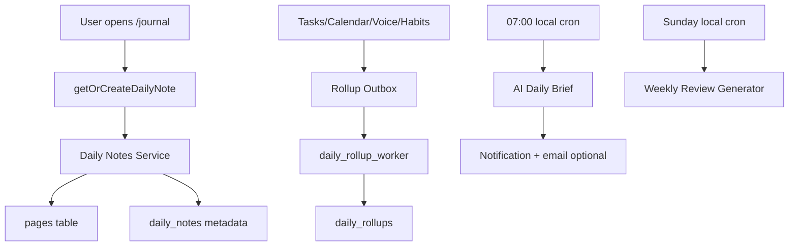

# 🔥 مرحلة 15 — Daily Notes + Journal Mode + Calendar Heatmap

<aside>
🎯

**KILLER FEATURE #2** — الميزة المؤسسة لـ Roam Research و LogSeq و Reflect. مذكورة كـ #1 reason في تعليقات Obsidian. Notion ليس لديه equivalent حقيقي.

</aside>

## 📊 Community Evidence

- Roam بُني بالكامل حول Daily Notes — مجتمع ولاء قوي رغم $15/شهر
- Reflect App Store: "I love the daily note format and back linking" = أعلى تقييم
- r/ObsidianMD: Daily Notes plugin = #2 الأكثر استخداماً
- XDA: "Calendar plugin is the backbone of my Obsidian workflow"

## 🎯 Scope

- صفحة يومية تلقائية بتاريخ اليوم
- Cmd+Shift+D يفتح اليوم الحالي فوراً
- Templates: morning pages, gratitude, tasks, reflections
- Auto-rollups: المهام/الأفكار/highlights تتجمع تلقائياً
- Calendar Heatmap (GitHub-style)
- Weekly/Monthly/Yearly review pages مولّدة تلقائياً
- AI Daily Brief: ملخص ذكي لأمس + خطة اليوم
- Linked mentions: ربط تلقائي بالصفحات
- استيراد من Day One / Bear / Apple Notes

## 🧠 توسيع معماري وتنفيذي — Daily Journal Operating System

المرحلة دي مش مجرد صفحة يومية. دي طبقة **Daily Operating Layer** فوق الصفحات والمهام والذكاء الاصطناعي: كل يوم يبقى container موحد للمهام، الأحداث، الملاحظات، الصوتيات، المزاج، الـ highlights، والـ reflections. لازم تتبني كـ primitive داخلي مستقر لأن مراحل كتير بعد كده هتعتمد عليها.

### المبادئ غير القابلة للكسر

- **Idempotency:** فتح اليوم الحالي أو cron اليومي لا ينشئ أكثر من daily note لنفس `workspace_id + user_id + date`.
- **Timezone correctness:** تاريخ اليومية يتحدد من `user_settings.timezone` وليس UTC.
- **Page-native:** اليومية في النهاية صفحة عادية داخل نظام الصفحات، لكن لها metadata في `daily_notes`.
- **No AI without gateway:** أي brief أو summary يمر من `runAIWithQuota` فقط، وليس direct provider call.
- **Privacy:** journal body لا يدخل analytics أو public sharing أو AI إلا بموافقة صريحة من المستخدم.
- **Fast open:** صفحة اليوم تفتح من read model/cache خلال أقل من 100ms.
- **Offline first:** المستخدم يقدر يكتب يوميته offline وتتزامن لاحقاً بدون فقد.

## 🧩 Domain Model

```tsx
export type DailyNoteId = string
export type LocalDateISO = `${number}-${number}-${number}`

export interface DailyNote {
  id: DailyNoteId
  workspaceId: string
  userId: string
  date: LocalDateISO
  pageId: string
  timezone: string
  wordCount: number
  blockCount: number
  mood?: 1 | 2 | 3 | 4 | 5
  energy?: 1 | 2 | 3 | 4 | 5
  createdAt: string
  updatedAt: string
}

export interface DailyRollupItem {
  id: string
  dailyNoteId: string
  type: 'task' | 'event' | 'highlight' | 'mention' | 'voice' | 'habit' | 'focus'
  sourceId: string
  sourceTable: string
  title: string
  url?: string
  occurredAt: string
}
```

## 🏗️ Execution Architecture



## 🛡️ تصحيح Schema للإنتاج

الجداول الموجودة كبداية جيدة، لكن للإنتاج لازم نضيف `updated_at`, `timezone`, `energy`, `template_id`, وقيود عزل tenant واضحة. لو المشروع ماشي على قاعدة ULID `TEXT` في باقي النظام، حوّل المفاتيح من UUID إلى `TEXT ULID` قبل التنفيذ النهائي.

```sql
-- 0270_create_daily_notes.production.sql
CREATE TABLE daily_notes (
  id TEXT PRIMARY KEY CHECK (id ~ '^[0-9A-HJKMNP-TV-Z]{26}$'),
  workspace_id TEXT NOT NULL REFERENCES workspaces(id) ON DELETE CASCADE,
  user_id TEXT NOT NULL REFERENCES users(id) ON DELETE CASCADE,
  date DATE NOT NULL,
  timezone TEXT NOT NULL DEFAULT 'UTC',
  page_id TEXT NOT NULL REFERENCES pages(id) ON DELETE CASCADE,
  template_id TEXT REFERENCES daily_note_templates(id) ON DELETE SET NULL,
  word_count INT NOT NULL DEFAULT 0 CHECK (word_count >= 0),
  block_count INT NOT NULL DEFAULT 0 CHECK (block_count >= 0),
  mood SMALLINT CHECK (mood BETWEEN 1 AND 5),
  energy SMALLINT CHECK (energy BETWEEN 1 AND 5),
  ai_brief_status TEXT NOT NULL DEFAULT 'pending'
    CHECK (ai_brief_status IN ('pending','queued','generated','failed','disabled')),
  ai_brief_page_block_id TEXT,
  created_at TIMESTAMPTZ NOT NULL DEFAULT now(),
  updated_at TIMESTAMPTZ NOT NULL DEFAULT now(),
  UNIQUE(workspace_id, user_id, date)
);

CREATE INDEX idx_daily_notes_workspace_user_date
  ON daily_notes(workspace_id, user_id, date DESC);

ALTER TABLE daily_notes ENABLE ROW LEVEL SECURITY;
ALTER TABLE daily_notes FORCE ROW LEVEL SECURITY;
CREATE POLICY daily_notes_isolation ON daily_notes
  USING (workspace_id = current_workspace_id() AND user_id = current_user_id());
```

```sql
-- 0272_daily_rollups.production.sql
CREATE TABLE daily_rollups (
  id TEXT PRIMARY KEY CHECK (id ~ '^[0-9A-HJKMNP-TV-Z]{26}$'),
  workspace_id TEXT NOT NULL REFERENCES workspaces(id) ON DELETE CASCADE,
  daily_note_id TEXT NOT NULL REFERENCES daily_notes(id) ON DELETE CASCADE,
  rollup_type TEXT NOT NULL CHECK (rollup_type IN (
    'task','event','highlight','mention','voice','habit','focus','expense','learning'
  )),
  source_table TEXT NOT NULL,
  source_id TEXT NOT NULL,
  title TEXT NOT NULL,
  url TEXT,
  occurred_at TIMESTAMPTZ NOT NULL,
  created_at TIMESTAMPTZ NOT NULL DEFAULT now(),
  UNIQUE(daily_note_id, rollup_type, source_table, source_id)
);

CREATE INDEX idx_daily_rollups_note_type
  ON daily_rollups(daily_note_id, rollup_type, occurred_at DESC);

ALTER TABLE daily_rollups ENABLE ROW LEVEL SECURITY;
ALTER TABLE daily_rollups FORCE ROW LEVEL SECURITY;
CREATE POLICY daily_rollups_isolation ON daily_rollups
  USING (workspace_id = current_workspace_id());
```

## 🔧 Daily Note Service

```tsx
// src/features/journal/daily-note-service.ts
import 'server-only'
import { ulid } from '@/lib/ulid'
import { db } from '@/lib/db'
import { getUserSettings } from '@/features/settings/get-user-settings'
import { formatInTimeZone } from 'date-fns-tz'

export async function getOrCreateDailyNote(ctx: RequestContext, input?: { date?: Date }) {
  const settings = await getUserSettings(ctx.userId)
  const timezone = settings.timezone ?? 'Africa/Cairo'
  const localDate = formatInTimeZone(input?.date ?? new Date(), timezone, 'yyyy-MM-dd')

  return db.tx(async (tx) => {
    const existing = await tx.oneOrNone(`
      SELECT * FROM daily_notes
      WHERE workspace_id=$1 AND user_id=$2 AND date=$3
      FOR UPDATE
    `, [ctx.workspaceId, ctx.userId, localDate])
    if (existing) return existing

    const pageId = ulid()
    const noteId = ulid()
    const template = await loadDefaultDailyTemplate(tx, ctx.userId)
    await tx.none(`
      INSERT INTO pages(id, workspace_id, owner_user_id, title, content, created_at, updated_at)
      VALUES($1,$2,$3,$4,$5,now(),now())
    `, [
      pageId,
      ctx.workspaceId,
      ctx.userId,
      `يومية ${localDate}`,
      renderDailyTemplate(template?.content, { date: localDate, timezone }),
    ])

    await tx.none(`
      INSERT INTO daily_notes(id, workspace_id, user_id, date, timezone, page_id, template_id)
      VALUES($1,$2,$3,$4,$5,$6,$7)
    `, [noteId, ctx.workspaceId, ctx.userId, localDate, timezone, pageId, template?.id ?? null])

    await tx.none(`
      INSERT INTO outbox_events(id, workspace_id, topic, payload)
      VALUES($1,$2,'daily_note.created',$3)
    `, [ulid(), ctx.workspaceId, { noteId, pageId, userId: ctx.userId, date: localDate }])

    return tx.one(`SELECT * FROM daily_notes WHERE id=$1`, [noteId])
  })
}
```

## 🧱 Template System

```tsx
export const DEFAULT_DAILY_TEMPLATE = `
## 🌅 Morning
- أهم 3 حاجات النهارده:
  - [ ] 
  - [ ] 
  - [ ] 

## 🧠 Notes

## ✅ Tasks Rollup
<daily-rollup type="tasks" />

## 💡 Highlights

## 🌙 Reflection
- المزاج:
- الطاقة:
- أفضل لحظة:
- اتعلمت إيه:
- ممتن لإيه:
`.trim()

export function renderDailyTemplate(template: string | undefined, vars: { date: string; timezone: string }) {
  return (template ?? DEFAULT_DAILY_TEMPLATE)
    .replaceAll('date', vars.date)
    .replaceAll('timezone', vars.timezone)
}
```

## ⚙️ API Contracts

```tsx
// POST /api/journal/today
const TodaySchema = z.object({
  date: z.string().date().optional(),
})

export const POST = secureMutation({
  name: 'journal.today',
  schema: TodaySchema,
  capability: 'journal:write',
  rateLimit: { limit: 60, windowSec: 60 },
  async handler(input, ctx) {
    return getOrCreateDailyNote(ctx, input.date ? { date: new Date(input.date) } : undefined)
  },
})
```

```tsx
// GET /api/journal/heatmap?year=2026
export async function getJournalHeatmap(ctx: RequestContext, year: number) {
  return db.manyOrNone(`
    SELECT date, word_count, block_count, mood, energy
    FROM daily_notes
    WHERE workspace_id=$1 AND user_id=$2
      AND date >= $3::date
      AND date < ($3::date + INTERVAL '1 year')
    ORDER BY date ASC
  `, [ctx.workspaceId, ctx.userId, `${year}-01-01`])
}
```

## 🔁 Rollup Worker

```tsx
// src/workers/daily-rollups.ts
export async function rebuildDailyRollups(ctx: SystemContext, noteId: string) {
  const note = await dailyNoteRepo.get(noteId)
  const start = zonedTimeToUtc(`${note.date} 00:00`, note.timezone)
  const end = addDays(start, 1)

  const sources = await Promise.all([
    taskRepo.completedBetween(note.userId, start, end),
    calendarRepo.eventsBetween(note.userId, start, end),
    voiceRepo.memosBetween(note.userId, start, end),
    habitRepo.logsBetween(note.userId, start, end),
    focusRepo.sessionsBetween(note.userId, start, end),
  ])

  for (const item of sources.flat()) {
    await dailyRollupRepo.upsert({
      workspaceId: note.workspaceId,
      dailyNoteId: note.id,
      rollupType: item.type,
      sourceTable: item.sourceTable,
      sourceId: item.id,
      title: item.title,
      url: item.url,
      occurredAt: item.occurredAt,
    })
  }
}
```

## 🤖 AI Daily Brief — Production Version

```tsx
import { runAIWithQuota } from '@/lib/ai/gateway'

const DailyBriefSchema = z.object({
  summary: z.string().max(900),
  focus: z.array(z.string()).min(1).max(3),
  risks: z.array(z.string()).max(3),
  suggestedPlan: z.array(z.object({
    time: z.string(),
    title: z.string(),
    reason: z.string(),
  })).max(6),
})

export async function generateDailyBrief(ctx: RequestContext, date: Date) {
  const timezone = (await getUserSettings(ctx.userId)).timezone
  const localDate = formatInTimeZone(date, timezone, 'yyyy-MM-dd')
  const yesterday = await dailyNoteRepo.safeSummary(ctx, subDays(date, 1))
  const upcoming = await calendarRepo.safeDailyAgenda(ctx, date)
  const overdueTasks = await taskRepo.safeOverdueList(ctx)

  const result = await runAIWithQuota({
    workspaceId: ctx.workspaceId,
    userId: ctx.userId,
    operation: 'daily_brief',
    sensitivity: 'normal',
    model: 'fast-small',
    responseSchema: DailyBriefSchema,
    prompt: [
      'اكتب Daily Brief بالعربي المصري التقني المختصر.',
      'لا تستخدم أي محتوى Vault.',
      'لا تخترع أحداث غير موجودة.',
      'اعتمد فقط على البيانات المرسلة.',
    ].join('\n'),
    input: { localDate, timezone, yesterday, upcoming, overdueTasks },
  })

  if (!result.ok) throw new Error('DAILY_BRIEF_FAILED')
  await dailyNoteRepo.attachBrief(ctx, localDate, result.data)
  return result.data
}
```

## 🗓️ Calendar Heatmap Component

```tsx
export function CalendarHeatmap({ days }: { days: Array<{ date: string; wordCount: number; mood?: number }> }) {
  const max = Math.max(1, ...days.map((d) => d.wordCount))
  return (
    <div className="grid grid-flow-col grid-rows-7 gap-1" aria-label="Journal activity heatmap">
      {days.map((d) => {
        const intensity = Math.ceil((d.wordCount / max) * 5)
        return (
          <button
            key={d.date}
            className={`h-3 w-3 rounded-sm heat-${intensity}`}
            title={`${d.date}: ${d.wordCount} كلمة`}
            aria-label={`${d.date}: ${d.wordCount} كلمة`}
          />
        )
      })}
    </div>
  )
}
```

## 📥 Import Pipeline

```tsx
export type JournalImportSource = 'day_one' | 'bear' | 'apple_notes' | 'markdown_zip'

export async function importJournalArchive(ctx: RequestContext, file: File, source: JournalImportSource) {
  const job = await importJobRepo.create(ctx, { source, kind: 'journal' })
  await queue.add('journal-import', {
    jobId: job.id,
    workspaceId: ctx.workspaceId,
    userId: ctx.userId,
    fileRef: await encryptedUpload(file),
    source,
  }, { jobId: `journal-import:${ctx.userId}:${job.id}` })
  return job
}
```

## 🧪 Tests موسعة

```tsx
describe('Daily Notes', () => {
  it('getOrCreateDailyNote idempotent لنفس user/date')
  it('timezone: Cairo 00:30 ينشئ تاريخ القاهرة وليس UTC')
  it('RLS يمنع user من قراءة daily note لغيره')
  it('template variables تتحول صح')
  it('rollup worker لا يكرر نفس task مرتين')
  it('heatmap يرسم 365 يوم في أقل من 200ms')
  it('AI brief يمر عبر runAIWithQuota فقط')
  it('AI brief لا يحتوي vault أو secrets')
  it('weekly review يتولد يوم الأحد حسب timezone')
  it('import Day One 1000 entries أقل من 30s')
  it('offline draft يتزامن بدون overwrite')
})
```

## 📋 Tasks إضافية

- [ ]  تحويل schema النهائي لـ `TEXT ULID` لو باقي النظام يستخدم ULID.
- [ ]  إضافة `timezone`, `energy`, `updated_at`, `ai_brief_status` لـ `daily_notes`.
- [ ]  بناء `DailyNoteService.getOrCreateDailyNote`.
- [ ]  بناء `DailyRollupWorker` لكل tasks/events/voice/habits/focus.
- [ ]  بناء `DailyTemplateRenderer` مع variables وdefault template.
- [ ]  بناء `CalendarHeatmap` accessible + virtualized عند تعدد السنوات.
- [ ]  بناء `WeeklyReviewGenerator` و`MonthlyReviewGenerator`.
- [ ]  بناء import jobs لـ Day One/Bear/Apple Notes/Markdown ZIP.
- [ ]  بناء offline draft queue في IndexedDB.
- [ ]  إضافة اختصارات: Cmd+Shift+D لليوم، Cmd+Alt+Left/Right للتنقل بين الأيام.
- [ ]  إضافة privacy setting: السماح/منع AI من تلخيص اليوميات.
- [ ]  إضافة tests لكل timezone وRLS وAI guard.

## 🗄️ Schema (Migrations 0270–0274)

> ⛔ **DEPRECATED — النسخة القديمة (UUID)**
> النسخة اللي تحت دي كانت draft أولي وبتستخدم UUID.
> **لا تستخدمها في التنفيذ.** استخدم فقط النسخة الإنتاجية (ULID) الموجودة في قسم "🛡️ تصحيح Schema للإنتاج" أعلاه.
> السبب: Phase 00 Invariant يفرض TEXT ULID على كل المفاتيح. هذه النسخة محفوظة للمرجعية فقط.

<details>
<summary>⛔ Draft قديم — UUID (لا تنفذه)</summary>

```sql
-- 0270_create_daily_notes.sql (DEPRECATED — use ULID version above)
CREATE TABLE daily_notes (
  id UUID PRIMARY KEY DEFAULT gen_random_uuid(),
  workspace_id UUID NOT NULL REFERENCES workspaces(id) ON DELETE CASCADE,
  user_id UUID NOT NULL REFERENCES users(id) ON DELETE CASCADE,
  date DATE NOT NULL,
  page_id UUID NOT NULL REFERENCES pages(id) ON DELETE CASCADE,
  word_count INT DEFAULT 0,
  block_count INT DEFAULT 0,
  mood SMALLINT,
  created_at TIMESTAMPTZ NOT NULL DEFAULT NOW(),
  UNIQUE(user_id, date)
);
CREATE INDEX idx_daily_notes_user_date ON daily_notes(user_id, date DESC);

-- 0271_daily_note_templates.sql (DEPRECATED)
CREATE TABLE daily_note_templates (
  id UUID PRIMARY KEY DEFAULT gen_random_uuid(),
  user_id UUID REFERENCES users(id) ON DELETE CASCADE,
  name TEXT NOT NULL,
  content TEXT NOT NULL,
  is_default BOOLEAN DEFAULT false
);

-- 0272_daily_rollups.sql (DEPRECATED)
CREATE TABLE daily_rollups (
  daily_note_id UUID REFERENCES daily_notes(id) ON DELETE CASCADE,
  rollup_type TEXT NOT NULL, -- 'tasks' | 'highlights' | 'mentions' | 'voice'
  source_id UUID NOT NULL,
  PRIMARY KEY (daily_note_id, rollup_type, source_id)
);

-- 0273_periodic_reviews.sql (DEPRECATED)
CREATE TABLE periodic_reviews (
  id UUID PRIMARY KEY DEFAULT gen_random_uuid(),
  user_id UUID NOT NULL,
  period_type TEXT NOT NULL, -- 'week' | 'month' | 'quarter' | 'year'
  period_start DATE NOT NULL,
  period_end DATE NOT NULL,
  page_id UUID REFERENCES pages(id),
  ai_summary TEXT,
  UNIQUE(user_id, period_type, period_start)
);

-- 0274_daily_streak.sql (DEPRECATED)
CREATE TABLE daily_streaks (
  user_id UUID PRIMARY KEY REFERENCES users(id) ON DELETE CASCADE,
  current_streak INT DEFAULT 0,
  longest_streak INT DEFAULT 0,
  last_entry_date DATE
);
```

</details>

## ✅ Schema الإنتاجي الكامل — ULID + RLS (Migrations 0270–0276)

> هذا هو الـ Schema المعتمد للتنفيذ. يتوافق مع Phase 00 Invariants:
> TEXT ULID، workspace isolation، FORCE RLS، CHECK constraints.

```sql
-- 0271_daily_note_templates.production.sql
CREATE TABLE daily_note_templates (
  id TEXT PRIMARY KEY CHECK (id ~ '^[0-9A-HJKMNP-TV-Z]{26}$'),
  workspace_id TEXT NOT NULL REFERENCES workspaces(id) ON DELETE CASCADE,
  user_id TEXT NOT NULL REFERENCES users(id) ON DELETE CASCADE,
  name TEXT NOT NULL,
  content TEXT NOT NULL,
  is_default BOOLEAN NOT NULL DEFAULT false,
  created_at TIMESTAMPTZ NOT NULL DEFAULT now(),
  updated_at TIMESTAMPTZ NOT NULL DEFAULT now()
);

ALTER TABLE daily_note_templates ENABLE ROW LEVEL SECURITY;
ALTER TABLE daily_note_templates FORCE ROW LEVEL SECURITY;
CREATE POLICY daily_note_templates_isolation ON daily_note_templates
  USING (workspace_id = current_workspace_id() AND user_id = current_user_id());

-- 0273_periodic_reviews.production.sql
CREATE TABLE periodic_reviews (
  id TEXT PRIMARY KEY CHECK (id ~ '^[0-9A-HJKMNP-TV-Z]{26}$'),
  workspace_id TEXT NOT NULL REFERENCES workspaces(id) ON DELETE CASCADE,
  user_id TEXT NOT NULL REFERENCES users(id) ON DELETE CASCADE,
  period_type TEXT NOT NULL CHECK (period_type IN ('week','month','quarter','year')),
  period_start DATE NOT NULL,
  period_end DATE NOT NULL,
  page_id TEXT REFERENCES pages(id) ON DELETE SET NULL,
  ai_summary TEXT,
  ai_brief_status TEXT NOT NULL DEFAULT 'pending'
    CHECK (ai_brief_status IN ('pending','queued','generated','failed','disabled')),
  created_at TIMESTAMPTZ NOT NULL DEFAULT now(),
  updated_at TIMESTAMPTZ NOT NULL DEFAULT now(),
  UNIQUE(workspace_id, user_id, period_type, period_start)
);

ALTER TABLE periodic_reviews ENABLE ROW LEVEL SECURITY;
ALTER TABLE periodic_reviews FORCE ROW LEVEL SECURITY;
CREATE POLICY periodic_reviews_isolation ON periodic_reviews
  USING (workspace_id = current_workspace_id() AND user_id = current_user_id());

-- 0274_daily_streaks.production.sql
CREATE TABLE daily_streaks (
  workspace_id TEXT NOT NULL REFERENCES workspaces(id) ON DELETE CASCADE,
  user_id TEXT NOT NULL REFERENCES users(id) ON DELETE CASCADE,
  current_streak INT NOT NULL DEFAULT 0 CHECK (current_streak >= 0),
  longest_streak INT NOT NULL DEFAULT 0 CHECK (longest_streak >= 0),
  last_entry_date DATE,
  updated_at TIMESTAMPTZ NOT NULL DEFAULT now(),
  PRIMARY KEY (workspace_id, user_id)
);

ALTER TABLE daily_streaks ENABLE ROW LEVEL SECURITY;
ALTER TABLE daily_streaks FORCE ROW LEVEL SECURITY;
CREATE POLICY daily_streaks_isolation ON daily_streaks
  USING (workspace_id = current_workspace_id() AND user_id = current_user_id());
```

## 🎨 Frontend

```tsx
// app/journal/page.tsx
export default async function JournalPage() {
  const today = await getOrCreateDailyNote(new Date())
  return (
    <Layout>
      <CalendarHeatmap data={await getYearActivity()} />
      <DailyNoteEditor noteId={today.id} />
      <RollupSidebar date={today.date} />
    </Layout>
  )
}

// shortcut handler
useHotkeys('cmd+shift+d', () => router.push('/journal'))
```

## 🔌 Backend

- `POST /api/journal/today` (idempotent: ينشئ إذا غير موجود)
- `GET /api/journal/heatmap?year=2026`
- `POST /api/journal/review/:period` (weekly/monthly/yearly)
- Cron: 00:01 يومياً يحضّر صفحة اليوم بالـ template
- Cron: كل أحد ينشئ Weekly Review بـ AI summary

## 🤖 AI Daily Brief

```tsx
async function generateDailyBrief(userId: string, date: Date) {
  const yesterday = await getDailyNote(userId, subDays(date, 1))
  const upcoming = await getCalendarEvents(userId, date)
  const overdueTasks = await getOverdueTasks(userId)
  return runAIWithQuota({
    operation: 'daily_brief',
    sensitivity: 'normal',
    system: 'You are a thoughtful journal companion. Summarize yesterday and suggest today focus in Arabic. Never use vault content.',
    input: { yesterday, upcoming, overdueTasks }
  })
}
```

## 🔗 Integration

| مع | كيف |
| --- | --- |
| مرحلة 7-8 | صفحة يومية = صفحة عادية بـ schema metadata |
| مرحلة 14 | linked mentions في daily notes |
| مرحلة 17 | بحث في كل اليوميات |
| مرحلة 21 | AI Daily Brief + smart linking |
| مرحلة 28 (W24 calendar) | heatmap يدمج events |
| مرحلة 59 (Voice Memos) | voice memo يضاف لـ daily note |

## ✅ Acceptance

- فتح اليوم الحالي < 100ms
- Calendar heatmap 365 يوم يرسم < 200ms
- AI Daily Brief يصل بريد المستخدم الساعة 7 صباحاً (الـ timezone الخاص به)
- Streak counter يحدث live
- Weekly Review يولد تلقائياً كل أحد فجراً
- استيراد 1000 entry من Day One < 30s

## 💡 ملاحظة استراتيجية

يُفضل تنفيذها بعد مرحلة 21 (W18 AI) لتفعيل Daily Brief مباشرة. يصبح gateway feature يجذب مستخدمي Roam/Obsidian/Reflect.
