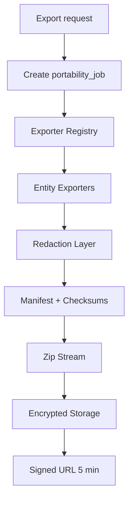
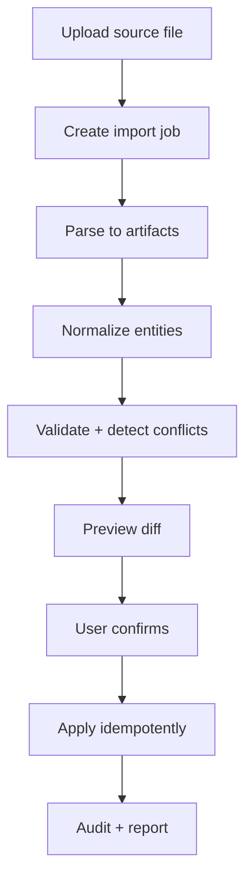

## 🧠 Master Architect Upgrade — Data Portability & Compliance Gate

## 🧠 توسعة تنفيذية كاملة — Data Portability & Restore Operating System

مرحلة 20 لازم تبقى **نظام نقل بيانات واسترجاع كامل** وليس مجرد Import/Export. الهدف إن المستخدم يقدر يدخل بياناته، يطلعها، يعمل backup، يعمل restore، وينفذ طلبات GDPR بثقة كاملة وبدون فقد أو تكرار أو تسريب أسرار.

<aside>
🚨

أي Export لا يحتوي Manifest + Checksums + Schema Version + Redaction Policy يعتبر غير صالح. وأي Restore يكتب مباشرة في الجداول النهائية بدون staging/dry-run يعتبر blocker.

</aside>

### أهداف المرحلة الموسعة

- Export كامل للـ workspace بصيغ JSON/Markdown/CSV/Assets.
- Import آمن من Notion/Todoist/Obsidian/Apple Notes/CSV/JSON.
- Restore عبر staging namespace مع dry-run diff قبل commit.
- Backup encrypted مع checksum وretention وsigned URLs قصيرة.
- GDPR lifecycle: access/export/erasure/rectification/portability.
- Versioned format contract مع migration adapters.
- Audit كامل لكل export/import/restore/download.
- No vault plaintext نهائياً في zip أو logs أو AI.

### المبادئ غير القابلة للكسر

- **Idempotent jobs:** نفس `idempotency_key` لا ينشئ export/import مكرر.
- **No direct restore:** restore يبدأ staging → validation → diff → explicit confirm → commit.
- **Short signed URLs:** كل روابط التحميل 5 دقائق فقط.
- **Tenant isolation:** كل artifacts لها `workspace_id` وRLS + FORCE.
- **Checksum everywhere:** كل file داخل zip له sha256 في manifest.
- **Schema versioned:** أي تغيير في export format يرفع version ويضيف adapter.
- **No orphan files:** cleanup job يحذف artifacts المنتهية من storage.

## 🧱 Domain Model

```tsx
export type PortabilityJobStatus =
  | 'queued'
  | 'running'
  | 'preview_ready'
  | 'waiting_confirmation'
  | 'completed'
  | 'failed'
  | 'cancelled'
  | 'expired'

export type ImportSource =
  | 'notion'
  | 'todoist'
  | 'obsidian'
  | 'apple_notes'
  | 'csv'
  | 'json'
  | 'markdown_zip'

export type ExportFormat = 'json_zip' | 'markdown_zip' | 'csv_zip' | 'full_backup'

export interface ExportManifestFile {
  path: string
  kind: 'json' | 'csv' | 'markdown' | 'asset' | 'manifest'
  sha256: string
  bytes: number
  rows?: number
  entityType?: string
}

export interface WorkspaceExportManifest {
  schemaVersion: number
  appVersion: string
  workspaceId: string
  generatedAt: string
  generatedBy: string
  format: ExportFormat
  files: ExportManifestFile[]
  totals: Record<string, number>
  redaction: {
    vault: 'omitted' | 'encrypted_blob_only'
    secrets: 'redacted'
    aiPrompts: 'omitted' | 'redacted'
  }
  checksums: {
    manifestSha256?: string
    archiveSha256?: string
  }
}
```

## 🗄️ Schema إنتاجي موسع

> ✅ **هذا هو الـ Schema المعتمد (Canonical).**
> يوجد أسفل الملف نسخة بديلة تستخدم جداول منفصلة (`import_jobs`, `export_jobs`, `backups`, `restore_jobs`).
> **القرار المعماري:** نعتمد الجدول الموحد `portability_jobs` مع `job_type` لأنه:
> 1. أقل تكرار في RLS policies وindexes
> 2. أسهل في الـ observability (query واحد لكل أنواع الـ jobs)
> 3. يتبع نمط DRY المعتمد في Phase 00

```sql
-- 1800_portability_jobs.sql
CREATE TABLE portability_jobs (
  id TEXT PRIMARY KEY CHECK (id ~ '^[0-9A-HJKMNP-TV-Z]{26}$'),
  workspace_id TEXT NOT NULL REFERENCES workspaces(id) ON DELETE CASCADE,
  user_id TEXT NOT NULL REFERENCES users(id) ON DELETE CASCADE,
  job_type TEXT NOT NULL CHECK (job_type IN ('import','export','backup','restore','gdpr')),
  source TEXT,
  format TEXT,
  status TEXT NOT NULL DEFAULT 'queued' CHECK (status IN (
    'queued','running','preview_ready','waiting_confirmation',
    'completed','failed','cancelled','expired'
  )),
  idempotency_key TEXT,
  options_json JSONB NOT NULL DEFAULT '{}'::jsonb,
  progress_json JSONB NOT NULL DEFAULT '{"pct":0}'::jsonb,
  result_json JSONB,
  error_code TEXT,
  error_message TEXT,
  attempts INT NOT NULL DEFAULT 0,
  started_at TIMESTAMPTZ,
  finished_at TIMESTAMPTZ,
  expires_at TIMESTAMPTZ,
  created_at TIMESTAMPTZ NOT NULL DEFAULT now(),
  updated_at TIMESTAMPTZ NOT NULL DEFAULT now(),
  UNIQUE(workspace_id, user_id, job_type, idempotency_key)
);

CREATE INDEX idx_portability_jobs_workspace_status
  ON portability_jobs(workspace_id, job_type, status, created_at DESC);

ALTER TABLE portability_jobs ENABLE ROW LEVEL SECURITY;
ALTER TABLE portability_jobs FORCE ROW LEVEL SECURITY;
CREATE POLICY portability_jobs_isolation ON portability_jobs
  USING (workspace_id = current_workspace_id() AND user_id = current_user_id());
```

```sql
-- 1801_portability_artifacts.sql
CREATE TABLE portability_artifacts (
  id TEXT PRIMARY KEY CHECK (id ~ '^[0-9A-HJKMNP-TV-Z]{26}$'),
  workspace_id TEXT NOT NULL REFERENCES workspaces(id) ON DELETE CASCADE,
  job_id TEXT NOT NULL REFERENCES portability_jobs(id) ON DELETE CASCADE,
  artifact_type TEXT NOT NULL CHECK (artifact_type IN ('source_upload','parsed_entity','export_file','backup_blob','manifest','restore_diff')),
  storage_path TEXT,
  entity_type TEXT,
  entity_source_id TEXT,
  payload JSONB,
  sha256 TEXT,
  size_bytes BIGINT,
  validation_status TEXT NOT NULL DEFAULT 'pending'
    CHECK (validation_status IN ('pending','valid','invalid','skipped')),
  error_message TEXT,
  expires_at TIMESTAMPTZ,
  created_at TIMESTAMPTZ NOT NULL DEFAULT now()
);

CREATE INDEX idx_portability_artifacts_job
  ON portability_artifacts(job_id, artifact_type);

ALTER TABLE portability_artifacts ENABLE ROW LEVEL SECURITY;
ALTER TABLE portability_artifacts FORCE ROW LEVEL SECURITY;
CREATE POLICY portability_artifacts_isolation ON portability_artifacts
  USING (workspace_id = current_workspace_id());
```

```sql
-- 1802_restore_staging_entities.sql
CREATE TABLE restore_staging_entities (
  id TEXT PRIMARY KEY CHECK (id ~ '^[0-9A-HJKMNP-TV-Z]{26}$'),
  workspace_id TEXT NOT NULL REFERENCES workspaces(id) ON DELETE CASCADE,
  restore_job_id TEXT NOT NULL REFERENCES portability_jobs(id) ON DELETE CASCADE,
  entity_type TEXT NOT NULL,
  source_id TEXT NOT NULL,
  target_id TEXT,
  action TEXT NOT NULL CHECK (action IN ('create','update','skip','conflict','delete')),
  payload JSONB NOT NULL,
  diff_json JSONB,
  validation_status TEXT NOT NULL DEFAULT 'pending'
    CHECK (validation_status IN ('pending','valid','invalid','conflict')),
  error_message TEXT,
  created_at TIMESTAMPTZ NOT NULL DEFAULT now(),
  UNIQUE(restore_job_id, entity_type, source_id)
);

ALTER TABLE restore_staging_entities ENABLE ROW LEVEL SECURITY;
ALTER TABLE restore_staging_entities FORCE ROW LEVEL SECURITY;
CREATE POLICY restore_staging_isolation ON restore_staging_entities
  USING (workspace_id = current_workspace_id());
```

## 🧩 Export Engine Architecture



```tsx
export interface EntityExporter<T = unknown> {
  entityType: string
  export(ctx: ExportContext): AsyncGenerator<ExportChunk<T>>
}

export type ExportChunk<T> = {
  path: string
  kind: 'json' | 'csv' | 'markdown' | 'asset'
  rows?: number
  content: T | Uint8Array | string
}

export const EXPORTERS: EntityExporter[] = [
  pagesExporter,
  blocksExporter,
  databaseSchemasExporter,
  databaseRowsExporter,
  tasksExporter,
  habitsExporter,
  goalsExporter,
  reviewsExporter,
  automationsMetadataExporter,
  filesManifestExporter,
]
```

```tsx
export async function buildWorkspaceExport(ctx: ExportContext) {
  const manifest: WorkspaceExportManifest = {
    schemaVersion: CURRENT_EXPORT_SCHEMA_VERSION,
    appVersion: process.env.APP_VERSION!,
    workspaceId: ctx.workspaceId,
    generatedAt: new Date().toISOString(),
    generatedBy: ctx.userId,
    format: ctx.format,
    files: [],
    totals: {},
    redaction: {
      vault: ctx.includeEncryptedVault ? 'encrypted_blob_only' : 'omitted',
      secrets: 'redacted',
      aiPrompts: 'redacted',
    },
    checksums: {},
  }

  const zip = createStreamingZipWriter()
  for (const exporter of EXPORTERS) {
    for await (const chunk of exporter.export(ctx)) {
      const safeChunk = await redactExportChunk(chunk)
      await addFileToExport(zip, manifest, safeChunk)
      manifest.totals[exporter.entityType] = (manifest.totals[exporter.entityType] ?? 0) + (chunk.rows ?? 1)
      await updateJobProgress(ctx.jobId, { current: exporter.entityType })
    }
  }

  const manifestBytes = new TextEncoder().encode(JSON.stringify(manifest, null, 2))
  manifest.checksums.manifestSha256 = sha256Hex(manifestBytes)
  await zip.add('manifest.json', manifestBytes)

  const archive = await zip.close()
  manifest.checksums.archiveSha256 = sha256Hex(archive)
  return { archive, manifest }
}
```

## 🔐 Redaction Layer

```tsx
const EXPORT_SECRET_KEYS = [
  'password',
  'token',
  'access_token',
  'refresh_token',
  'secret',
  'api_key',
  'webhook_secret',
  'private_key',
]

export function redactExportJson(value: unknown): unknown {
  if (Array.isArray(value)) return value.map(redactExportJson)
  if (!value || typeof value !== 'object') return value
  return Object.fromEntries(
    Object.entries(value as Record<string, unknown>).map(([key, v]) => {
      const lower = key.toLowerCase()
      if (EXPORT_SECRET_KEYS.some((s) => lower.includes(s))) return [key, '[REDACTED]']
      return [key, redactExportJson(v)]
    })
  )
}

export async function redactExportChunk(chunk: ExportChunk): Promise<ExportChunk> {
  if (chunk.kind === 'json') return { ...chunk, content: redactExportJson(chunk.content) }
  return chunk
}
```

## 📥 Import Pipeline Architecture



```tsx
export interface Importer {
  source: ImportSource
  detect(file: UploadedFile): Promise<boolean>
  parse(ctx: ImportContext): AsyncGenerator<NormalizedImportEntity>
  validate(entity: NormalizedImportEntity): Promise<ValidationResult>
  mapToInternal(entity: NormalizedImportEntity): Promise<InternalEntityDraft>
}

export type NormalizedImportEntity = {
  sourceId: string
  entityType: 'page' | 'task' | 'note' | 'database' | 'file' | 'habit'
  title?: string
  content?: string
  properties?: Record<string, unknown>
  relations?: Array<{ type: string; targetSourceId: string }>
  attachments?: Array<{ name: string; sourcePath: string; sha256?: string }>
}
```

## 🧪 Import Dry-run Diff

```tsx
export type ImportDiff = {
  summary: {
    create: number
    update: number
    skip: number
    conflict: number
    invalid: number
  }
  entities: Array<{
    sourceId: string
    entityType: string
    action: 'create' | 'update' | 'skip' | 'conflict' | 'invalid'
    reason?: string
    previewTitle?: string
  }>
}

export async function buildImportPreview(ctx: ImportContext, artifacts: NormalizedImportEntity[]): Promise<ImportDiff> {
  const diff: ImportDiff = { summary: { create: 0, update: 0, skip: 0, conflict: 0, invalid: 0 }, entities: [] }
  for (const entity of artifacts) {
    const validation = await validateImportEntity(ctx, entity)
    const existing = await findExistingByImportSource(ctx, entity.sourceId)
    const action = !validation.ok ? 'invalid' : existing ? 'update' : 'create'
    diff.summary[action]++
    diff.entities.push({ sourceId: entity.sourceId, entityType: entity.entityType, action, reason: validation.error, previewTitle: entity.title })
  }
  return diff
}
```

## ✅ Idempotent Import Apply

```tsx
export async function applyImport(ctx: ImportContext, jobId: string) {
  return db.tx(async (tx) => {
    const job = await portabilityRepo.getJobForUpdate(tx, ctx, jobId)
    if (job.status !== 'preview_ready' && job.status !== 'waiting_confirmation') {
      throw new AppError('IMPORT_BAD_STATE', `Cannot apply from ${job.status}`, 409)
    }

    const staged = await restoreRepo.listValidStagedEntities(tx, jobId)
    const result = { inserted: 0, updated: 0, skipped: 0, failed: 0 }

    for (const entity of staged) {
      try {
        const previous = await importMapRepo.find(tx, ctx, entity.entity_type, entity.source_id)
        if (previous) {
          await updateEntityFromImport(tx, ctx, previous.targetId, entity.payload)
          result.updated++
        } else {
          const targetId = await createEntityFromImport(tx, ctx, entity.payload)
          await importMapRepo.record(tx, ctx, entity.entity_type, entity.source_id, targetId)
          result.inserted++
        }
      } catch (err) {
        result.failed++
        await recordImportEntityError(tx, entity.id, err)
      }
    }

    await portabilityRepo.complete(tx, jobId, result)
    await audit.write(tx, { action: 'import.applied', actorId: ctx.userId, workspaceId: ctx.workspaceId, metadata: result })
    return result
  })
}
```

## 🔄 Restore Flow مفصل

```tsx
export async function startRestoreDryRun(ctx: RequestContext, backupId: string) {
  const backup = await backupRepo.getOwned(ctx, backupId)
  const encrypted = await storage.download(backup.storagePath)
  const archive = await decryptBackupClientOrServerPolicy(ctx, backup, encrypted)
  const manifest = await readManifest(archive)
  await verifyManifest(manifest, archive)

  const job = await portabilityRepo.createJob(ctx, {
    jobType: 'restore',
    status: 'running',
    options: { backupId, dryRun: true },
  })

  for await (const entity of parseArchiveEntities(archive, manifest)) {
    const validation = await validateRestoredEntity(ctx, entity)
    await restoreStagingRepo.insert(ctx, job.id, {
      entityType: entity.type,
      sourceId: entity.id,
      action: await decideRestoreAction(ctx, entity),
      payload: entity,
      validationStatus: validation.ok ? 'valid' : 'invalid',
      errorMessage: validation.error,
    })
  }

  const diff = await restoreStagingRepo.summarize(job.id)
  await portabilityRepo.markPreviewReady(job.id, diff)
  return { jobId: job.id, diff }
}
```

## 🧾 GDPR Lifecycle

```tsx
export async function createGdprRequest(ctx: RequestContext, kind: GdprKind) {
  const request = await gdprRepo.create({
    id: ulid(),
    workspaceId: ctx.workspaceId,
    userId: ctx.userId,
    kind,
    status: 'received',
    dueAt: addDays(new Date(), 30).toISOString(),
  })

  await audit.write({
    action: 'gdpr.request_received',
    actorId: ctx.userId,
    workspaceId: ctx.workspaceId,
    resourceId: request.id,
    metadata: { kind },
  })

  if (kind === 'access' || kind === 'portability') {
    await queue.add('gdpr-export', { requestId: request.id }, { jobId: `gdpr:${request.id}` })
  }
  return request
}
```

### Erasure rules

- soft-delete account أولاً مع grace period.
- legal hold يمنع hard delete.
- vault blobs تُحذف encrypted كما هي بدون decrypt.
- storage cleanup يتأكد من عدم وجود orphan files.
- audit logs يتم anonymize بدل delete لو القانون يتطلب retention.

## 🔗 Version Adapters

```tsx
export interface ExportVersionAdapter {
  from: number
  to: number
  migrateManifest(manifest: unknown): WorkspaceExportManifest
  migrateEntity(entityType: string, entity: unknown): unknown
}

export const VERSION_ADAPTERS: ExportVersionAdapter[] = [
  v15To16Adapter,
  v16To17Adapter,
  v17To18Adapter,
]

export function migrateExportToCurrent(input: { version: number; manifest: unknown; entities: unknown[] }) {
  let version = input.version
  let manifest = input.manifest
  let entities = input.entities
  while (version < CURRENT_EXPORT_SCHEMA_VERSION) {
    const adapter = VERSION_ADAPTERS.find((a) => a.from === version)
    if (!adapter) throw new Error(`NO_EXPORT_ADAPTER_${version}`)
    manifest = adapter.migrateManifest(manifest)
    entities = entities.map((e: any) => adapter.migrateEntity(e.entityType, e))
    version = adapter.to
  }
  return { manifest, entities }
}
```

## 🧰 UI Surfaces

```
apps/web/src/app/(app)/[workspaceSlug]/settings/
├── import/page.tsx
├── import/[jobId]/preview/page.tsx
├── export/page.tsx
├── export/[jobId]/page.tsx
├── backup/page.tsx
├── backup/[id]/restore/page.tsx
└── privacy/gdpr/page.tsx

components/portability/
├── ImportSourcePicker.tsx
├── ImportPreviewDiff.tsx
├── ExportFormatPicker.tsx
├── ExportJobProgress.tsx
├── BackupList.tsx
├── RestoreDryRunDiff.tsx
├── GdprRequestPanel.tsx
└── ManifestVerifier.tsx
```

## 📊 Observability

```tsx
export const PORTABILITY_METRICS = [
  'import_job_created_total',
  'import_job_failed_total',
  'import_entity_conflict_total',
  'export_job_duration_ms',
  'export_archive_size_bytes',
  'restore_dry_run_duration_ms',
  'restore_conflict_total',
  'backup_created_total',
  'backup_cleanup_deleted_total',
  'gdpr_request_open_total',
] as const
```

### Alerts

- Export failure rate > 5% خلال 30 دقيقة → P2.
- GDPR request due within 48h and not fulfilled → P1 compliance.
- Restore validation invalid ratio > 20% → P2.
- Orphan storage files > 1000 → P3 cleanup.

## 🧪 Test Plan موسع

```tsx
describe('Data Portability', () => {
  it('export includes manifest with sha256 for every file')
  it('manifest verification fails if any file checksum differs')
  it('vault export never includes plaintext')
  it('secrets are redacted recursively')
  it('signed URL expires after 5 minutes')
  it('import parse is idempotent for same source file')
  it('import preview detects create/update/conflict')
  it('import apply does not duplicate entities on retry')
  it('restore writes to staging before final tables')
  it('restore dry-run returns diff without mutations')
  it('GDPR access request creates export job')
  it('GDPR erasure respects legal hold')
  it('schema v16 export migrates to current version')
  it('RLS blocks cross-workspace artifacts')
  it('cleanup removes expired artifacts from storage')
})
```

## 📋 Tasks إضافية

- [ ]  توحيد `import_jobs/export_jobs/backups/restore_jobs` أو اعتماد `portability_jobs` مع `job_type`.
- [ ]  بناء `WorkspaceExportManifest` v17/v18 مع checksums.
- [ ]  بناء `ManifestVerifier` يرفض أي archive ناقص أو متلاعب.
- [ ]  بناء `redactExportJson` لكل secrets.
- [ ]  بناء streaming zip writer لتجنب memory spikes.
- [ ]  بناء `ImportPreviewDiff` و`RestoreDryRunDiff`.
- [ ]  بناء import mapping table لمنع duplicates.
- [ ]  بناء version adapters لكل format قديم.
- [ ]  بناء cleanup job للـ expired signed artifacts.
- [ ]  بناء GDPR SLA dashboard.
- [ ]  إضافة tests لـ vault/no plaintext/RLS/idempotency/checksum.

## 🧠 تطوير تنفيذي إضافي — Portable Workspace Manifest Pack

أي export لازم يكون قابل للتحقق والاسترجاع. الـ zip بدون manifest/checksum يعتبر غير مكتمل.

### Export Manifest

```tsx
export type WorkspaceExportManifest = {
  version: 17
  workspaceId: string
  generatedAt: string
  files: Array<{
    path: string
    kind: 'json' | 'csv' | 'markdown' | 'asset'
    sha256: string
    rows?: number
  }>
  redaction: {
    vault: 'encrypted_blob_only' | 'omitted'
    secrets: 'redacted'
  }
}
```

### Checksum Builder

```tsx
export async function addFileToExport(zip: ZipWriter, manifest: WorkspaceExportManifest, file: ExportFile) {
  const bytes = typeof file.content === 'string'
    ? new TextEncoder().encode(file.content)
    : file.content
  manifest.files.push({
    path: file.path,
    kind: file.kind,
    sha256: sha256Hex(bytes),
    rows: file.rows,
  })
  await zip.add(file.path, bytes)
}
```

### Restore Staging Rule

```sql
CREATE TABLE IF NOT EXISTS restore_staging_entities (
  id TEXT PRIMARY KEY,
  workspace_id TEXT NOT NULL,
  restore_job_id TEXT NOT NULL,
  entity_type TEXT NOT NULL,
  source_id TEXT NOT NULL,
  payload JSONB NOT NULL,
  validation_status TEXT NOT NULL DEFAULT 'pending',
  error_message TEXT,
  created_at TIMESTAMPTZ NOT NULL DEFAULT now()
);
```

### Acceptance

- Restore لا يكتب في الجداول النهائية قبل dry-run واضح.
- signed URL مدة 5 دقائق فقط.
- Vault export لا يحتوي plaintext أبدًا.
- كل export/import/restore له audit event ومؤشر progress.
- **Export completeness:** export job يغطي pages, blocks, db schemas, db rows, files manifests, automations metadata، وaudit-friendly manifest بchecksums.
- **Vault rule:** vault export encrypted client-side أو omitted by default مع تحذير واضح. server لا يفك تشفير ولا يضيف plaintext للzip.
- **Import safety:** import into staging namespace أولًا، validate schema/version/tenant ownership، dry-run diff، ثم commit idempotent.
- **Retention & deletion:** delete/export requests تسجل lifecycle، signed URLs قصيرة العمر، background cleanup، وno orphan files.
- **Format contract:** Markdown/JSON/CSV export versioned، مع compatibility tests تمنع breaking changes بدون migration adapter.

# Wave 17 — Import / Export & Data Portability

## 🎯 نظرة عامة

**هدف المرحلة:** بناء طبقة قابلية النقل اللي بتخلّي المستخدم يدخل بياناته من أي مكان ويطلعها لو حب، ويعمل نسخ احتياطي آمن ويرجعه بأمان.

**المستخدم هيكسب إيه:**

- بيستورد بياناته من Notion / Todoist / Obsidian / Apple Notes / CSV من غير ما يفقد حاجة.
- بيصدر workspace كاملة في ملف zip مرتب وفيه manifest وversion.
- بيقدر يطلب GDPR Export ويستلم بياناته خلال 30 يوم.
- بيعمل backup مشفّر للموقع كله ويرجعه لو حصل مشكلة.
- بيشوف معاينة قبل ما يطبّق أي import أو restore.

**اللي هيتبنى في المرحلة:**

- ImporterRegistry بـ 5 importers + جدول import_jobs + worker للمعالجة.
- ExporterEngine بـ 8 exporters + manifest + zipper + schema versioning.
- BackupService بـ encryption AES-GCM 256 + Supabase Storage + retention 30d.
- RestoreService بـ dry-run + apply + rollback.
- GDPR endpoint + Migration helpers + UI scaffolding.

## 🔧 تفاصيل التنفيذ

### Pre-flight

```bash
git tag --list | grep w16-frozen
pnpm install --frozen-lockfile && pnpm typecheck && pnpm lint
node scripts/check-migrations.ts   # last = 1712
node scripts/check-rls.ts
```

branch: `wave/17-import-export` • Migration range: `1800`–`1899` • Tag: `w17-frozen`.

### Repository Additions

```
packages/
├── import/src/             # registry + 5 importers + parsers + dry-run + execute
├── export/src/             # engine + manifest + 8 exporters + zipper
├── backup/src/             # service + encrypt/decrypt + storage adapter
├── restore/src/            # service + dry-run + apply + rollback
└── migrations-helper/src/  # v1-to-v2 + checksum
apps/web/src/app/
├── (app)/[workspaceSlug]/settings/{import,export,backup}/page.tsx
└── api/v1/{import,export,backup}/...
apps/worker/src/jobs/
├── import-process.job.ts
├── export-build.job.ts
├── backup-create.job.ts
├── backup-cleanup.job.ts
└── restore-apply.job.ts
```

### Migration Roadmap (1800–1899)

> ⚠️ **نسخة بديلة (Superseded):** الجدول أدناه يستخدم جداول منفصلة لكل نوع job.
> **القرار النهائي:** استخدم الجدول الموحد `portability_jobs` من قسم "Schema إنتاجي موسع" أعلاه.
> الـ migrations `1800–1803` و`1805` أدناه يُستبدلون بـ `portability_jobs` + `portability_artifacts`.
> فقط `1804` (backups)، `1806–1808` (schema_versions, migration_runs, gdpr_requests) تبقى صالحة كجداول مستقلة.

| رقم | الاسم | الغرض |
| --- | --- | --- |
| 1800 | `import_jobs` | queue للـ imports |
| 1801 | `import_artifacts` | parsed entities قبل apply |
| 1802 | `export_jobs` | queue للـ exports |
| 1803 | `export_artifacts` | generated files manifest |
| 1804 | `backups` | encrypted backup records |
| 1805 | `restore_jobs` | restore operations |
| 1806 | `schema_versions` | versioning للـ exports |
| 1807 | `migration_runs` | سجل migrations helpers |
| 1808 | `gdpr_requests` | سجل GDPR requests |
| 1809 | `rls_pack_w17` | RLS لكل الجداول |

### Sample Migrations

```sql
-- 1800__import_jobs.sql
BEGIN;
CREATE TABLE IF NOT EXISTS import_jobs (
  id TEXT PRIMARY KEY,
  workspace_id TEXT NOT NULL REFERENCES workspaces(id),
  user_id TEXT NOT NULL REFERENCES users(id),
  source TEXT NOT NULL,
  status TEXT NOT NULL DEFAULT 'queued',
  source_file_url TEXT, size_bytes BIGINT,
  options_json JSONB NOT NULL DEFAULT '{}'::jsonb,
  preview_json JSONB, result_json JSONB,
  error_message TEXT, attempts INT NOT NULL DEFAULT 0,
  started_at TIMESTAMPTZ, finished_at TIMESTAMPTZ,
  created_at TIMESTAMPTZ NOT NULL DEFAULT now(), updated_at TIMESTAMPTZ NOT NULL DEFAULT now(),
  CONSTRAINT chk_import_source CHECK (source IN ('notion','todoist','obsidian','apple','csv','json')),
  CONSTRAINT chk_import_status CHECK (status IN ('queued','parsing','preview_ready','applying','completed','failed','cancelled'))
);
CREATE INDEX idx_import_jobs_workspace_status ON import_jobs(workspace_id, status, created_at DESC);
ALTER TABLE import_jobs ENABLE ROW LEVEL SECURITY; ALTER TABLE import_jobs FORCE ROW LEVEL SECURITY;
CREATE POLICY import_jobs_isolation ON import_jobs USING (workspace_id = current_workspace_id());
GRANT SELECT, INSERT, UPDATE ON import_jobs TO app_user;
COMMIT;

-- 1804__backups.sql
BEGIN;
CREATE TABLE IF NOT EXISTS backups (
  id TEXT PRIMARY KEY,
  workspace_id TEXT NOT NULL REFERENCES workspaces(id),
  user_id TEXT NOT NULL REFERENCES users(id),
  storage_path TEXT NOT NULL, size_bytes BIGINT NOT NULL,
  encryption_algo TEXT NOT NULL DEFAULT 'AES-GCM-256',
  iv BYTEA NOT NULL, auth_tag BYTEA NOT NULL,
  schema_version INT NOT NULL, checksum TEXT NOT NULL,
  status TEXT NOT NULL DEFAULT 'ready',
  expires_at TIMESTAMPTZ NOT NULL DEFAULT now() + INTERVAL '30 days',
  created_at TIMESTAMPTZ NOT NULL DEFAULT now()
);
CREATE INDEX idx_backups_workspace ON backups(workspace_id, created_at DESC);
ALTER TABLE backups ENABLE ROW LEVEL SECURITY; ALTER TABLE backups FORCE ROW LEVEL SECURITY;
CREATE POLICY backups_isolation ON backups USING (workspace_id = current_workspace_id());
GRANT SELECT, INSERT, UPDATE ON backups TO app_user;
COMMIT;

-- 1808__gdpr_requests.sql
BEGIN;
CREATE TABLE IF NOT EXISTS gdpr_requests (
  id TEXT PRIMARY KEY,
  user_id TEXT NOT NULL REFERENCES users(id),
  kind TEXT NOT NULL, status TEXT NOT NULL DEFAULT 'received',
  due_at TIMESTAMPTZ NOT NULL DEFAULT now() + INTERVAL '30 days',
  fulfilled_at TIMESTAMPTZ, export_job_id TEXT REFERENCES export_jobs(id),
  notes TEXT, created_at TIMESTAMPTZ NOT NULL DEFAULT now(),
  CONSTRAINT chk_gdpr_kind CHECK (kind IN ('access','erasure','rectification','portability'))
);
ALTER TABLE gdpr_requests ENABLE ROW LEVEL SECURITY; ALTER TABLE gdpr_requests FORCE ROW LEVEL SECURITY;
CREATE POLICY gdpr_self ON gdpr_requests USING (user_id = current_user_id());
GRANT SELECT, INSERT, UPDATE ON gdpr_requests TO app_user;
COMMIT;
```

### Importer Interface + Registry

```tsx
export interface Importer {
  source: 'notion'|'todoist'|'obsidian'|'apple'|'csv'|'json';
  parse(ctx, fileUrl, options): Promise<{ artifacts: ImportArtifact[]; preview: ImportPreview }>;
  apply(ctx, artifacts): Promise<{ inserted: number; skipped: number; failed: number }>;
}
export const IMPORTERS: Record<string, Importer> = { notion: notionImporter, todoist: todoistImporter, obsidian: obsidianImporter, apple: appleImporter, csv: csvImporter };
export function getImporter(source: string) {
  const i = IMPORTERS[source]; if (!i) throw new AppError('IMPORTER_NOT_FOUND', { source }); return i;
}
```

### Export Engine + Backup Service

```tsx
export const CURRENT_SCHEMA_VERSION = 17;
export async function buildWorkspaceExport(ctx) {
  const [pages, tasks, notes, habits, expenses, calendar, reviews, lifeScore] = await Promise.all([
    pagesExporter(ctx), tasksExporter(ctx), notesExporter(ctx), habitsExporter(ctx),
    expensesExporter(ctx), calendarExporter(ctx), reviewsExporter(ctx), lifeScoreExporter(ctx),
  ]);
  const manifest = buildManifest({ version: CURRENT_SCHEMA_VERSION, workspaceId: ctx.workspaceId, userId: ctx.userId });
  const buffer = await zipBuffers([
    { name: 'manifest.json', content: JSON.stringify(manifest, null, 2) },
    { name: 'pages.json', content: JSON.stringify(pages) },
    { name: 'tasks.json', content: JSON.stringify(tasks) },
    { name: 'notes.json', content: JSON.stringify(notes) },
    { name: 'habits.json', content: JSON.stringify(habits) },
    { name: 'expenses.json', content: JSON.stringify(expenses) },
    { name: 'calendar.json', content: JSON.stringify(calendar) },
    { name: 'reviews.json', content: JSON.stringify(reviews) },
    { name: 'life_score.json', content: JSON.stringify(lifeScore) },
  ]);
  return { buffer, checksum: sha256Hex(buffer), size: buffer.byteLength };
}
export async function createBackup(ctx) {
  const id = createUlid();
  const { buffer, checksum, size } = await buildWorkspaceExport({ ...ctx, jobId: id });
  const { ciphertext, iv, authTag } = await encryptBlob(buffer, ctx.masterKey);
  const storagePath = `backups/${ctx.workspaceId}/${id}.bin`;
  await uploadToStorage(storagePath, ciphertext);
  await ctx.db.query(`INSERT INTO backups (id, workspace_id, user_id, storage_path, size_bytes, iv, auth_tag, schema_version, checksum, status)
     VALUES ($1,$2,$3,$4,$5,$6,$7,$8,$9,'ready')`,
    [id, ctx.workspaceId, ctx.userId, storagePath, size, iv, authTag, 17, checksum]);
  return { id, storagePath };
}
```

### API Routes

| Method | Path | الغرض |
| --- | --- | --- |
| POST | `/api/v1/import` | upload + start parse |
| GET | `/api/v1/import/:jobId` | status |
| GET | `/api/v1/import/:jobId/preview` | dry-run preview |
| POST | `/api/v1/import/:jobId/confirm` | apply |
| POST | `/api/v1/import/:jobId/cancel` | cancel |
| POST | `/api/v1/export` | request workspace export |
| GET | `/api/v1/export/:jobId` | status + signed URL |
| POST | `/api/v1/export/user-data` | GDPR Article 15/20 |
| POST | `/api/v1/backup` | create |
| GET | `/api/v1/backup` | list |
| GET | `/api/v1/backup/:id` | download URL |
| POST | `/api/v1/backup/:id/restore` | start restore (dry-run افتراضي) |

قواعد: envelope + Idempotency-Key + rate-limit + signed URLs مع TTL 5min.

### Worker Jobs / Audit / Performance

- Jobs: `import-process` • `import-apply` • `export-build` • `backup-create` • `backup-cleanup` (يومي retention) • `restore-apply`.
- Audit: `import.started/parsed/preview_ready/applied/failed/cancelled` • `export.requested/built/ready/downloaded/expired` • `backup.created/restored/expired` • `restore.started/preview_ready/applied/failed` • `gdpr.request_received/fulfilled/rejected`.
- Performance: Import 10k rows < 60s • Export full workspace < 30s • Backup encrypt+upload < 45s • Restore dry-run < 15s.

### Handoff to Wave 18

- AI prompts ممنوع تشوف backup encryption keys.
- AI mapping للـ importers اختياري في W18.
- Vault export = encrypted-only blobs (W18 يربط بـ master key).

## 📝 Tasks تلخيصية للمرحلة

- [ ]  افتح branch `wave/17-import-export` + issue `[W17] Master Tracker`.
- [ ]  Preflight + تأكيد `w16-frozen` + storage bucket.
- [ ]  إنشاء packages: import, export, backup, restore, migrations-helper.
- [ ]  Migrations 1800–1809 + RLS + storage policies.
- [ ]  Importers: notion, todoist, obsidian, apple, csv (مع stubs لو ناقص tokens).
- [ ]  Export engine + 8 exporters + manifest.
- [ ]  Backup encrypt/upload + retention job + restore dry-run/apply/rollback.
- [ ]  Worker jobs + API routes كاملة + signed URLs.
- [ ]  GDPR endpoint + SLA tracking.
- [ ]  Audit events + ADRs 0170–0175 + docs + perf budgets.
- [ ]  CI أخضر + tag `w17-frozen`.
