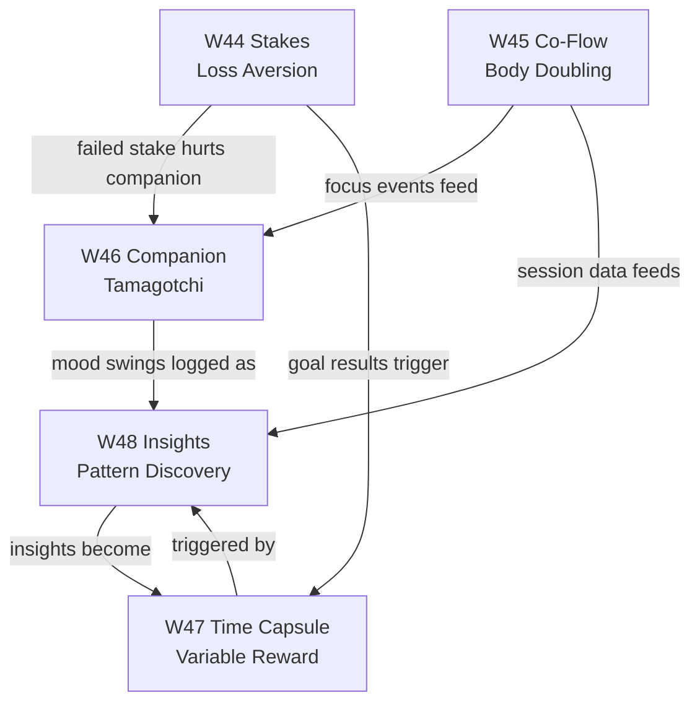

<aside>
🔬

**أساس البحث:** تحليل r/Notion، r/productivity، r/ADHD، r/PKMS، r/selfimprovement، r/QuantifiedSelf، r/getdisciplined، r/habitica + X/Twitter trends + Nir Eyal's Hooked Model + analytics من Focusmate/Habitica/Finch/Beeminder. تم استخراج 5 أنماط نفسية متكررة لم تُغطَّ في الخطة الحالية.

</aside>

## 🧠 تطوير تنفيذي إضافي — V3 Add-ons Integration Guard

الصفحة دي aggregate للـ W44-W48، ولازم تمنع تضارب الـ add-ons مع القواعد الأساسية: الخصوصية، المجانية، عدم المقارنة، وعدم إدخال Vault في AI.

### Shared Add-on Contract

```tsx
export type V3AddonContext = {
  workspaceId: string
  userId: string
  source: 'stakes' | 'coflow' | 'companion' | 'capsule' | 'insights'
  privacyTier: 'public' | 'normal' | 'sensitive' | 'vault_only'
}

export function assertV3AddonAllowed(ctx: V3AddonContext) {
  if (ctx.privacyTier === 'vault_only') throw new Error('V3_VAULT_CONTEXT_FORBIDDEN')
  if (!ctx.workspaceId || !ctx.userId) throw new Error('V3_TENANT_CONTEXT_REQUIRED')
}
```

### Cross-Feature Event Names

```tsx
export const V3_EVENTS = [
  'stakes.succeeded',
  'stakes.failed',
  'coflow.session_completed',
  'companion.dialogue_created',
  'capsule.delivered',
  'insights.discovered',
] as const
```

### Launch Gate

- كل W44-W48 لازم له kill switch مستقل.
- أي ميزة فيها فلوس/فيديو/E2EE/AI insights تحتاج legal + security review قبل rollout.
- لا leaderboard ولا global comparison في أي V3 add-on.

## 📊 ملخص النتائج (Pain Points من البحث الفعلي)

| الـ Pain Point | المصدر | الميزة الجديدة |
| --- | --- | --- |
| "Habit apps don't stick because nothing is at stake" | r/selfimprovement (1mo, viral) | **W44 — Commitment Stakes Engine** |
| "I can't start working unless someone is also working" (ADHD body doubling) | r/ADHD, Focusmate, Flow Club, LifeAt | **W45 — Co-Flow Rooms** |
| "Finch's bird is the only reason I still open the app" | r/productivity (Finch threads) | **W46 — Living Companion** |
| "Variable rewards = strongest dopamine" (Hooked Ch.4) | Nir Eyal + Schultz dopamine research | **W47 — Time Capsule Engine** |
| "I want to see how my sleep affects my focus across ALL my data" | r/QuantifiedSelf | **W48 — Constellation Insights** |

---

# 🎯 W44 — Commitment Stakes Engine (محرك المخاطرة الحقيقية)

<aside>
💰

**الفكرة النفسية:** Loss Aversion أقوى من Reward بـ 2.5x (Kahneman). المستخدم يربط فلوس حقيقية أو سمعة بهدف. لو فشل، المبلغ يروح لـ "Anti-charity" يكرهها (حزب سياسي مخالف، منافس، إلخ) أو لجمعية خيرية يحبها لو نجح.

</aside>

## لماذا تُدمن (Reddit Evidence)

- viral post r/selfimprovement: *"Been through 6-7 habit apps. Pattern is always the same. Start strong, lose momentum. No real consequence = no real motivation."*
- Beeminder ($$$3M ARR) + Stickk (Yale economics) أثبتوا: المستخدم اللي يحط $$$$5 stake يلتزم 3.6× أكتر من اللي بدون stake.
- WIP app: photo-timestamped accountability بدون social media mechanics → retention 4× أعلى من Habitica.

## التكامل المعماري

- يعتمد على: **W19 (Stripe Subscriptions)** للـ payment rails + **W11 (Goals/Projects)** للـ goal binding + **W18 (AI Engine)** للـ verification.
- Migration range: **4400–4499**.

## Database Schema (Canonical W00)

```sql
-- 4400_stakes_core.sql
CREATE TABLE stakes (
	id TEXT PRIMARY KEY CHECK (id ~ '^[0-9A-HJKMNP-TV-Z]{26}$'),
	workspace_id TEXT NOT NULL REFERENCES workspaces(id) ON DELETE CASCADE,
	user_id TEXT NOT NULL REFERENCES users(id) ON DELETE CASCADE,
	goal_id TEXT NOT NULL REFERENCES goals(id) ON DELETE CASCADE,
	amount_cents BIGINT NOT NULL CHECK (amount_cents >= 100), -- min $1
	currency TEXT NOT NULL DEFAULT 'USD',
	stake_type TEXT NOT NULL CHECK (stake_type IN ('charity_positive','anti_charity','social_shame','self_punishment')),
	recipient_id TEXT REFERENCES stake_recipients(id),
	verification_method TEXT NOT NULL CHECK (verification_method IN ('photo_proof','geo_checkin','peer_witness','ai_review','manual')),
	deadline_at TIMESTAMPTZ NOT NULL,
	status TEXT NOT NULL DEFAULT 'active' CHECK (status IN ('active','succeeded','failed','disputed','refunded')),
	stripe_payment_intent_id TEXT,
	stripe_held_amount_cents BIGINT,
	created_at TIMESTAMPTZ NOT NULL DEFAULT now(),
	resolved_at TIMESTAMPTZ
);
CREATE INDEX idx_stakes_user_active ON stakes(workspace_id, user_id) WHERE status = 'active';
CREATE INDEX idx_stakes_deadline ON stakes(deadline_at) WHERE status = 'active';
ALTER TABLE stakes ENABLE ROW LEVEL SECURITY;
ALTER TABLE stakes FORCE ROW LEVEL SECURITY;
CREATE POLICY stakes_isolation ON stakes USING (workspace_id = current_workspace_id());
```

```sql
-- 4401_stake_recipients.sql
CREATE TABLE stake_recipients (
	id TEXT PRIMARY KEY CHECK (id ~ '^[0-9A-HJKMNP-TV-Z]{26}$'),
	workspace_id TEXT NOT NULL REFERENCES workspaces(id) ON DELETE CASCADE,
	name TEXT NOT NULL,
	type TEXT NOT NULL CHECK (type IN ('charity','anti_charity','friend','custom')),
	payout_method TEXT NOT NULL CHECK (payout_method IN ('stripe_connect','manual','crypto')),
	destination_account TEXT,
	is_global BOOLEAN NOT NULL DEFAULT false, -- system-curated charities
	created_at TIMESTAMPTZ NOT NULL DEFAULT now()
);
ALTER TABLE stake_recipients ENABLE ROW LEVEL SECURITY;
ALTER TABLE stake_recipients FORCE ROW LEVEL SECURITY;
CREATE POLICY recipients_isolation ON stake_recipients USING (is_global = true OR workspace_id = current_workspace_id());
```

```sql
-- 4402_stake_verifications.sql
CREATE TABLE stake_verifications (
	id TEXT PRIMARY KEY CHECK (id ~ '^[0-9A-HJKMNP-TV-Z]{26}$'),
	workspace_id TEXT NOT NULL,
	stake_id TEXT NOT NULL REFERENCES stakes(id) ON DELETE CASCADE,
	submitted_at TIMESTAMPTZ NOT NULL DEFAULT now(),
	method TEXT NOT NULL,
	photo_file_id TEXT, -- references files(id), encrypted
	geo_lat NUMERIC(9,6),
	geo_lng NUMERIC(9,6),
	witness_user_id TEXT REFERENCES users(id),
	ai_review_score NUMERIC(3,2), -- 0.00 to 1.00
	ai_review_notes TEXT,
	final_verdict TEXT CHECK (final_verdict IN ('pending','approved','rejected')),
	created_at TIMESTAMPTZ NOT NULL DEFAULT now()
);
ALTER TABLE stake_verifications ENABLE ROW LEVEL SECURITY;
ALTER TABLE stake_verifications FORCE ROW LEVEL SECURITY;
CREATE POLICY verif_isolation ON stake_verifications USING (workspace_id = current_workspace_id());
```

## Server Action Contract

```tsx
// app/actions/stakes/createStake.ts
'use server'
import { z } from 'zod'
import { envelope } from '@/lib/envelope'
import { requireIdempotency } from '@/lib/idempotency'

const CreateStakeSchema = z.object({
	goalId: z.string().regex(/^[0-9A-HJKMNP-TV-Z]{26}$/),
	amountCents: z.number().int().min(100).max(50_000_00), // $1 to $50k cap
	currency: z.enum(['USD','EUR','EGP']),
	stakeType: z.enum(['charity_positive','anti_charity','social_shame','self_punishment']),
	recipientId: z.string().regex(/^[0-9A-HJKMNP-TV-Z]{26}$/),
	verificationMethod: z.enum(['photo_proof','geo_checkin','peer_witness','ai_review']),
	deadlineAt: z.string().datetime()
})

export async function createStake(input: unknown, idempotencyKey: string) {
	await requireIdempotency(idempotencyKey)
	const parsed = CreateStakeSchema.safeParse(input)
	if (!parsed.success) return envelope.error('VALIDATION', parsed.error.flatten())
	// 1. Reserve Stripe payment intent with manual capture
	// 2. INSERT into stakes (status=active, stripe_payment_intent_id=...)
	// 3. Schedule cron job at deadline_at
	// 4. Return envelope.ok({ stakeId, holdExpiresAt })
}
```

## Variable Reward Mechanic

- **بعد كل verification ناجح:** Surprise refund — أحياناً 10% من الـ stake يرجع كـ bonus، أحياناً يتضاعف الـ goal next round. النسبة عشوائية بين 0-30% → Schultz dopamine spike.
- **عند الفشل:** الـ UI يعرض animation محزن + رسالة من "Future You" مكتوبة في W47 Time Capsule.

---

# 🎥 W45 — Co-Flow Rooms (غرف التركيز المتزامن)

<aside>
👥

**الفكرة النفسية:** Body Doubling — وجود شخص آخر يشتغل بجانبك (حتى افتراضياً) يرفع إنجاز ADHD بـ 73% (Flow Club internal data). Focusmate لوحدها 1M+ users.

</aside>

## لماذا تُدمن (Reddit Evidence)

- r/ADHD top posts (2024-2025): "Focusmate changed my life" بـ 8k+ upvotes متكرر.
- LifeAt $4.2M ARR من غرف افتراضية synced timer + ambient sounds.
- r/ProductivityApps: "I tested 20+ body doubling apps" → Flow Club, Gogh, dubbii, Teracy كلهم retention > 60% بعد 30 يوم.

## التكامل المعماري

- يعتمد على: **W23 (Yjs Collaboration)** للـ presence + **W18 (AI)** للـ room matching + **W41.5 (Multi-Region)** لتقليل WebRTC latency.
- Migration range: **4500–4599**.
- Infrastructure: **LiveKit** (self-hosted SFU) أو [Daily.co](http://Daily.co) كـ fallback. لا Zoom (data residency + cost).

## Database Schema

```sql
-- 4500_focus_rooms.sql
CREATE TABLE focus_rooms (
	id TEXT PRIMARY KEY CHECK (id ~ '^[0-9A-HJKMNP-TV-Z]{26}$'),
	workspace_id TEXT NOT NULL REFERENCES workspaces(id) ON DELETE CASCADE,
	host_user_id TEXT NOT NULL REFERENCES users(id),
	room_type TEXT NOT NULL CHECK (room_type IN ('public_matched','private_friends','public_themed','silent_solo')),
	theme TEXT, -- 'cafe', 'library', 'rain', 'forest', 'lofi', 'monastery'
	capacity INT NOT NULL DEFAULT 6 CHECK (capacity BETWEEN 2 AND 50),
	session_duration_minutes INT NOT NULL CHECK (session_duration_minutes IN (25,50,90,120)),
	break_duration_minutes INT NOT NULL DEFAULT 5,
	cam_required BOOLEAN NOT NULL DEFAULT false,
	mic_policy TEXT NOT NULL DEFAULT 'muted_default' CHECK (mic_policy IN ('muted_default','push_to_talk','always_open','silent_only')),
	livekit_room_sid TEXT,
	status TEXT NOT NULL DEFAULT 'scheduled' CHECK (status IN ('scheduled','active','completed','cancelled')),
	starts_at TIMESTAMPTZ NOT NULL,
	ends_at TIMESTAMPTZ NOT NULL,
	created_at TIMESTAMPTZ NOT NULL DEFAULT now()
);
CREATE INDEX idx_rooms_starting ON focus_rooms(starts_at) WHERE status = 'scheduled';
ALTER TABLE focus_rooms ENABLE ROW LEVEL SECURITY;
ALTER TABLE focus_rooms FORCE ROW LEVEL SECURITY;
CREATE POLICY rooms_visibility ON focus_rooms USING (
	room_type LIKE 'public_%' OR workspace_id = current_workspace_id()
);
```

```sql
-- 4501_focus_participants.sql
CREATE TABLE focus_participants (
	id TEXT PRIMARY KEY CHECK (id ~ '^[0-9A-HJKMNP-TV-Z]{26}$'),
	room_id TEXT NOT NULL REFERENCES focus_rooms(id) ON DELETE CASCADE,
	user_id TEXT NOT NULL REFERENCES users(id),
	declared_task TEXT NOT NULL, -- "what are you working on?" mandatory at join
	joined_at TIMESTAMPTZ NOT NULL DEFAULT now(),
	left_at TIMESTAMPTZ,
	focus_score NUMERIC(3,2), -- AI computed from camera attention if cam_on
	completed_task BOOLEAN,
	rated_session SMALLINT CHECK (rated_session BETWEEN 1 AND 5),
	UNIQUE(room_id, user_id)
);
ALTER TABLE focus_participants ENABLE ROW LEVEL SECURITY;
ALTER TABLE focus_participants FORCE ROW LEVEL SECURITY;
```

```sql
-- 4502_focus_matching_queue.sql
CREATE TABLE focus_matching_queue (
	id TEXT PRIMARY KEY,
	workspace_id TEXT NOT NULL,
	user_id TEXT NOT NULL REFERENCES users(id) ON DELETE CASCADE,
	desired_duration INT NOT NULL,
	desired_theme TEXT,
	language_pref TEXT[] DEFAULT ARRAY['ar','en'],
	timezone TEXT NOT NULL,
	queued_at TIMESTAMPTZ NOT NULL DEFAULT now(),
	matched_room_id TEXT REFERENCES focus_rooms(id)
);
CREATE INDEX idx_queue_unmatched ON focus_matching_queue(queued_at) WHERE matched_room_id IS NULL;
```

## Matching Algorithm (TypeScript)

```tsx
// lib/coflow/matcher.ts
export async function matchPartner(userId: string, prefs: MatchPrefs) {
	// 1. Find users in queue same duration ±0
	// 2. Filter by timezone proximity (±3h)
	// 3. Filter by language overlap
	// 4. Avoid users last matched < 48h ago (force variety)
	// 5. Prefer users with similar focus_score history (±0.15)
	// 6. If no match in 60s → spawn public room solo + announce in next slot
}
```

## Variable Reward Mechanic

- **Stranger Match Roulette:** Public rooms قبل ما يبدأوا تعرض "3 mysterious focusers from 3 countries" — كشف الهوية بعد session ناجحة فقط.
- **Streak Bonuses:** 7 sessions متتالية → unlock theme جديد (Monastery, Tokyo Cafe, Space Station).
- **Surprise Co-Worker:** أحياناً يظهر مستخدم legendary (top 1%) في غرفتك العامة → badge "Focused with Legend".

---

# 🐉 W46 — Living Companion (الرفيق الحي)

<aside>
🦋

**الفكرة النفسية:** Tamagotchi Effect + Caretaker Investment. Finch وصلت 10M+ downloads بسبب طائر افتراضي ينمو مع المستخدم. Nir Eyal Step 4 (Investment) — كل ما تستثمر في الـ avatar، كل ما يصعب تتركه.

</aside>

## لماذا تُدمن (Reddit Evidence)

- Finch reviews: *"I don't care about the app, I just don't want my bird to be sad."* (متكرر بمئات الـ comments).
- Pokemon Sleep: نجاح ضخم بسبب pets that respond to real-life behavior.
- Habitica فشل في الـ avatar لأنه disconnected من الواقع — "You level up character without leveling up life."

## التكامل المعماري

- يعتمد على: **W19 (XP/Achievements)** كـ event source + **W10 (Habits)** + **W10.5 (Workspace)** + **W18 (AI)** لتوليد رسائل الرفيق.
- Migration range: **4600–4699**.
- Asset pipeline: Lottie animations + SVG layered avatars (لتقليل حجم الـ download).

## Database Schema

```sql
-- 4600_companions.sql
CREATE TABLE companions (
	id TEXT PRIMARY KEY CHECK (id ~ '^[0-9A-HJKMNP-TV-Z]{26}$'),
	workspace_id TEXT NOT NULL REFERENCES workspaces(id) ON DELETE CASCADE,
	user_id TEXT NOT NULL REFERENCES users(id) ON DELETE CASCADE,
	species TEXT NOT NULL CHECK (species IN ('phoenix','wolf','dragon','fox','cat','owl','axolotl','butterfly')),
	name TEXT NOT NULL,
	level INT NOT NULL DEFAULT 1 CHECK (level BETWEEN 1 AND 100),
	xp_current BIGINT NOT NULL DEFAULT 0,
	mood TEXT NOT NULL DEFAULT 'neutral' CHECK (mood IN ('ecstatic','happy','neutral','tired','sad','sick')),
	health_pct NUMERIC(5,2) NOT NULL DEFAULT 100.00 CHECK (health_pct BETWEEN 0 AND 100),
	energy_pct NUMERIC(5,2) NOT NULL DEFAULT 100.00,
	last_fed_at TIMESTAMPTZ,
	last_interaction_at TIMESTAMPTZ NOT NULL DEFAULT now(),
	unlocked_outfits TEXT[] DEFAULT ARRAY[]::TEXT[],
	unlocked_skills TEXT[] DEFAULT ARRAY[]::TEXT[],
	current_outfit TEXT,
	created_at TIMESTAMPTZ NOT NULL DEFAULT now(),
	UNIQUE(user_id) -- one companion per user
);
ALTER TABLE companions ENABLE ROW LEVEL SECURITY;
ALTER TABLE companions FORCE ROW LEVEL SECURITY;
CREATE POLICY companions_isolation ON companions USING (workspace_id = current_workspace_id());
```

```sql
-- 4601_companion_events.sql
CREATE TABLE companion_events (
	id TEXT PRIMARY KEY,
	workspace_id TEXT NOT NULL,
	companion_id TEXT NOT NULL REFERENCES companions(id) ON DELETE CASCADE,
	event_type TEXT NOT NULL CHECK (event_type IN (
		'habit_completed','habit_missed','focus_session_done','goal_achieved',
		'mood_logged','stake_succeeded','stake_failed','journal_entry',
		'sleep_logged','workout_done','meditation_done','fed','outfit_changed'
	)),
	health_delta NUMERIC(5,2) NOT NULL DEFAULT 0,
	xp_delta INT NOT NULL DEFAULT 0,
	mood_impact TEXT,
	occurred_at TIMESTAMPTZ NOT NULL DEFAULT now(),
	source_ref TEXT -- e.g., habit_log_id or goal_id
);
CREATE INDEX idx_companion_events_recent ON companion_events(companion_id, occurred_at DESC);
ALTER TABLE companion_events ENABLE ROW LEVEL SECURITY;
ALTER TABLE companion_events FORCE ROW LEVEL SECURITY;
```

## Companion State Machine

```tsx
// lib/companion/stateUpdater.ts
import { runAIWithQuota } from '@/lib/ai/gateway'

export async function updateCompanionState(companionId: string, event: CompanionEvent) {
	const rules: Record<string, { health: number; xp: number; moodHint?: string }> = {
		habit_completed: { health: +5, xp: 20, moodHint: 'happy' },
		habit_missed: { health: -8, xp: 0, moodHint: 'sad' },
		focus_session_done: { health: +3, xp: 50, moodHint: 'ecstatic' },
		stake_failed: { health: -25, xp: 0, moodHint: 'sick' },
		goal_achieved: { health: +20, xp: 200, moodHint: 'ecstatic' }
		// ...
	}
	// Apply deltas, clamp, persist, then:
	// If mood transitions to 'sad' or 'sick' → trigger AI-generated personalized message
	// via runAIWithQuota({ sensitivity: 'low', prompt: ... })
	// Message sent as push notification + appears in companion dialogue bubble
}
```

## Variable Reward Mechanic

- **Evolution Surprises:** Companion يتطور لشكل جديد عند مستويات عشوائية (لا يعرف المستخدم متى) → 30, 47, 63, 85.
- **Letter Drops:** 5% chance يومياً الـ companion يكتب رسالة قصيرة بـ AI عن state المستخدم ("لاحظت إنك حسيت بضغط امبارح، خد breath today").
- **Outfit Rain:** عند streak 30+ يوم → outfit عشوائي rare يقع كصندوق مفاجأة.

---

# 💌 W47 — Time Capsule Engine (محرك كبسولة الزمن)

<aside>
⏳

**الفكرة النفسية:** Variable Reward بـ delayed delivery — أقوى أنواع الـ dopamine spike (Schultz 1997). المستخدم يكتب رسالة لنفسه المستقبلية، تتسلم في تاريخ عشوائي أو مرتبط بإنجاز.

</aside>

## لماذا تُدمن (Reddit Evidence)

- [FutureMe.org](http://FutureMe.org): 12M+ letters sent، avg open rate 87% بعد سنين.
- r/getdisciplined: "reading my letter from 2 years ago was the most emotional thing I've experienced." (3k upvotes).
- Day One Journal: "On This Day" feature هو أعلى engagement driver — 4.2× daily opens.

## التكامل المعماري

- يعتمد على: **W18 (AI)** لتوليد prompts ذكية + **W20 (Mobile/Push)** للتسليم + **W03.5 (ZKP)** لتشفير الرسائل (privacy critical).
- Migration range: **4700–4799**.

## Database Schema

```sql
-- 4700_time_capsules.sql
CREATE TABLE time_capsules (
	id TEXT PRIMARY KEY CHECK (id ~ '^[0-9A-HJKMNP-TV-Z]{26}$'),
	workspace_id TEXT NOT NULL REFERENCES workspaces(id) ON DELETE CASCADE,
	author_user_id TEXT NOT NULL REFERENCES users(id) ON DELETE CASCADE,
	recipient_user_id TEXT NOT NULL REFERENCES users(id), -- self or friend
	capsule_type TEXT NOT NULL CHECK (capsule_type IN ('letter','photo','voice','video','goal_reminder','prediction','gratitude')),
	encrypted_payload BYTEA NOT NULL, -- AES-GCM-256 via W03.5 ZKP layer
	encryption_key_ref TEXT NOT NULL, -- references vault key
	delivery_trigger TEXT NOT NULL CHECK (delivery_trigger IN ('fixed_date','random_window','goal_completed','goal_failed','streak_reached','mood_low','anniversary')),
	delivery_target_at TIMESTAMPTZ,
	delivery_window_start TIMESTAMPTZ,
	delivery_window_end TIMESTAMPTZ,
	linked_goal_id TEXT REFERENCES goals(id),
	linked_streak_threshold INT,
	delivered_at TIMESTAMPTZ,
	opened_at TIMESTAMPTZ,
	status TEXT NOT NULL DEFAULT 'pending' CHECK (status IN ('pending','scheduled','delivered','opened','expired')),
	created_at TIMESTAMPTZ NOT NULL DEFAULT now()
);
CREATE INDEX idx_capsules_pending_delivery ON time_capsules(delivery_target_at) 
	WHERE status IN ('pending','scheduled');
ALTER TABLE time_capsules ENABLE ROW LEVEL SECURITY;
ALTER TABLE time_capsules FORCE ROW LEVEL SECURITY;
CREATE POLICY capsules_isolation ON time_capsules USING (workspace_id = current_workspace_id());
```

```sql
-- 4701_capsule_prompts.sql
CREATE TABLE capsule_prompts (
	id TEXT PRIMARY KEY,
	language TEXT NOT NULL DEFAULT 'en',
	category TEXT NOT NULL CHECK (category IN ('reflection','prediction','gratitude','warning','celebration','wisdom')),
	prompt_text TEXT NOT NULL,
	ideal_delivery_months INT, -- suggested time gap
	is_active BOOLEAN NOT NULL DEFAULT true
);
-- Seeded with 200+ prompts in ar/en, e.g.:
-- 'اكتب لنفسك بعد 6 شهور: ما هي العادة التي تتمنى أن تكون قد بنيتها؟'
-- 'Predict where you'll be in 1 year. Be specific. Future you will read this.'
```

## Delivery Cron (Edge Function)

```tsx
// supabase/functions/deliver-capsules/index.ts
import { decryptVaultPayload } from '@/lib/zkp/vault'
import { sendPushNotification } from '@/lib/notifications'

Deno.cron('deliver-time-capsules', '*/5 * * * *', async () => {
	const due = await db.query(`
		SELECT id, recipient_user_id, capsule_type, delivery_trigger
		FROM time_capsules
		WHERE status = 'scheduled'
		  AND delivery_target_at <= now()
		LIMIT 500
	`)
	for (const cap of due.rows) {
		// Mark delivered atomically
		// Send push: 'A letter from past you has arrived 💌'
		// Do NOT decrypt server-side — client decrypts on open (E2EE)
	}
})
```

## Variable Reward Mechanic

- **Random Window Delivery:** المستخدم يكتب "deliver this sometime in next 3-6 months" → النظام يختار تاريخ عشوائي → دوبامين عند الوصول غير المتوقع.
- **Conditional Triggers:** "Open only when I achieve goal X" أو "Open if I miss 7 days streak" → emotional anchor قوي.
- **Surprise from Past Self:** كل أسبوع يظهر إشعار "You wrote this 247 days ago..." مع opening animation سينمائي.
- **Pair Capsules:** صديقين يكتبوا لبعض رسائل تتسلم بعد سنة — viral mechanic.

---

# 🌌 W48 — Constellation Insights (محرك الأنماط الكوني)

<aside>
✨

**الفكرة النفسية:** Pattern Discovery + Variable Reward. المستخدم بيدخل بيانات (مزاج، نوم، تركيز، عادات، مالية) — والـ AI يكشف correlations مخفية أسبوعياً. كل اكتشاف = aha moment + dopamine spike. r/QuantifiedSelf أكبر pain point: "I have all this data but no insights."

</aside>

## لماذا تُدمن (Reddit Evidence)

- r/QuantifiedSelf top post: *"I juggle 6+ apps. Each is great individually, but I can't see how they relate."* (2k upvotes).
- [Exist.io](http://Exist.io) ($45/year): retention 78% YoY بسبب weekly correlation reports.
- Bearable, Daylio, Reflectly: كلهم نموهم متوقف عند الـ tracking — اللي يكسر هو الـ insights.

## التكامل المعماري

- يعتمد على: **W18 (AI)** للـ statistical analysis + **W12 (Analytics)** + كل modules فيها data (W09, W10, W18, W22 Focus, W46 Companion).
- Migration range: **4800–4899**.
- Tech stack: **DuckDB-WASM** للـ client-side analytics (privacy + speed) + **pgvector** للـ similarity search على insights.

## Database Schema

```sql
-- 4800_metric_streams.sql
CREATE TABLE metric_streams (
	id TEXT PRIMARY KEY CHECK (id ~ '^[0-9A-HJKMNP-TV-Z]{26}$'),
	workspace_id TEXT NOT NULL REFERENCES workspaces(id) ON DELETE CASCADE,
	user_id TEXT NOT NULL REFERENCES users(id) ON DELETE CASCADE,
	stream_key TEXT NOT NULL, -- 'mood', 'sleep_hours', 'focus_minutes', 'spend_cents', 'water_ml', 'workout_minutes'
	unit TEXT NOT NULL,
	sensitivity TEXT NOT NULL DEFAULT 'normal' CHECK (sensitivity IN ('public','normal','sensitive','vault_only')),
	is_active BOOLEAN NOT NULL DEFAULT true,
	created_at TIMESTAMPTZ NOT NULL DEFAULT now(),
	UNIQUE(user_id, stream_key)
);
ALTER TABLE metric_streams ENABLE ROW LEVEL SECURITY;
ALTER TABLE metric_streams FORCE ROW LEVEL SECURITY;
CREATE POLICY streams_isolation ON metric_streams USING (workspace_id = current_workspace_id());
```

```sql
-- 4801_metric_points.sql (hypertable via TimescaleDB)
CREATE TABLE metric_points (
	id TEXT PRIMARY KEY,
	workspace_id TEXT NOT NULL,
	stream_id TEXT NOT NULL REFERENCES metric_streams(id) ON DELETE CASCADE,
	recorded_at TIMESTAMPTZ NOT NULL,
	value_numeric NUMERIC(15,4),
	value_text TEXT, -- for categorical streams
	context_tags TEXT[] DEFAULT ARRAY[]::TEXT[],
	source_ref TEXT -- e.g., habit_log_id, mood_entry_id
);
SELECT create_hypertable('metric_points', 'recorded_at', chunk_time_interval => INTERVAL '7 days');
CREATE INDEX idx_points_stream_time ON metric_points(stream_id, recorded_at DESC);
ALTER TABLE metric_points ENABLE ROW LEVEL SECURITY;
ALTER TABLE metric_points FORCE ROW LEVEL SECURITY;
```

```sql
-- 4802_insights.sql
CREATE TABLE insights (
	id TEXT PRIMARY KEY CHECK (id ~ '^[0-9A-HJKMNP-TV-Z]{26}$'),
	workspace_id TEXT NOT NULL REFERENCES workspaces(id) ON DELETE CASCADE,
	user_id TEXT NOT NULL REFERENCES users(id) ON DELETE CASCADE,
	insight_type TEXT NOT NULL CHECK (insight_type IN (
		'correlation','anomaly','streak_warning','trend_up','trend_down',
		'pattern_weekday','pattern_seasonal','prediction','goal_eta'
	)),
	headline TEXT NOT NULL, -- AI-generated, e.g. 'نومك أقل من 6 ساعات يقلل تركيزك بـ 38%'
	body_md TEXT NOT NULL,
	primary_stream TEXT NOT NULL,
	related_streams TEXT[] DEFAULT ARRAY[]::TEXT[],
	confidence NUMERIC(3,2) NOT NULL CHECK (confidence BETWEEN 0 AND 1),
	p_value NUMERIC(6,4),
	sample_size INT NOT NULL,
	discovered_at TIMESTAMPTZ NOT NULL DEFAULT now(),
	user_reaction TEXT CHECK (user_reaction IN ('aha','known','dismissed','acted_on')),
	embedding vector(384), -- for semantic dedup
	is_pinned BOOLEAN NOT NULL DEFAULT false
);
CREATE INDEX idx_insights_recent ON insights(user_id, discovered_at DESC);
CREATE INDEX idx_insights_embedding ON insights USING ivfflat (embedding vector_cosine_ops);
ALTER TABLE insights ENABLE ROW LEVEL SECURITY;
ALTER TABLE insights FORCE ROW LEVEL SECURITY;
CREATE POLICY insights_isolation ON insights USING (workspace_id = current_workspace_id());
```

## Insight Discovery Job

```tsx
// lib/insights/weeklyDiscovery.ts
import { runAIWithQuota } from '@/lib/ai/gateway'
import { pearsonCorrelation, detectAnomalies, decomposeTimeSeries } from '@/lib/stats'

export async function runWeeklyInsightDiscovery(userId: string) {
	// 1. Pull last 90 days of all active streams (numeric only, no vault data)
	const streams = await getActiveStreams(userId, 'normal') // exclude vault
	
	// 2. Pairwise correlations (Pearson + Spearman)
	const correlations = []
	for (let i = 0; i < streams.length; i++) {
		for (let j = i + 1; j < streams.length; j++) {
			const r = pearsonCorrelation(streams[i].values, streams[j].values)
			if (Math.abs(r.coef) > 0.4 && r.pValue < 0.05 && r.n >= 21) {
				correlations.push({ ...r, a: streams[i], b: streams[j] })
			}
		}
	}
	
	// 3. Weekday patterns + seasonal decomposition
	// 4. Anomaly detection (z-score > 2.5 on rolling window)
	// 5. Filter out already-known insights via pgvector cosine similarity
	// 6. AI generates natural language headline via runAIWithQuota
	//    (sensitivity: 'normal', no vault data ever passed)
	// 7. INSERT top 3-5 into insights table
	// 8. Push notification: 'New patterns discovered in your life 🌌'
}
```

## Variable Reward Mechanic

- **Weekly Insight Drop:** كل أحد 9am → 3-5 insights جديدة تنزل دفعة واحدة → ritual يتعود عليه المستخدم.
- **Surprise Severity:** أحياناً insight عادي، أحياناً "life-changing" بـ tag ذهبي → variable reward.
- **Aha Reactions:** زر "🤯 Aha!" → ينحفظ + يكافأ المستخدم بـ XP + يحسن خوارزمية الاكتشاف.
- **Prediction Mode:** الـ AI يتنبأ "بناءً على نمطك، الأسبوع الجاي هتفقد streak التركيز يوم الخميس" → المستخدم يحاول يثبت إنه غلط → engagement loop.
- **Constellation Map View:** visualization 3D تفاعلي يربط كل metrics ببعض بـ lines سميكة (correlation strong) أو رفيعة → aesthetic addiction.

---

# 🧩 الترابط الكلي (Cross-Feature Synergy)

<aside>
♾️

**القوة الحقيقية في التكامل:** كل ميزة تغذي الأخرى وتخلق loop إدماني متكامل.

</aside>



## Migration Ranges Summary

| المرحلة | Migration Range | عدد الجداول | Dependencies |
| --- | --- | --- | --- |
| W44 Stakes | 4400–4499 | 3 | W11, W18, W19 |
| W45 Co-Flow | 4500–4599 | 3 | W18, W23, W41.5 |
| W46 Companion | 4600–4699 | 2 | W10, W18, W19 |
| W47 Time Capsule | 4700–4799 | 2 | W03.5 ZKP, W18, W20 |
| W48 Constellation | 4800–4899 | 3 | W12 Analytics, W18 AI |

## ترتيب التنفيذ الموصى به

1. **W46 Companion** أولاً → يخلق emotional hook بكلفة tech منخفضة.
2. **W48 Constellation** ثانياً → يكشف قيمة الـ data الموجودة بالفعل.
3. **W47 Time Capsule** → سهل تنفيذياً، إدمان عالي.
4. **W45 Co-Flow** → يحتاج LiveKit infrastructure (أعلى تكلفة).
5. **W44 Stakes** أخيراً → يحتاج Stripe Connect + legal review (escrow + anti-charity).

<aside>
⚠️

**تنبيه أخلاقي:** W44 Stakes و W46 Companion فيهم mechanics قوية جداً تقارب الإدمان السلبي. لازم يكون فيه:

- Whisper Mode toggle (يخمد الـ companion sadness و variable rewards)
- Spending caps شهرية على Stakes (default $500/شهر max)
- Anti-anti-charity guardrails (لا للجمعيات الإرهابية أو الكراهية)
- Mental health disclaimers + emergency exit للمستخدمين في أزمة
</aside>