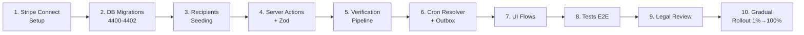
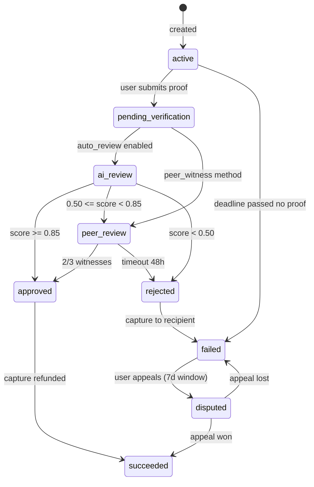
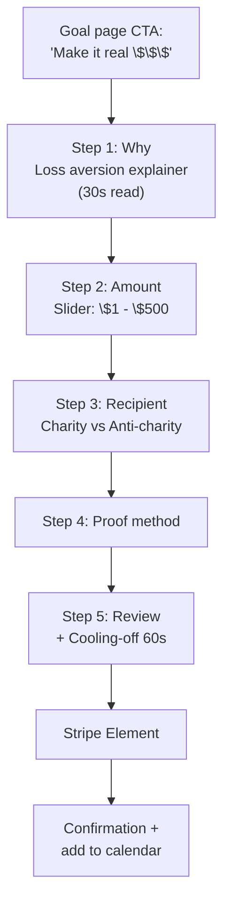
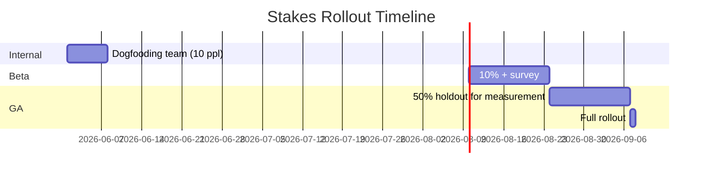

<aside>
📐

**هدف هذا الدليل:** خريطة بناء كاملة من 0 إلى Production لمحرك الـ Stakes، مع كل decision tree وأخطاء شائعة وحلولها وquality gates لكل step.

</aside>

## 🧠 تطوير تنفيذي إضافي — Stakes Compliance Runtime Pack

محرك الـ Stakes يتعامل مع أموال حقيقية، لذلك أي خطوة بدون audit/idempotency/legal gate تعتبر blocker.

### Payment State Lock

```tsx
export async function transitionStake(stakeId: string, from: StakeStatus, to: StakeStatus, ctx: SystemContext) {
  return db.tx(async (tx) => {
    const row = await tx.one(`SELECT * FROM stakes WHERE id=$1 FOR UPDATE`, [stakeId])
    if (row.status !== from) throw new Error(`STAKE_BAD_STATE:${row.status}`)
    await tx.none(`UPDATE stakes SET status=$2, resolved_at=CASE WHEN $2 IN ('succeeded','failed') THEN now() ELSE resolved_at END WHERE id=$1`, [stakeId, to])
    await tx.none(`INSERT INTO stake_audit_log(id, workspace_id, stake_id, actor_type, action, prev_status, new_status)
      VALUES($1,$2,$3,$4,$5,$6,$7)`,
      [ulid(), row.workspace_id, stakeId, ctx.actorType, `stake.${to}`, from, to])
    return { ok: true }
  })
}
```

### Legal Kill Switch

```tsx
export function assertStakesJurisdictionAllowed(countryCode: string) {
  const allowed = ['US','GB','DE','FR','EG','SA']
  if (!allowed.includes(countryCode)) throw new Error('STAKES_JURISDICTION_DISABLED')
}
```

### Required Reviews

- Legal review قبل manual capture.
- OFAC/sanctions screening للـ recipients.
- Chargeback runbook قبل rollout 1%.

# 🗺️ الخريطة التنفيذية الكلية



**المدة المتوقعة:** 4 sprints × أسبوعين = شهرين كاملين. لا تختصر.

---

# المرحلة 1️⃣ — إعداد Stripe Connect (قبل أي كود)

<aside>
⚠️

**أكبر خطأ:** الناس تبدأ كود قبل ما يحلوا الـ legal/Stripe. النتيجة: rewrite كامل بعد شهر.

</aside>

## Checklist مسبق

- [ ]  فتح Stripe Connect account (Standard + Express معاً)
- [ ]  الحصول على **Money Services Business (MSB)** licence لو الـ holding period > 7 أيام (FinCEN رقم 31 CFR 1010)
- [ ]  مراجعة قوانين الـ Escrow في:
    - USA: state-by-state (NY و CA الأصعب)
    - EU: PSD2 + e-money licence
    - مصر/SA: لازم local payment partner (Paymob/HyperPay)
- [ ]  صياغة **Terms of Service** خاصة بالـ Stakes (محامي متخصص)
- [ ]  **Anti-Charity allowlist** — لا للجمعيات الإرهابية/الكراهية (OFAC + EU sanctions list check)

## Stripe Configuration

```tsx
// lib/payments/stripe-config.ts
import Stripe from 'stripe'

export const stripe = new Stripe(process.env.STRIPE_SECRET_KEY!, {
	apiVersion: '2024-11-20.acacia',
	typescript: true,
	maxNetworkRetries: 3,
	timeout: 20_000,
	telemetry: false // privacy
})

// CRITICAL: استخدم manual capture دائماً للـ stakes
export const STAKE_PAYMENT_INTENT_DEFAULTS = {
	capture_method: 'manual' as const, // hold بدون charge
	confirmation_method: 'automatic' as const,
	setup_future_usage: undefined,
	statement_descriptor_suffix: 'STAKE'
} as const
```

**Quality Gate 1.1:** قبل ما تنتقل للـ migrations، لازم تكون عملت test transaction كامل في Stripe test mode (auth → capture → refund).

---

# المرحلة 2️⃣ — Database Migrations (بالترتيب الدقيق)

## ترتيب التنفيذ (CRITICAL — لا تبدّل)

1. `4400_stakes_core.sql` — الجدول الأم
2. `4401_stake_recipients.sql` — قبل ما نقدر نـ FK من stakes
3. `4402_stake_verifications.sql` — يعتمد على stakes
4. `4403_stake_audit_log.sql` — للـ compliance (مذكور تحت)
5. `4404_stake_seed_charities.sql` — seed data

## إضافة Audit Log (لم تُذكر في الخطة الأصلية — لازمة)

```sql
-- 4403_stake_audit_log.sql
CREATE TABLE stake_audit_log (
	id TEXT PRIMARY KEY CHECK (id ~ '^[0-9A-HJKMNP-TV-Z]{26}$'),
	workspace_id TEXT NOT NULL,
	stake_id TEXT NOT NULL REFERENCES stakes(id),
	actor_user_id TEXT REFERENCES users(id),
	actor_type TEXT NOT NULL CHECK (actor_type IN ('user','system','admin','stripe_webhook')),
	action TEXT NOT NULL CHECK (action IN (
		'created','funded','verification_submitted','verification_approved',
		'verification_rejected','captured','refunded','disputed','resolved'
	)),
	prev_status TEXT,
	new_status TEXT,
	amount_cents_delta BIGINT,
	reason TEXT,
	ipython_hash TEXT, -- hashed IP for fraud
	user_agent TEXT,
	created_at TIMESTAMPTZ NOT NULL DEFAULT now()
);
CREATE INDEX idx_audit_stake ON stake_audit_log(stake_id, created_at DESC);
ALTER TABLE stake_audit_log ENABLE ROW LEVEL SECURITY;
ALTER TABLE stake_audit_log FORCE ROW LEVEL SECURITY;
-- Read-only after insert (immutability via trigger)
CREATE OR REPLACE FUNCTION prevent_audit_mutation() RETURNS trigger AS $$
BEGIN RAISE EXCEPTION 'Audit log is append-only'; END;
$$ LANGUAGE plpgsql;
CREATE TRIGGER no_update_audit BEFORE UPDATE OR DELETE ON stake_audit_log
FOR EACH ROW EXECUTE FUNCTION prevent_audit_mutation();
```

## Idempotency Table (ضرورية للـ Stripe webhooks)

```sql
-- 4405_stake_idempotency.sql
CREATE TABLE stake_idempotency_keys (
	key TEXT PRIMARY KEY,
	workspace_id TEXT NOT NULL,
	operation TEXT NOT NULL,
	request_hash TEXT NOT NULL,
	response_envelope JSONB NOT NULL,
	created_at TIMESTAMPTZ NOT NULL DEFAULT now(),
	expires_at TIMESTAMPTZ NOT NULL DEFAULT (now() + INTERVAL '24 hours')
);
CREATE INDEX idx_idempotency_expiry ON stake_idempotency_keys(expires_at);
-- Cleanup job daily
```

**Quality Gate 2.1:** شغّل `EXPLAIN ANALYZE` على query الـ active stakes filter — لازم يستخدم index ويكون < 5ms.

**Quality Gate 2.2:** ابدأ test على RLS:

```sql
SET LOCAL app.current_workspace_id = 'WORKSPACE_A';
SELECT count(*) FROM stakes; -- يجب يرجّع stakes WORKSPACE_A فقط
SET LOCAL app.current_workspace_id = 'WORKSPACE_B';
SELECT count(*) FROM stakes; -- مختلف تماماً
```

---

# المرحلة 3️⃣ — Server Action مع Defense in Depth

## Layered Validation Pattern

```tsx
// app/actions/stakes/createStake.ts
'use server'
import { z } from 'zod'
import { envelope, type Envelope } from '@/lib/envelope'
import { requireIdempotency, persistIdempotencyResult } from '@/lib/idempotency'
import { rateLimit } from '@/lib/ratelimit'
import { authenticatedUser } from '@/lib/auth'
import { db } from '@/lib/db'
import { stripe, STAKE_PAYMENT_INTENT_DEFAULTS } from '@/lib/payments/stripe-config'
import { auditLog } from '@/lib/stakes/audit'
import { ulid } from '@/lib/ulid'
import { detectFraud } from '@/lib/fraud'

// Layer 1: Schema validation
const CreateStakeSchema = z.object({
	goalId: z.string().regex(/^[0-9A-HJKMNP-TV-Z]{26}$/),
	amountCents: z.number().int().min(100).max(50_000_00),
	currency: z.enum(['USD','EUR','EGP']),
	stakeType: z.enum(['charity_positive','anti_charity','social_shame','self_punishment']),
	recipientId: z.string().regex(/^[0-9A-HJKMNP-TV-Z]{26}$/),
	verificationMethod: z.enum(['photo_proof','geo_checkin','peer_witness','ai_review']),
	deadlineAt: z.string().datetime().refine(
		(d) => new Date(d) > new Date(Date.now() + 60_000),
		'deadline must be at least 1 minute in future'
	).refine(
		(d) => new Date(d) < new Date(Date.now() + 365 * 24 * 3600_000),
		'deadline cannot be more than 1 year out'
	)
})

export async function createStake(
	input: unknown,
	idempotencyKey: string
): Promise<Envelope<{ stakeId: string; clientSecret: string }>> {
	// Layer 2: Auth
	const user = await authenticatedUser()
	if (!user) return envelope.error('UNAUTHENTICATED')
	
	// Layer 3: Rate limit (max 10 stakes/hour per user)
	const rl = await rateLimit(`stakes:create:${user.id}`, { max: 10, window: '1h' })
	if (!rl.allowed) return envelope.error('RATE_LIMITED', { retryAfter: rl.retryAfter })
	
	// Layer 4: Idempotency
	const cached = await requireIdempotency(idempotencyKey, input)
	if (cached) return cached as Envelope<any>
	
	// Layer 5: Schema
	const parsed = CreateStakeSchema.safeParse(input)
	if (!parsed.success) return envelope.error('VALIDATION', parsed.error.flatten())
	
	// Layer 6: Business rules
	const monthlySpend = await db.queryFirst(
		`SELECT COALESCE(SUM(amount_cents),0)::bigint AS total
		 FROM stakes
		 WHERE user_id = $1 
		   AND created_at > now() - INTERVAL '30 days'
		   AND status NOT IN ('refunded')`,
		[user.id]
	)
	const userCapCents = await getUserStakeCapCents(user.id) // default $500
	if (monthlySpend.total + parsed.data.amountCents > userCapCents) {
		return envelope.error('STAKE_CAP_EXCEEDED', { capCents: userCapCents, currentCents: monthlySpend.total })
	}
	
	// Layer 7: Fraud check
	const fraudScore = await detectFraud({ userId: user.id, amountCents: parsed.data.amountCents })
	if (fraudScore > 0.7) return envelope.error('REVIEW_REQUIRED')
	
	// Layer 8: Atomic transaction
	const stakeId = ulid()
	const result = await db.transaction(async (tx) => {
		const pi = await stripe.paymentIntents.create({
			amount: parsed.data.amountCents,
			currency: parsed.data.currency.toLowerCase(),
			customer: user.stripeCustomerId,
			...STAKE_PAYMENT_INTENT_DEFAULTS,
			metadata: { stakeId, userId: user.id, workspaceId: user.workspaceId }
		}, { idempotencyKey: `stake-pi-${stakeId}` })
		
		await tx.execute(
			`INSERT INTO stakes(id, workspace_id, user_id, goal_id, amount_cents, currency, 
			  stake_type, recipient_id, verification_method, deadline_at, status, 
			  stripe_payment_intent_id, stripe_held_amount_cents)
			 VALUES($1,$2,$3,$4,$5,$6,$7,$8,$9,$10,'active',$11,$5)`,
			[stakeId, user.workspaceId, user.id, parsed.data.goalId, parsed.data.amountCents,
			 parsed.data.currency, parsed.data.stakeType, parsed.data.recipientId, 
			 parsed.data.verificationMethod, parsed.data.deadlineAt, pi.id]
		)
		await auditLog(tx, { stakeId, action: 'created', actorUserId: user.id, newStatus: 'active' })
		return { stakeId, clientSecret: pi.client_secret! }
	})
	
	const response = envelope.ok(result)
	await persistIdempotencyResult(idempotencyKey, response)
	return response
}
```

## ✅ Quality Gates للـ Server Action

| Gate | Check | Tool |
| --- | --- | --- |
| 3.1 | كل error path له envelope.error مع code محدد | ESLint rule custom |
| 3.2 | كل DB write داخل transaction | Code review + grep |
| 3.3 | Idempotency key مطلوب على كل mutation | OpenAPI spec validation |
| 3.4 | Stripe call له idempotencyKey منفصل | Unit test |
| 3.5 | RLS مفعّل + tested بـ workspace switching | Integration test |
| 3.6 | Fraud score يفحص قبل الـ DB insert | E2E test |

---

# المرحلة 4️⃣ — Verification Pipeline (الأصعب)

## State Machine



## AI Verification (عبر W18.5 Gateway)

```tsx
// lib/stakes/verifyWithAI.ts
import { runAIWithQuota } from '@/lib/ai/gateway' // W18.5
import { z } from 'zod'

const VerificationResultSchema = z.object({
	score: z.number().min(0).max(1),
	reasoning: z.string().max(500),
	detected_objects: z.array(z.string()),
	timestamp_visible: z.boolean(),
	location_match: z.boolean().optional()
})

export async function verifyStakeProof(stakeId: string, photoUrl: string, goalDescription: string) {
	// CRITICAL: لا تمرر vault data أو PII
	const result = await runAIWithQuota({
		sensitivity: 'normal',
		workspaceId: ctx.workspaceId,
		userId: ctx.userId,
		model: 'vision-fast',
		operation: 'stake_verification',
		prompt: `Analyze this photo as proof of completion for: "${goalDescription}". 
		        Return JSON only.`,
		input: { imageUrl: photoUrl },
		responseSchema: VerificationResultSchema,
		timeout: 15_000,
		maxRetries: 2
	})
	if (!result.ok) {
		// Fallback to manual review queue
		await enqueueManualReview(stakeId, 'ai_unavailable')
		return { method: 'manual', score: null }
	}
	return result.data
}
```

## Failure Modes & Recovery

| Failure | Detection | Recovery |
| --- | --- | --- |
| Stripe webhook lost | Stake stays in `active` past deadline | Reconciliation cron every 1h queries Stripe directly |
| AI service timeout | Verification stuck > 5min | Auto-escalate to peer review |
| Charity payout fails | Webhook `transfer.failed` | Hold in `pending_payout` table, retry exponentially 24h/48h/72h, then alert ops |
| User chargeback | Stripe `charge.disputed` | Auto-freeze user account + flag for fraud review |
| Concurrent verification submits | Race on UPDATE | SELECT ... FOR UPDATE + advisory lock per stake_id |

---

# المرحلة 5️⃣ — Cron Resolver + Outbox Pattern

```tsx
// lib/stakes/resolver.ts
import { db } from '@/lib/db'
import { stripe } from '@/lib/payments/stripe-config'
import { publishEvent } from '@/lib/outbox' // W00 outbox

export async function resolveExpiredStakes() {
	// CRITICAL: استخدم SKIP LOCKED للـ concurrent workers
	const batch = await db.query(`
		SELECT id, stripe_payment_intent_id, amount_cents, recipient_id, stake_type, user_id, workspace_id
		FROM stakes
		WHERE status = 'active'
		  AND deadline_at <= now()
		ORDER BY deadline_at ASC
		LIMIT 50
		FOR UPDATE SKIP LOCKED
	`)
	
	for (const stake of batch.rows) {
		try {
			await db.transaction(async (tx) => {
				// 1. Capture the held amount
				await stripe.paymentIntents.capture(stake.stripe_payment_intent_id, {
					amount_to_capture: stake.amount_cents
				}, { idempotencyKey: `capture-${stake.id}` })
				
				// 2. Update state
				await tx.execute(
					`UPDATE stakes SET status='failed', resolved_at=now() WHERE id=$1`,
					[stake.id]
				)
				
				// 3. Emit event to outbox (cross-feature integration)
				await publishEvent(tx, {
					topic: 'stakes.failed',
					payload: { stakeId: stake.id, userId: stake.user_id, amountCents: stake.amount_cents }
				})
				
				// 4. Queue payout to recipient
				await tx.execute(
					`INSERT INTO pending_payouts(stake_id, recipient_id, amount_cents) VALUES($1,$2,$3)`,
					[stake.id, stake.recipient_id, stake.amount_cents]
				)
			})
		} catch (err) {
			// 5. Telemetry + retry counter
			await recordResolverError(stake.id, err)
		}
	}
}
```

**Schedule:** كل 5 دقايق عبر **pg_cron** أو [**Trigger.dev**](http://Trigger.dev). لا تستخدم setInterval في Node — يفشل لو الـ process restart.

---

# المرحلة 6️⃣ — UI Flow (Conversion-Optimized)

## الـ Funnel الأمثل (مأخوذ من Beeminder A/B tests)



## Cooling-off Period (Ethical Requirement)

```tsx
// components/stakes/CoolingOff.tsx
export function CoolingOff({ amountCents, onConfirm, onCancel }) {
	const [remaining, setRemaining] = useState(60)
	useEffect(() => {
		const t = setInterval(() => setRemaining(r => Math.max(0, r - 1)), 1000)
		return () => clearInterval(t)
	}, [])
	return (
		<div className="rounded-2xl border border-amber-200 p-6 bg-amber-50">
			<h3>تأكيد نهائي</h3>
			<p>ستلتزم بـ <strong>{formatMoney(amountCents)}</strong>. لو فشلت، ستذهب للطرف المحدد بلا استرداد.</p>
			<button disabled={remaining > 0} onClick={onConfirm}>
				{remaining > 0 ? `انتظر ${remaining}s` : 'متأكد، التزم'}
			</button>
			<button onClick={onCancel}>إلغاء</button>
		</div>
	)
}
```

---

# المرحلة 7️⃣ — Testing Strategy

## Test Pyramid (الأعداد المطلوبة فعلياً)

| Layer | Count | Tool | Run Frequency |
| --- | --- | --- | --- |
| Unit (pure logic) | ~80 | Vitest | على كل commit |
| Integration (DB + Stripe test) | ~25 | Vitest + testcontainers | على كل PR |
| E2E happy paths | 5 سيناريوهات | Playwright + Stripe Mock | قبل merge |
| Load (concurrent stakes) | 1 | k6, 1000 users/30s | weekly |
| Chaos (kill Stripe webhook) | 3 سيناريوهات | Toxiproxy | قبل release |

## ✅ Test Scenarios الإجبارية

```tsx
// __tests__/stakes/createStake.spec.ts
describe('createStake', () => {
	it('rejects amount below \$1', async () => { /* ... */ })
	it('rejects deadline in past', async () => { /* ... */ })
	it('rejects deadline > 1 year', async () => { /* ... */ })
	it('respects monthly cap', async () => { /* ... */ })
	it('returns cached response on duplicate idempotency key', async () => { /* ... */ })
	it('rolls back DB if Stripe fails', async () => { /* ... */ })
	it('rolls back Stripe if DB fails', async () => { /* ... */ })
	it('prevents cross-workspace access via RLS', async () => { /* ... */ })
	it('handles concurrent submissions atomically', async () => { /* ... */ })
})
```

---

# المرحلة 8️⃣ — Observability

## Metrics المطلوبة (Prometheus/Datadog)

```
# Counter
stakes_created_total{workspace, currency, stake_type}
stakes_resolved_total{outcome="succeeded|failed|disputed"}
stakes_capture_errors_total{stripe_error_code}

# Histogram
stake_verification_duration_seconds{method}
stake_resolution_latency_seconds  # time from deadline to capture

# Gauge
stakes_active_count{workspace}
stake_pending_payouts_count
stake_pending_payouts_amount_cents
```

## Alerts (PagerDuty)

| Alert | Trigger | Severity | Runbook |
| --- | --- | --- | --- |
| stake_resolver_lag | oldest active stake past deadline > 15min | P1 | RB-STK-01 |
| stripe_capture_error_spike | error rate > 2% over 10min | P1 | RB-STK-02 |
| pending_payout_backlog | > 100 unpaid OR > $10k | P2 | RB-STK-03 |
| chargeback_rate | > 0.5% over 7 days | P1 | RB-STK-04 |
| verification_ai_unavailable | fallback rate > 30% | P2 | RB-STK-05 |

## Structured Logging

```tsx
// كل log entry لازم يحتوي:
logger.info('stake_created', {
	stakeId, userId, workspaceId, amountCents, 
	stakeType, verificationMethod,
	latencyMs, traceId, requestId
	// NEVER log: card numbers, full names, exact location
})
```

---

# المرحلة 9️⃣ — Gradual Rollout Plan



**Kill Switch:** feature flag `stakes.enabled` يتحكم في الـ entry points كلها. لو الـ chargeback rate تخطى 1%، توقف automatic.

---

# 🚨 Anti-Patterns (لا تفعل أبداً)

<aside>
🚫

**أكثر 10 أخطاء قاتلة في بناء Stakes systems:**

</aside>

1. ❌ **استخدام float للأموال** → استخدم `BIGINT cents` فقط.
2. ❌ **Capture فوري بدل manual capture** → فقدت قدرة الـ refund إن المستخدم نجح.
3. ❌ **عدم استخدام idempotency keys** → user يضغط مرتين = double charge = chargeback.
4. ❌ **عمل DB write قبل Stripe call** → الـ stake موجود في DB بدون payment intent = orphan rows.
5. ❌ **Trust frontend في amount validation** → user manipulates DevTools → ضع cap في server.
6. ❌ **Webhook بدون signature verification** → attacker يزوّر success events.
7. ❌ **Polling Stripe بدل webhooks** → rate limited + slow + expensive.
8. ❌ **لا audit log** → impossible to debug disputes و compliance issues.
9. ❌ **Anti-charity مفتوحة بدون allowlist** → خطر legal كبير.
10. ❌ **No cooling-off period** → user lawsuit + brand damage.

---

# 📋 Definition of Done (الـ DoD النهائي)

- [ ]  كل الـ 5 migrations applied + RLS tested
- [ ]  Stripe Connect activated + test transactions ناجحة
- [ ]  Server actions كلها تمر بـ 8 layers (auth → rate → idempotency → schema → business → fraud → transaction → audit)
- [ ]  State machine موثق ومختبر لكل transition
- [ ]  AI verification > 90% accuracy على test set
- [ ]  Cron resolver running + monitored + alerted
- [ ]  UI funnel converts > 8% (baseline من A/B testing)
- [ ]  Cooling-off period implemented
- [ ]  Test coverage > 85% on critical paths
- [ ]  5 runbooks جاهزة + on-call team trained
- [ ]  Legal sign-off للـ ToS و anti-charity list
- [ ]  Spending cap default $500/شهر، تعديل يحتاج 2FA
- [ ]  Whisper Mode toggle ظاهر في settings
- [ ]  Mental health disclaimer + emergency exit في UI
- [ ]  Gradual rollout plan تم تنفيذه (1% → 10% → 50% → 100%)
- [ ]  Post-launch retro بعد 30 يوم
