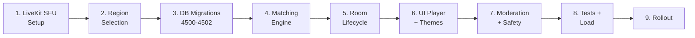
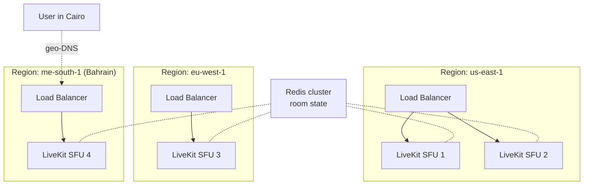
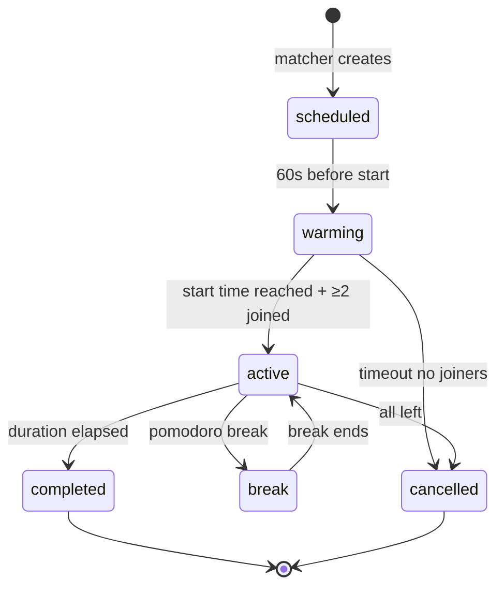

<aside>
📐

**هدف هذا الدليل:** بناء منصة WebRTC body-doubling تتحمل آلاف الـ concurrent sessions بـ < 200ms latency وتكلفة تشغيلية أقل من $0.02/session.

</aside>

## 🧠 تطوير تنفيذي إضافي — Co-Flow Production Runtime Pack

Co-Flow لازم يشتغل anonymous-first، server-time، وmoderation-ready قبل أي public room.

### Anonymous Participant DTO

```tsx
export type PublicRoomParticipant = {
  anonymousId: string
  declaredTask: string
  joinedAt: string
  mediaState: 'audio_only' | 'camera_on' | 'silent'
}

export function toPublicParticipant(row: ParticipantRow): PublicRoomParticipant {
  return {
    anonymousId: hashRoomScoped(row.room_id, row.user_id).slice(0, 10),
    declaredTask: sanitizePlainText(row.declared_task, 100),
    joinedAt: row.joined_at,
    mediaState: row.media_state,
  }
}
```

### Token Endpoint Guard

```tsx
await rateLimit(`livekit-token:${ctx.userId}`, { max: 20, window: '10m' })
await assertRoomJoinable(roomId, ctx)
await moderation.assertUserCanJoin(ctx.userId)
```

### Room Privacy Rules

- لا تعرض names في public matched rooms.
- لا recording إلا عند report وبـ retention قصير.
- Leave Silently زر ثابت لا يطلب confirmation.

# 🗺️ الخريطة التنفيذية



**المدة:** 5 sprints (10 أسابيع). الـ infra أصعب من الـ code.

---

# المرحلة 1️⃣ — LiveKit SFU Architecture

## Why SFU (Selective Forwarding Unit) وليس MCU أو P2P

| Architecture | Bandwidth (6 users) | Server CPU | Latency | الحكم |
| --- | --- | --- | --- | --- |
| P2P Mesh | O(n²) = 30 streams | منخفض | 40ms | ❌ لا يقاس فوق 4 users |
| MCU (mixing) | O(n) = 6 streams | عالي جداً | 250ms | ❌ غالي جداً |
| **SFU (forwarding)** | O(n) = 6 streams | متوسط | 80-120ms | ✅ **الاختيار** |

## Topology الموصى بها



## Infrastructure as Code (Terraform مثال)

```hcl
# infra/livekit/main.tf
resource "aws_ecs_service" "livekit_sfu" {
	name            = "livekit-sfu-${var.region}"
	cluster         = aws_ecs_cluster.main.id
	task_definition = aws_ecs_task_definition.livekit.arn
	desired_count   = 3 # autoscale 3-20
	
	capacity_provider_strategy {
		capacity_provider = "FARGATE"
		weight            = 100
	}
	
	deployment_circuit_breaker {
		enable   = true
		rollback = true
	}
}

resource "aws_appautoscaling_policy" "sfu_scale_on_participants" {
	name               = "sfu-scale-participants"
	policy_type        = "TargetTrackingScaling"
	target_value       = 200 # max 200 participants per SFU instance
}
```

## ⚠️ Critical Network Settings

```yaml
# livekit.yaml
port: 7880
rtc:
  tcp_port: 7881
  udp_port: 7882
  use_external_ip: true
  ice_lite: false # full ICE for NAT traversal
  stun_servers:
    - stun:stun.l.google.com:19302
  turn_servers:
    - host: turn.zenith.example.com
      protocol: udp
      port: 3478
      username: ${TURN_USER}
      credential: ${TURN_PASS}
redis:
  address: ${REDIS_URL}
keys:
  ${LIVEKIT_API_KEY}: ${LIVEKIT_API_SECRET}
limit:
  num_tracks: 50 # per room
  bytes_per_sec: 5_000_000 # 5 Mbps per participant max
```

**Quality Gate 1.1:** قبل ما تكتب أي backend code، لازم تكون عملت:

- SFU شغّال في 3 regions
- TURN server شغّال (TCP 443 fallback لـ corporate firewalls)
- اختبرت call بين user في Cairo و user في Tokyo بـ latency < 250ms

---

# المرحلة 2️⃣ — Token Generation (Security Critical)

```tsx
// lib/coflow/tokens.ts
import { AccessToken } from 'livekit-server-sdk'
import { z } from 'zod'

const TokenRequestSchema = z.object({
	roomId: z.string().regex(/^[0-9A-HJKMNP-TV-Z]{26}$/),
	participantName: z.string().max(50),
	camRequested: z.boolean(),
	micRequested: z.boolean()
})

export async function issueRoomToken(input: unknown, ctx: AuthContext) {
	const parsed = TokenRequestSchema.parse(input)
	
	// ⚠️ CRITICAL: تحقق إن الـ user مسموح له يدخل الـ room
	const room = await db.queryFirst(
		`SELECT host_user_id, room_type, workspace_id, status, capacity, cam_required
		 FROM focus_rooms WHERE id = $1`,
		[parsed.roomId]
	)
	if (!room) throw new Error('ROOM_NOT_FOUND')
	if (room.status !== 'scheduled' && room.status !== 'active') {
		throw new Error('ROOM_NOT_JOINABLE')
	}
	
	// Private rooms لازم workspace match
	if (room.room_type === 'private_friends' && room.workspace_id !== ctx.workspaceId) {
		throw new Error('ACCESS_DENIED')
	}
	
	// تحقق من الـ capacity
	const currentCount = await getActiveParticipantCount(parsed.roomId)
	if (currentCount >= room.capacity) throw new Error('ROOM_FULL')
	
	// ⚠️ Enforce cam_required server-side
	if (room.cam_required && !parsed.camRequested) {
		throw new Error('CAM_REQUIRED')
	}
	
	// Block lists (banned users)
	if (await isUserBanned(ctx.userId, parsed.roomId)) {
		throw new Error('USER_BANNED')
	}
	
	const token = new AccessToken(
		process.env.LIVEKIT_API_KEY!,
		process.env.LIVEKIT_API_SECRET!,
		{
			identity: ctx.userId,
			name: parsed.participantName,
			ttl: '2h'
		}
	)
	token.addGrant({
		roomJoin: true,
		room: parsed.roomId,
		canPublish: parsed.camRequested || parsed.micRequested,
		canPublishData: true, // for chat/reactions
		canSubscribe: true,
		hidden: false,
		canUpdateOwnMetadata: false // critical security
	})
	
	return await token.toJwt()
}
```

---

# المرحلة 3️⃣ — Matching Engine (الأصعب خوارزمياً)

## Multi-criteria Scoring

```tsx
// lib/coflow/matcher.ts
type QueueEntry = {
	userId: string
	desiredDuration: 25 | 50 | 90 | 120
	desiredTheme: string | null
	languagePref: string[]
	timezone: string
	queuedAt: Date
	focusScoreAvg: number | null
	lastMatchedAt: Date | null
}

function scoreCompatibility(a: QueueEntry, b: QueueEntry): number {
	let score = 0
	
	// 1. Duration MUST match exactly (hard requirement)
	if (a.desiredDuration !== b.desiredDuration) return -Infinity
	
	// 2. Timezone proximity (max 40 points)
	const tzDiffHours = Math.abs(getUtcOffsetDiff(a.timezone, b.timezone))
	score += Math.max(0, 40 - tzDiffHours * 10)
	
	// 3. Language overlap (max 25 points)
	const commonLangs = a.languagePref.filter(l => b.languagePref.includes(l))
	score += commonLangs.length > 0 ? 25 : 0
	
	// 4. Theme match (max 15 points)
	if (a.desiredTheme && a.desiredTheme === b.desiredTheme) score += 15
	
	// 5. Focus score similarity (max 10 points)
	if (a.focusScoreAvg && b.focusScoreAvg) {
		const diff = Math.abs(a.focusScoreAvg - b.focusScoreAvg)
		score += Math.max(0, 10 - diff * 50)
	}
	
	// 6. Variety bonus (avoid same partner < 48h)
	if (a.lastMatchedAt && (Date.now() - a.lastMatchedAt.getTime()) < 48 * 3600_000) {
		score -= 30 // penalty
	}
	
	// 7. Wait time fairness (max 10 points)
	const aWaitMin = (Date.now() - a.queuedAt.getTime()) / 60_000
	score += Math.min(10, aWaitMin / 6)
	
	return score
}

export async function runMatchingTick() {
	// Pull queue every 10 seconds
	const queue = await db.query(`
		SELECT q.*, u.timezone, u.focus_score_avg, u.last_matched_at
		FROM focus_matching_queue q
		JOIN users u ON u.id = q.user_id
		WHERE q.matched_room_id IS NULL
		  AND q.queued_at > now() - INTERVAL '5 minutes'
		ORDER BY q.queued_at ASC
		LIMIT 200
	`)
	
	const used = new Set<string>()
	const matches: Array<[QueueEntry, QueueEntry]> = []
	
	for (const a of queue.rows) {
		if (used.has(a.user_id)) continue
		let best: QueueEntry | null = null
		let bestScore = -Infinity
		for (const b of queue.rows) {
			if (b.user_id === a.user_id || used.has(b.user_id)) continue
			const s = scoreCompatibility(a, b)
			if (s > bestScore) { bestScore = s; best = b }
		}
		if (best && bestScore > 30) { // threshold
			matches.push([a, best])
			used.add(a.user_id)
			used.add(best.user_id)
		}
	}
	
	// Create rooms for each match (transactionally)
	for (const [a, b] of matches) {
		await createMatchedRoom(a, b)
	}
	
	// Solo fallback after 60s wait
	for (const entry of queue.rows) {
		if (used.has(entry.user_id)) continue
		const waitedSec = (Date.now() - entry.queued_at.getTime()) / 1000
		if (waitedSec > 60) await assignToPublicRoom(entry)
	}
}
```

## Run Frequency

- **كل 10 ثواني** عبر [**Trigger.dev**](http://Trigger.dev) أو **Cloudflare Cron** (لا setInterval).
- Lock عبر `pg_try_advisory_lock(998877)` علشان worker واحد بس يشتغل في كل لحظة.

---

# المرحلة 4️⃣ — Room Lifecycle + State Sync

## State Machine



## LiveKit Webhook Handler

```tsx
// app/api/livekit/webhook/route.ts
import { WebhookReceiver } from 'livekit-server-sdk'

const receiver = new WebhookReceiver(
	process.env.LIVEKIT_API_KEY!,
	process.env.LIVEKIT_API_SECRET!
)

export async function POST(req: Request) {
	const body = await req.text()
	const auth = req.headers.get('authorization')!
	
	// ⚠️ MUST verify signature
	let event
	try {
		event = await receiver.receive(body, auth)
	} catch (e) {
		return new Response('invalid signature', { status: 401 })
	}
	
	switch (event.event) {
		case 'participant_joined':
			await handleJoin(event.room!.name, event.participant!.identity)
			break
		case 'participant_left':
			await handleLeave(event.room!.name, event.participant!.identity)
			break
		case 'room_finished':
			await finalizeRoom(event.room!.name)
			break
	}
	return new Response('ok')
}
```

## Pomodoro Timer Sync (مهم جداً للـ UX)

<aside>
⚠️

**المشكلة:** لو كل client يحسب الـ timer محلياً، سيختلفون. الحل: server-authoritative time.

</aside>

```tsx
// lib/coflow/timer.ts
// Server emits tick every 1s via Redis pub/sub
export async function emitRoomTick(roomId: string) {
	const room = await getRoomState(roomId)
	const elapsedSec = (Date.now() - room.startedAt.getTime()) / 1000
	const phase = computePhase(elapsedSec, room.sessionDurationMinutes, room.breakDurationMinutes)
	
	await redis.publish(`room:${roomId}:tick`, JSON.stringify({
		phase,        // 'focus' | 'break'
		elapsedSec,
		remainingSec: room.sessionDurationMinutes * 60 - elapsedSec,
		serverTimeMs: Date.now() // client computes clock skew
	}))
}

// Client:
function useRoomTimer(roomId: string) {
	const [tick, setTick] = useState<TickPayload | null>(null)
	useEffect(() => {
		const ws = new WebSocket(`/api/coflow/${roomId}/timer`)
		ws.onmessage = (e) => setTick(JSON.parse(e.data))
		return () => ws.close()
	}, [roomId])
	// Smooth interpolation between ticks using requestAnimationFrame
	return useInterpolatedTime(tick)
}
```

---

# المرحلة 5️⃣ — Moderation & Safety (لا تتساهل)

## Layered Safety

| Layer | Mechanism | Action |
| --- | --- | --- |
| Pre-join | Account age > 24h + email verified + phone (optional) | Block |
| Pre-join | Sanctions/banned list check | Block + log |
| In-room | Video frame sampling every 30s → NSFW model (W18 Gateway) | Auto-mute cam + warn |
| In-room | Audio sampling → profanity/threat model | Mute mic + warn |
| In-room | User reports (1-click) | Auto-mute reported user + notify mod |
| Post-room | 3 reports = auto-suspend 24h | Suspend |
| Post-room | 5 suspensions = permanent ban | Ban |

## NSFW Detection Pipeline

```tsx
// lib/coflow/moderation.ts
import { runAIWithQuota } from '@/lib/ai/gateway'

export async function sampleAndModerateVideo(roomId: string, participantId: string) {
	// Sample frame every 30s via egress recording
	const frameUrl = await captureFrame(roomId, participantId)
	
	const result = await runAIWithQuota({
		sensitivity: 'normal',
		model: 'vision-moderation',
		operation: 'coflow_video_check',
		input: { imageUrl: frameUrl },
		timeout: 5000
	})
	
	if (result.ok && result.data.nsfw_score > 0.8) {
		await forceMuteCam(roomId, participantId, 'NSFW detected')
		await createIncident({ severity: 'high', roomId, participantId })
		await notifyOnCallMod()
	}
}
```

## Emergency Exit Always-Available

زر **"Leave Silently"** ظاهر دايماً → exit بدون إشعار أي مشترك → critical للنساء/الأقليات/المعرضين للتنمر.

---

# المرحلة 6️⃣ — UI/UX Standards

## Mandatory Components

```tsx
// components/coflow/RoomShell.tsx
<RoomShell>
  <PreJoin>
    <DeclaredTaskInput required minLength={5} maxLength={100} />
    <CameraPreview />
    <MicTest />
    <ThemePreview />
    <SafetyAgreement />
  </PreJoin>
  
  <InRoom>
    <ParticipantGrid maxVisible={6} />
    <PomodoroTimer serverAuthoritative />
    <AmbientPlayer trackUrl={theme.audioUrl} volume={0.3} />
    <ReactionsBar /> {/* clap, fire, focus emoji */}
    <ReportButton oneClickReport />
    <LeaveSilentlyButton alwaysVisible />
    <BreakOverlay show={phase === 'break'}>
      <BreathingExercise />
    </BreakOverlay>
  </InRoom>
  
  <PostSession>
    <TaskCompletedToggle />
    <SessionRating /> {/* 1-5 stars */}
    <PartnerRating optional /> {/* anti-toxic: only positive options */}
    <NextSessionCTA />
  </PostSession>
</RoomShell>
```

## Accessibility (WCAG 2.1 AA)

- Captions على الـ ambient audio
- Keyboard navigation كاملة (Esc يخرج)
- Screen reader announces phase changes
- Reduced motion option للـ visual themes
- Text-only mode للـ users بدون كاميرا/مايك

---

# المرحلة 7️⃣ — Performance Optimization

## Bandwidth Adaptation

```tsx
// Simulcast: 3 quality layers per publisher
const publishOptions: TrackPublishOptions = {
	simulcast: true,
	videoEncoding: {
		maxBitrate: 1_500_000,
		maxFramerate: 30
	},
	videoSimulcastLayers: [
		VideoPreset.h180,  // 320×180 @ 100kbps
		VideoPreset.h360,  // 640×360 @ 500kbps
		VideoPreset.h720   // 1280×720 @ 1.5Mbps
	]
}

// Subscribers auto-downgrade based on:
// - Network conditions (REMB feedback)
// - Visible viewport (don't fetch 720p if rendered 180px)
// - Page visibility (pause when tab hidden)
```

## Cost Optimization

- **Egress recording فقط عند report** (لا تسجل كل sessions)
- **Audio-only fallback** = 5× أقل bandwidth
- **Idle detection:** لو 5 دقايق بدون audio/movement → reduce quality
- **TURN bypass:** prefer P2P إن الـ NAT يسمح (يوفّر 70% bandwidth cost)

---

# المرحلة 8️⃣ — Testing Strategy

## Test Pyramid

| Type | Count | Tool |
| --- | --- | --- |
| Unit (matching logic) | ~40 | Vitest |
| Integration (DB + Redis) | ~20 | testcontainers |
| WebRTC E2E | 5 | Playwright + fake media |
| Load test | 3 سيناريوهات | k6 + LiveKit load generator |
| Network chaos | 4 سيناريوهات | tc + Toxiproxy |

## Load Test Scenarios المطلوبة

```jsx
// k6/coflow-load.js
import { check } from 'k6'
export const options = {
	scenarios: {
		join_storm: {
			executor: 'ramping-arrival-rate',
			startRate: 10, timeUnit: '1s',
			stages: [
				{ target: 100, duration: '2m' },
				{ target: 500, duration: '5m' },
				{ target: 1000, duration: '5m' },
				{ target: 0, duration: '2m' }
			]
		}
	},
	thresholds: {
		'http_req_duration{name:issue_token}': ['p(95)<300'],
		'http_req_failed': ['rate<0.01']
	}
}
```

**Quality Gate 8.1:** 

- p95 join time < 1.5s
- p99 audio delay < 200ms
- Zero matcher deadlocks under 1000 concurrent queue entries

---

# المرحلة 9️⃣ — Observability

## Key Metrics

```
# Counters
coflow_rooms_created_total{type, theme}
coflow_participant_joins_total{outcome}
coflow_participant_drops_total{reason="network|kicked|left"}
coflow_moderation_actions_total{action, severity}

# Histograms
coflow_match_wait_seconds
coflow_token_issue_duration_ms
coflow_session_completion_rate

# Gauges (per region)
coflow_active_rooms{region}
coflow_active_participants{region}
coflow_sfu_cpu_pct{instance}
coflow_sfu_bandwidth_mbps{instance}
```

## Critical Alerts

- `match_wait_p95 > 90s` → P2 → matcher tuning needed
- `participant_drop_rate > 5%` → P1 → SFU/network issue
- `moderation_queue_depth > 50` → P1 → wake mod team
- `sfu_cpu > 80% sustained 5min` → autoscale or P1

---

# 🚨 Anti-Patterns

1. ❌ **Trust client-provided participant identity** → server signs always
2. ❌ **Skip TURN server** → 30% of users on corporate networks can't connect
3. ❌ **Sync timer via client clocks** → drift = bad UX
4. ❌ **Record all sessions by default** → privacy nightmare + cost explosion
5. ❌ **No rate limit on token endpoint** → DDoS vector
6. ❌ **Allow username in room title** → harassment + doxing
7. ❌ **No moderation queue** → first abuse = lawsuit
8. ❌ **Single region SFU** → users 5000km away = 400ms latency
9. ❌ **Buffer audio long** → echo + lag
10. ❌ **No 'leave silently' button** → safety failure

---

# 📋 Definition of Done

- [ ]  3+ regions deployed (US, EU, ME)
- [ ]  TURN servers على ports 443 و 3478
- [ ]  Token endpoint بـ rate limit + signature
- [ ]  Matcher tuned: p95 wait < 60s
- [ ]  Pomodoro timer server-authoritative
- [ ]  Webhook handler verifies signature
- [ ]  NSFW + audio moderation pipelines active
- [ ]  Emergency exit button دايماً ظاهر
- [ ]  WCAG 2.1 AA compliance
- [ ]  Simulcast 3 layers + adaptive quality
- [ ]  Load test 1000 concurrent users نجح
- [ ]  On-call mod team trained + paged
- [ ]  Per-region SFU autoscaling tested
- [ ]  Cost < $0.02/session/user verified
- [ ]  Post-session rating UI without negative options
