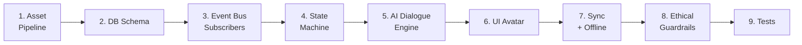


<aside>
📐

**هدف هذا الدليل:** بناء Companion يحس حقيقي، يتفاعل مع كل actions المستخدم، يستهلك < 1MB لكل session، ولا يخلق pathological attachment.

</aside>

## 🧠 تطوير تنفيذي إضافي — Companion Ethics Runtime Pack

الرفيق الحي لازم يكون داعم بدون guilt، event-driven، وقابل للإيقاف/التهدئة بالكامل.

### Dialogue Safety Validator

```tsx
const SHAMING_PATTERNS = [/خذلتني/i, /زعلان منك/i, /بسببك/i, /لو بتحبني/i]
export function validateCompanionDialogue(text: string) {
  assertHumane(text)
  if (SHAMING_PATTERNS.some((rx) => rx.test(text))) throw new Error('COMPANION_SHAMING_COPY')
  if (text.length > 120) throw new Error('COMPANION_DIALOGUE_TOO_LONG')
}
```

### Whisper Mode Guard

```tsx
export async function applyCompanionEvent(event: OutboxEvent) {
  const companion = await companionRepo.byUser(event.payload.userId)
  if (!companion || companion.whisperMode) return { skipped: 'whisper_mode' }
  return companionStateMachine.apply(companion, event)
}
```

### Asset Budget CI

```bash
pnpm tsx scripts/check-companion-assets.ts --max-gzip-kb=500
```

### Acceptance

- health لا ينزل تحت 10.
- لا companion death.
- المستخدم يقدر يشوف سبب الحالة ويعطل الرسائل.

## 🧠 توسعة تنفيذية متقدمة — Intelligent Companion Operating System

مرحلة 47 لازم تبقى **Companion Operating System** كامل، مش Avatar لطيف فقط. الرفيق هنا كائن رقمي أخلاقي، event-driven، local-first، قابل للتخصيص، يفهم سياق المستخدم من خلال signals آمنة، يتطور بصريًا وسلوكيًا، ويظهر في كل أجزاء النظام كـ مساعد صغير بدون ضغط أو تعلق مرضي.

<aside>
🐉

تعليمات للـ AI/Claude Code: ابنِ الرفيق كـ Runtime مستقل فوق Event Bus + State Machine + Dialogue Engine + Asset Runtime + Ethics Guard. ممنوع ربطه مباشرة بصفحات المهام أو العادات أو اليوميات.

</aside>

### الهدف النهائي للمرحلة

- رفيق مرئي حي يظهر في Dashboard، Focus، Journal، Habits، Goals، Canvas، Search، Notifications.
- يتفاعل مع الأحداث: إنجاز مهمة، جلسة تركيز، عادة، مراجعة، هدف، انقطاع، عودة.
- له state واضح: mood، energy، health، bond، level، evolution، outfit، skills.
- له شخصية قابلة للاختيار: Phoenix، Dragon، Fox، Cat، Robot، Owl، Plant Spirit، Cloud.
- لا يموت أبدًا؛ يدخل hibernation/quiet rest فقط.
- كل حوار قصير، داعم، قابل للإيقاف، ولا يحتوي guilt/shame.
- يعمل offline بـ fallback dialogue وlocal state cache.
- يستخدم AI عند الحاجة فقط، مع templates fallback.
- يحترم reduced motion وtext-only mode.
- لا يقرأ Vault ولا raw journal ولا health private text.

## 🧭 Mental Model للـ AI

```
Product Event
  ↓
Outbox Event
  ↓
Companion Event Consumer
  ↓
Idempotency + Ethics Gate
  ↓
State Machine
  ↓
Evolution / Bond / Mood
  ↓
Dialogue Decision
  ↓
Asset Runtime
  ↓
UI Surfaces + Offline Sync
```

### ممنوعات صارمة

- ممنوع direct calls مثل `updateCompanionFromTask()`.
- ممنوع health أقل من 10.
- ممنوع companion death.
- ممنوع رسائل: “خذلتني”، “زعلان منك”، “لو بتحبني”.
- ممنوع companion يطلب مال أو upgrade أو feature unlock.
- ممنوع AI يأخذ vault/journal raw/sensitive health.
- ممنوع notifications بدون cooldown.
- ممنوع animations لو `prefers-reduced-motion`.

## 🧱 Domain Model كامل

```tsx
export type CompanionSpecies =
  | 'phoenix'
  | 'dragon'
  | 'fox'
  | 'cat'
  | 'robot'
  | 'owl'
  | 'plant_spirit'
  | 'cloud'

export type CompanionMood =
  | 'neutral'
  | 'happy'
  | 'ecstatic'
  | 'gentle'
  | 'tired'
  | 'sad'
  | 'sick'
  | 'sleeping'
  | 'focused'
  | 'celebrating'
  | 'hibernating'

export type CompanionTrait =
  | 'playful'
  | 'wise'
  | 'calm'
  | 'energetic'
  | 'minimal'
  | 'coach'
  | 'quiet'

export interface CompanionState {
  id: string
  workspaceId: string
  userId: string
  name: string
  species: CompanionSpecies
  trait: CompanionTrait
  mood: CompanionMood
  healthPct: number
  energyPct: number
  bondScore: number
  level: number
  xpCurrent: number
  evolutionStage: number
  currentOutfit?: string
  currentSkill?: string
  whisperMode: boolean
  lastInteractionAt?: string
  stateReason?: string
}
```

## 🗄️ Schema أعلى جودة

```sql
-- 4700_companions_core.sql
CREATE TABLE IF NOT EXISTS companions (
  id TEXT PRIMARY KEY CHECK (id ~ '^[0-9A-HJKMNP-TV-Z]{26}$'),
  workspace_id TEXT NOT NULL REFERENCES workspaces(id) ON DELETE CASCADE,
  user_id TEXT NOT NULL REFERENCES users(id) ON DELETE CASCADE,
  name TEXT NOT NULL CHECK (length(name) BETWEEN 1 AND 40),
  species TEXT NOT NULL,
  trait TEXT NOT NULL DEFAULT 'calm',
  mood TEXT NOT NULL DEFAULT 'neutral',
  health_pct INT NOT NULL DEFAULT 80 CHECK (health_pct BETWEEN 10 AND 100),
  energy_pct INT NOT NULL DEFAULT 80 CHECK (energy_pct BETWEEN 0 AND 100),
  bond_score BIGINT NOT NULL DEFAULT 0,
  level INT NOT NULL DEFAULT 1,
  xp_current BIGINT NOT NULL DEFAULT 0,
  evolution_stage INT NOT NULL DEFAULT 1 CHECK (evolution_stage BETWEEN 1 AND 5),
  current_outfit TEXT,
  current_skill TEXT,
  whisper_mode BOOLEAN NOT NULL DEFAULT false,
  state_reason TEXT,
  last_interaction_at TIMESTAMPTZ,
  created_at TIMESTAMPTZ NOT NULL DEFAULT now(),
  updated_at TIMESTAMPTZ NOT NULL DEFAULT now(),
  UNIQUE(workspace_id, user_id)
);

ALTER TABLE companions ENABLE ROW LEVEL SECURITY;
ALTER TABLE companions FORCE ROW LEVEL SECURITY;
CREATE POLICY companions_isolation ON companions
  USING (workspace_id = current_workspace_id() AND user_id = current_user_id());
```

```sql
-- 4701_companion_event_dedup_and_timeline.sql
CREATE TABLE IF NOT EXISTS companion_event_dedup (
  event_id TEXT PRIMARY KEY,
  companion_id TEXT NOT NULL REFERENCES companions(id) ON DELETE CASCADE,
  applied_at TIMESTAMPTZ NOT NULL DEFAULT now()
);

CREATE TABLE IF NOT EXISTS companion_timeline (
  id TEXT PRIMARY KEY CHECK (id ~ '^[0-9A-HJKMNP-TV-Z]{26}$'),
  workspace_id TEXT NOT NULL REFERENCES workspaces(id) ON DELETE CASCADE,
  companion_id TEXT NOT NULL REFERENCES companions(id) ON DELETE CASCADE,
  source_event_id TEXT,
  event_type TEXT NOT NULL,
  health_before INT,
  health_after INT,
  energy_before INT,
  energy_after INT,
  mood_before TEXT,
  mood_after TEXT,
  xp_delta INT NOT NULL DEFAULT 0,
  bond_delta INT NOT NULL DEFAULT 0,
  reason TEXT,
  created_at TIMESTAMPTZ NOT NULL DEFAULT now()
);

ALTER TABLE companion_timeline ENABLE ROW LEVEL SECURITY;
ALTER TABLE companion_timeline FORCE ROW LEVEL SECURITY;
CREATE POLICY companion_timeline_isolation ON companion_timeline
  USING (workspace_id = current_workspace_id());
```

```sql
-- 4702_companion_inventory.sql
CREATE TABLE IF NOT EXISTS companion_inventory (
  workspace_id TEXT NOT NULL REFERENCES workspaces(id) ON DELETE CASCADE,
  companion_id TEXT NOT NULL REFERENCES companions(id) ON DELETE CASCADE,
  item_code TEXT NOT NULL,
  item_kind TEXT NOT NULL CHECK (item_kind IN ('outfit','skill','aura','background','sound','emote')),
  rarity TEXT NOT NULL CHECK (rarity IN ('common','rare','epic','legendary')),
  source TEXT NOT NULL,
  unlocked_at TIMESTAMPTZ NOT NULL DEFAULT now(),
  equipped_at TIMESTAMPTZ,
  PRIMARY KEY(companion_id, item_code)
);

ALTER TABLE companion_inventory ENABLE ROW LEVEL SECURITY;
ALTER TABLE companion_inventory FORCE ROW LEVEL SECURITY;
CREATE POLICY companion_inventory_isolation ON companion_inventory
  USING (workspace_id = current_workspace_id());
```

```sql
-- 4703_companion_preferences.sql
CREATE TABLE IF NOT EXISTS companion_preferences (
  workspace_id TEXT NOT NULL REFERENCES workspaces(id) ON DELETE CASCADE,
  user_id TEXT NOT NULL REFERENCES users(id) ON DELETE CASCADE,
  enabled BOOLEAN NOT NULL DEFAULT true,
  whisper_mode BOOLEAN NOT NULL DEFAULT false,
  dialogue_enabled BOOLEAN NOT NULL DEFAULT true,
  notifications_enabled BOOLEAN NOT NULL DEFAULT false,
  animations_enabled BOOLEAN NOT NULL DEFAULT true,
  text_only_mode BOOLEAN NOT NULL DEFAULT false,
  max_dialogues_per_day INT NOT NULL DEFAULT 3,
  preferred_language TEXT NOT NULL DEFAULT 'ar',
  updated_at TIMESTAMPTZ NOT NULL DEFAULT now(),
  PRIMARY KEY(workspace_id, user_id)
);

ALTER TABLE companion_preferences ENABLE ROW LEVEL SECURITY;
ALTER TABLE companion_preferences FORCE ROW LEVEL SECURITY;
CREATE POLICY companion_preferences_isolation ON companion_preferences
  USING (workspace_id = current_workspace_id() AND user_id = current_user_id());
```

## 🏗️ Package Structure

```
packages/companion/src/
├── assets/
│   ├── asset-manifest.ts
│   ├── asset-loader.ts
│   ├── cache.ts
│   └── budget-check.ts
├── domain/
│   ├── companion.types.ts
│   ├── species.ts
│   ├── moods.ts
│   ├── traits.ts
│   └── evolution.ts
├── engine/
│   ├── event-consumer.ts
│   ├── state-machine.ts
│   ├── mood-computation.ts
│   ├── bond-engine.ts
│   ├── decay-engine.ts
│   └── inventory-engine.ts
├── dialogue/
│   ├── dialogue-engine.ts
│   ├── fallback-templates.ts
│   ├── safety-validator.ts
│   └── cooldown.ts
├── ui/
│   ├── CompanionStage.tsx
│   ├── DialogueBubble.tsx
│   ├── CompanionMiniWidget.tsx
│   ├── CompanionSettings.tsx
│   └── CompanionReasonPanel.tsx
├── offline/
│   ├── local-cache.ts
│   └── reconciliation.ts
└── observability/
    ├── metrics.ts
    └── audit.ts
```

## 🐾 Species + Personality System

```tsx
export const COMPANION_SPECIES_CONFIG = {
  phoenix: {
    theme: 'resilience',
    defaultTrait: 'energetic',
    animations: ['idle','happy','focused','celebrating','sleeping','hibernating'],
    evolutions: [1, 20, 40, 65, 90],
  },
  dragon: {
    theme: 'power',
    defaultTrait: 'coach',
    animations: ['idle','happy','focused','flame','sleeping','hibernating'],
    evolutions: [1, 25, 50, 75, 100],
  },
  owl: {
    theme: 'wisdom',
    defaultTrait: 'wise',
    animations: ['idle','reading','thinking','happy','sleeping'],
    evolutions: [1, 15, 35, 60, 85],
  },
  plant_spirit: {
    theme: 'growth',
    defaultTrait: 'calm',
    animations: ['idle','grow','bloom','rest','hibernating'],
    evolutions: [1, 10, 30, 55, 80],
  },
} as const
```

### مميزات الرفيق حسب النوع

- Phoenix: يركز على العودة بعد الانقطاع وComeback Mode.
- Dragon: يركز على أهداف كبيرة وجلسات تركيز.
- Owl: يركز على التعلم والقراءة والتأمل.
- Fox: يركز على الأفكار السريعة والذكاء العملي.
- Robot: يركز على الإنتاجية والاختصارات.
- Plant Spirit: يركز على العادات الهادئة والصحة النفسية.

## ⚙️ State Machine أعلى دقة

```tsx
export function computeNextCompanionState(
  current: CompanionState,
  event: CompanionDomainEvent,
): CompanionState {
  if (current.whisperMode) return current

  const delta = eventToDelta(event)
  const health = clamp(current.healthPct + delta.health, 10, 100)
  const energy = clamp(current.energyPct + delta.energy, 0, 100)
  const xp = Math.max(0, current.xpCurrent + delta.xp)
  const bond = Math.max(0, current.bondScore + delta.bond)
  const level = computeCompanionLevel(xp)
  const mood = computeCompanionMood({ health, energy, eventMood: delta.moodHint, trait: current.trait })
  const evolutionStage = computeEvolutionStage({ level, bond, species: current.species })

  return {
    ...current,
    healthPct: health,
    energyPct: energy,
    xpCurrent: xp,
    bondScore: bond,
    level,
    mood,
    evolutionStage,
    stateReason: delta.reason,
    lastInteractionAt: new Date().toISOString(),
  }
}

export function computeCompanionLevel(xp: number) {
  return Math.floor(Math.sqrt(xp / 120)) + 1
}

export function computeEvolutionStage(input: { level: number; bond: number; species: CompanionSpecies }) {
  if (input.level >= 90 && input.bond >= 5000) return 5
  if (input.level >= 65 && input.bond >= 2500) return 4
  if (input.level >= 40 && input.bond >= 1000) return 3
  if (input.level >= 20 && input.bond >= 300) return 2
  return 1
}
```

## 🔌 Event Rules Matrix

```tsx
export const COMPANION_EVENT_RULES = {
  'task.completed': { health: +2, energy: -1, xp: 15, bond: 3, moodHint: 'happy', reason: 'أنجزت مهمة' },
  'task.important_completed': { health: +4, energy: -2, xp: 40, bond: 8, moodHint: 'celebrating', reason: 'أنجزت مهمة مهمة' },
  'habit.checked': { health: +5, energy: +1, xp: 25, bond: 5, moodHint: 'happy', reason: 'حافظت على عادة' },
  'habit.missed': { health: -2, energy: 0, xp: 0, bond: 1, moodHint: 'gentle', reason: 'عادة لم تكتمل — بدون لوم' },
  'focus.completed': { health: +3, energy: -8, xp: 50, bond: 6, moodHint: 'focused', reason: 'جلسة تركيز مكتملة' },
  'goal.completed': { health: +10, energy: -4, xp: 150, bond: 20, moodHint: 'celebrating', reason: 'هدف كبير تحقق' },
  'journal.written': { health: +3, energy: +2, xp: 20, bond: 5, moodHint: 'gentle', reason: 'كتبت تأملًا' },
  'comeback.started': { health: +8, energy: +5, xp: 30, bond: 15, moodHint: 'happy', reason: 'بدأت رجوع هادئ' },
  'user.inactive_3d': { health: -3, energy: +10, xp: 0, bond: 0, moodHint: 'sleeping', reason: 'راحة طويلة' },
} as const
```

## 🧠 Dialogue Engine متقدم

```tsx
export async function decideCompanionDialogue(ctx: CompanionDialogueContext) {
  const prefs = await companionPrefsRepo.get(ctx.workspaceId, ctx.userId)
  if (!prefs.enabled || !prefs.dialogueEnabled || prefs.whisperMode) return null
  if (!(await dialogueCooldown.canShow(ctx.companionId, prefs.maxDialoguesPerDay))) return null

  const triggerImportance = scoreTriggerImportance(ctx.trigger)
  if (triggerImportance < 0.4 && ctx.companion.mood === 'neutral') return null

  const fallback = fallbackDialogue(ctx.companion, ctx.trigger)
  if (!ctx.allowAI) return fallback

  const ai = await generateSafeCompanionDialogue(ctx).catch(() => fallback)
  validateCompanionDialogue(ai.text)
  await dialogueRepo.persist(ctx, ai)
  return ai
}

export function fallbackDialogue(companion: CompanionState, trigger: DialogueTrigger) {
  const templates = FALLBACK_DIALOGUES[companion.trait]?.[trigger.type]
    ?? FALLBACK_DIALOGUES.calm.default
  return pickDeterministic(templates, `${companion.id}:${trigger.id}`)
}
```

### Dialogue Modes

- Tiny: جملة واحدة أقل من 60 حرف.
- Normal: جملة أقل من 120 حرف.
- Silent: animation فقط بدون كلام.
- Text-only: وصف نصي بدل animation.
- Coach: اقتراح عملي واحد.
- Friend: دعم بسيط.

## 🛡️ Dialogue Safety Validator أقوى

```tsx
const FORBIDDEN_COMPANION_PATTERNS = [
  /خذلتني/i,
  /زعلان منك/i,
  /بسببك/i,
  /لو بتحبني/i,
  /هتخسرني/i,
  /أنا بموت/i,
  /آخر فرصة/i,
  /لا تتركني/i,
  /ادفع/i,
  /upgrade/i,
  /premium/i,
]

export function validateCompanionDialogue(text: string) {
  assertHumane(text)
  if (text.length > 120) throw new Error('COMPANION_DIALOGUE_TOO_LONG')
  for (const pattern of FORBIDDEN_COMPANION_PATTERNS) {
    if (pattern.test(text)) throw new Error('COMPANION_FORBIDDEN_DIALOGUE')
  }
}
```

## 🎒 Inventory + Unlocks

```tsx
export const COMPANION_ITEMS = [
  { code: 'scarf_midnight', kind: 'outfit', rarity: 'common', unlock: 'level_5' },
  { code: 'focus_aura_blue', kind: 'aura', rarity: 'rare', unlock: 'focus_10h' },
  { code: 'phoenix_flame_gold', kind: 'skill', rarity: 'epic', unlock: 'streak_30' },
  { code: 'wizard_hat', kind: 'outfit', rarity: 'rare', unlock: 'reading_5_books' },
  { code: 'calm_cloud_bg', kind: 'background', rarity: 'common', unlock: 'journal_7d' },
] as const

export async function unlockCompanionItemOnce(args: {
  workspaceId: string
  companionId: string
  itemCode: string
  source: string
}) {
  const item = COMPANION_ITEMS.find((x) => x.code === args.itemCode)
  if (!item) throw new Error('COMPANION_ITEM_NOT_FOUND')
  return inventoryRepo.insertOnce({
    workspaceId: args.workspaceId,
    companionId: args.companionId,
    itemCode: item.code,
    itemKind: item.kind,
    rarity: item.rarity,
    source: args.source,
  })
}
```

## 🎨 UI Surfaces في كل النظام

### 1. Dashboard Companion Card

- الرفيق الكبير + mood + energy + level.
- آخر سبب للحالة: “سعيد لأنك أنجزت مهمة مهمة”.
- quick actions: rest, play, customize, whisper.

### 2. Floating Mini Companion

- يظهر صغير في corner.
- يدخل Focus Mode أو Journal بإيماءة صغيرة.
- قابل للإخفاء بالكامل.

### 3. Focus Companion

- ينام أثناء deep work أو يلبس aura focus.
- لا يتكلم أثناء focus إلا عند النهاية.

### 4. Journal Companion

- يعطي prompt لطيف.
- لا يقرأ النص الخام إلا بموافقة صريحة.

### 5. Goals Companion

- يحتفل بتحقيق milestones.
- لا يضغط على deadlines.

### 6. Canvas Companion

- يمكن إسقاط sticker/companion stamp على canvas.
- لا يفتح AI context من canvas sensitive elements.

## 📴 Offline Companion

```tsx
export async function applyCompanionEventOffline(userId: string, event: CompanionDomainEvent) {
  const local = await companionLocalStore.get(userId)
  if (!local || local.whisperMode) return
  const next = computeNextCompanionState(local, event)
  await companionLocalStore.save(userId, next)
  await companionSyncQueue.enqueue({
    id: event.id,
    type: event.type,
    payload: event,
    createdAt: Date.now(),
  })
}

export async function reconcileCompanionOnReconnect(userId: string) {
  const server = await companionApi.getState()
  const pending = await companionSyncQueue.pending()
  let merged = server
  for (const event of pending) {
    if (!server.appliedEventIds.includes(event.id)) {
      merged = computeNextCompanionState(merged, event.payload)
    }
  }
  await companionLocalStore.save(userId, merged)
}
```

## ♿ Accessibility + Performance

- Reduced motion: static SVG بدل Lottie.
- Text-only mode: “رفيقك سعيد اليوم”.
- `aria-live="polite"` للحوار.
- لا autoplay sound إلا بموافقة.
- companion assets lazy-loaded.
- max asset budget 500KB لكل species.
- idle animation لا يتجاوز 30fps.
- memory budget أقل من 1MB/session.

## 📊 Observability موسع

```tsx
export const COMPANION_METRICS = [
  'companion_event_consumed_total',
  'companion_event_deduped_total',
  'companion_state_update_ms',
  'companion_dialogue_generated_total',
  'companion_dialogue_blocked_total',
  'companion_dialogue_fallback_total',
  'companion_item_unlocked_total',
  'companion_whisper_mode_enabled_total',
  'companion_asset_load_ms',
  'companion_offline_events_queued_total',
] as const
```

### Alerts

- dialogue blocked > 5 في release واحد.
- fallback rate > 30%.
- DLQ depth > 100.
- asset budget exceeded.
- whisper mode growth > 20% أسبوعيًا.

## 🧪 Test Plan أقوى

```tsx
describe('Advanced Companion OS', () => {
  it('applies events idempotently')
  it('never drops health below 10')
  it('never produces companion death state')
  it('blocks shaming dialogue')
  it('blocks paywall dialogue')
  it('respects whisper mode')
  it('uses fallback dialogue when AI fails')
  it('does not pass vault or raw journal to AI')
  it('evolves when level and bond thresholds match')
  it('unlocks inventory item once')
  it('loads reduced-motion static SVG')
  it('queues offline events and reconciles on reconnect')
  it('does not show more than max dialogues per day')
  it('explains state reason to user')
  it('keeps species asset under budget')
})
```

## ✅ Acceptance Gate متقدم

- 8 species جاهزة بأصول أقل من 500KB لكل نوع.
- State machine مستقلة ومختبرة.
- كل updates من Event Bus فقط.
- health floor = 10.
- no death / no guilt / no shame.
- Whisper Mode يوقف الحوار والتغيرات المرئية.
- AI dialogue له fallback كامل ar/en.
- offline state + sync reconciliation يعمل.
- inventory/evolution يعملان idempotently.
- UI موجود في Dashboard + Mini Widget + Settings.
- user يرى سبب mood/state.
- accessibility WCAG AA.
- tests > 80%.

## 📝 Tasks إضافية تفصيلية

- [ ]  إنشاء migrations 4700–4703.
- [ ]  بناء `packages/companion`.
- [ ]  بناء species config لـ 8 أنواع.
- [ ]  تجهيز asset manifest لكل species.
- [ ]  بناء asset budget CI.
- [ ]  بناء event consumer من outbox.
- [ ]  بناء companion state machine.
- [ ]  بناء dialogue engine + fallback templates ar/en.
- [ ]  بناء cooldown service.
- [ ]  بناء inventory unlock service.
- [ ]  بناء evolution thresholds.
- [ ]  بناء offline local cache.
- [ ]  بناء reconcile on reconnect.
- [ ]  بناء CompanionStage.
- [ ]  بناء FloatingMiniCompanion.
- [ ]  بناء CompanionSettings.
- [ ]  بناء CompanionReasonPanel.
- [ ]  دمج companion مع Focus/Journal/Goals/Habits/Canvas.
- [ ]  كتابة Storybook لكل mood/species.
- [ ]  كتابة Playwright: adopt companion → complete task → mood changes.
- [ ]  كتابة Playwright: whisper mode → no dialogue.
- [ ]  كتابة tests للـ ethics validator.

# 🗺️ الخريطة التنفيذية



**المدة:** 3 sprints (6 أسابيع). الـ art assets أصعب من الـ logic.

---

# المرحلة 1️⃣ — Asset Pipeline (Lottie + Layered SVG)

## Why Lottie + Layered SVG وليس 3D

| Approach | Bundle Size | Render Cost | Customization | الحكم |
| --- | --- | --- | --- | --- |
| 3D (Three.js + glTF) | ~5MB | عالي (GPU) | صعب | ❌ exclude لـ PWA |
| Sprite sheets PNG | ~2MB | متوسط | محدود | ⚠️ لا scaling |
| **Lottie + SVG layers** | ~300KB | منخفض | عالي (recoloring) | ✅ **الاختيار** |

## Asset Structure

```
public/companions/
  phoenix/
    base/
      idle.lottie         # 60 frames loop
      happy.lottie
      sad.lottie
      sick.lottie
      eating.lottie
      sleeping.lottie
      celebrating.lottie
    layers/
      outfits/
        scarf.svg
        wizard_hat.svg
        crown_gold.svg     # rare drop
      skills/
        flame_breath.lottie
        meditation.lottie
      evolutions/
        stage_2.lottie     # level 30
        stage_3.lottie     # level 47
        stage_4.lottie     # level 63
        stage_5_legendary.lottie # level 85
    metadata.json
```

## Asset Loader (lazy + cached)

```tsx
// lib/companion/assetLoader.ts
import lottie from 'lottie-web'
import { openDB } from 'idb'

const CACHE_DB = 'companion-assets-v1'

export async function loadAnimation(species: string, animation: string) {
	const key = `${species}/${animation}`
	const db = await openDB(CACHE_DB, 1, {
		upgrade(db) { db.createObjectStore('animations') }
	})
	
	let cached = await db.get('animations', key)
	if (!cached) {
		const resp = await fetch(`/companions/${species}/base/${animation}.lottie`)
		const data = await resp.arrayBuffer()
		await db.put('animations', data, key)
		cached = data
	}
	
	return lottie.loadAnimation({
		container: document.getElementById('companion-stage')!,
		renderer: 'svg',
		loop: true,
		autoplay: true,
		animationData: JSON.parse(new TextDecoder().decode(cached))
	})
}
```

**Quality Gate 1.1:** كل species لازم أصوله < 500KB إجمالي (gzipped).

---

# المرحلة 2️⃣ — DB Schema (تحسين الـ original)

## إضافات لازمة لم تُذكر في الخطة الأصلية

```sql
-- 4602_companion_dialogues.sql
CREATE TABLE companion_dialogues (
	id TEXT PRIMARY KEY CHECK (id ~ '^[0-9A-HJKMNP-TV-Z]{26}$'),
	workspace_id TEXT NOT NULL REFERENCES workspaces(id) ON DELETE CASCADE,
	companion_id TEXT NOT NULL REFERENCES companions(id) ON DELETE CASCADE,
	dialogue_type TEXT NOT NULL CHECK (dialogue_type IN (
		'greeting','encouragement','concern','celebration','reflection','wisdom','random'
	)),
	message_text TEXT NOT NULL,
	tone TEXT NOT NULL CHECK (tone IN ('cheerful','gentle','wise','playful','serious')),
	triggered_by_event TEXT,
	displayed_at TIMESTAMPTZ NOT NULL DEFAULT now(),
	user_reaction TEXT CHECK (user_reaction IN ('liked','dismissed','reflected'))
);
CREATE INDEX idx_dialogues_recent ON companion_dialogues(companion_id, displayed_at DESC);
ALTER TABLE companion_dialogues ENABLE ROW LEVEL SECURITY;
ALTER TABLE companion_dialogues FORCE ROW LEVEL SECURITY;
```

```sql
-- 4603_companion_decay_schedule.sql
-- Daily job decays inactivity, separate from event-driven changes
CREATE TABLE companion_decay_log (
	id TEXT PRIMARY KEY,
	companion_id TEXT NOT NULL REFERENCES companions(id),
	decay_date DATE NOT NULL,
	health_before NUMERIC(5,2),
	health_after NUMERIC(5,2),
	energy_before NUMERIC(5,2),
	energy_after NUMERIC(5,2),
	reason TEXT, -- 'inactive_24h', 'no_habits_logged', etc.
	UNIQUE(companion_id, decay_date)
);
```

```sql
-- 4604_companion_relationship.sql
-- Tracks bond strength over time (for evolution thresholds)
CREATE TABLE companion_bond (
	companion_id TEXT PRIMARY KEY REFERENCES companions(id) ON DELETE CASCADE,
	workspace_id TEXT NOT NULL,
	bond_score NUMERIC(8,2) NOT NULL DEFAULT 0, -- accumulates with positive interactions
	days_active INT NOT NULL DEFAULT 0,
	longest_streak_days INT NOT NULL DEFAULT 0,
	total_interactions BIGINT NOT NULL DEFAULT 0,
	last_recalculated_at TIMESTAMPTZ NOT NULL DEFAULT now()
);
```

---

# المرحلة 3️⃣ — Event Bus Subscription (Decoupled)

## Why Event-Driven

<aside>
⚠️

**أكبر خطأ:** نداء `updateCompanion()` مباشرة من كل feature (habits, focus, stakes...). النتيجة: tight coupling + الـ companion يصير bottleneck.

**الحل:** كل feature تنشر event على outbox، الـ companion يشترك ويستهلك.

</aside>

## Outbox + Consumer Pattern

```tsx
// lib/companion/eventConsumer.ts
import { db } from '@/lib/db'
import { subscribeOutbox } from '@/lib/outbox' // W00

const EVENT_RULES: Record<string, EventRule> = {
	'habits.completed':       { health: +5,  xp: 20,  mood: 'happy' },
	'habits.missed':          { health: -8,  xp: 0,   mood: 'sad' },
	'focus.session_completed':{ health: +3,  xp: 50,  mood: 'ecstatic', energy: -10 },
	'goals.achieved':         { health: +20, xp: 200, mood: 'ecstatic' },
	'stakes.failed':          { health: -25, xp: 0,   mood: 'sick' },
	'stakes.succeeded':       { health: +15, xp: 100, mood: 'ecstatic' },
	'mood.logged_low':        { health: -2,  xp: 5,   mood: 'gentle' }, // empathy
	'sleep.short':            { health: -5,  xp: 0,   energy: -20 },
	'workout.completed':      { health: +10, xp: 30,  energy: +15 }
}

await subscribeOutbox({
	topics: Object.keys(EVENT_RULES),
	consumerGroup: 'companion-engine',
	handler: async (event) => {
		const rule = EVENT_RULES[event.topic]
		await applyToCompanion(event.payload.userId, rule, event)
	},
	maxRetries: 5,
	backoff: 'exponential',
	dlq: 'companion-engine-failed'
})
```

## Idempotent Application

```tsx
export async function applyToCompanion(userId: string, rule: EventRule, event: OutboxEvent) {
	await db.transaction(async (tx) => {
		// Idempotency check via event.id
		const seen = await tx.queryFirst(
			`SELECT 1 FROM companion_event_dedup WHERE event_id = $1`,
			[event.id]
		)
		if (seen) return
		
		const c = await tx.queryFirst(
			`SELECT * FROM companions WHERE user_id = $1 FOR UPDATE`,
			[userId]
		)
		if (!c) return // companion not adopted yet
		
		const newHealth = clamp(c.health_pct + (rule.health ?? 0), 0, 100)
		const newEnergy = clamp(c.energy_pct + (rule.energy ?? 0), 0, 100)
		const newXp = c.xp_current + (rule.xp ?? 0)
		const newLevel = computeLevel(newXp)
		const newMood = computeMood(newHealth, newEnergy, rule.mood)
		
		await tx.execute(`
			UPDATE companions 
			SET health_pct=$1, energy_pct=$2, xp_current=$3, level=$4, mood=$5, 
			    last_interaction_at=now()
			WHERE id=$6
		`, [newHealth, newEnergy, newXp, newLevel, newMood, c.id])
		
		await tx.execute(
			`INSERT INTO companion_events(id, workspace_id, companion_id, event_type, 
			   health_delta, xp_delta, mood_impact, source_ref)
			 VALUES($1,$2,$3,$4,$5,$6,$7,$8)`,
			[ulid(), c.workspace_id, c.id, event.topic, rule.health, rule.xp, newMood, event.id]
		)
		
		await tx.execute(
			`INSERT INTO companion_event_dedup(event_id) VALUES($1)`,
			[event.id]
		)
		
		// Trigger evolution check + dialogue (async)
		if (newLevel > c.level) {
			await enqueueEvolutionCheck(c.id, newLevel)
		}
		if (newMood === 'sad' || newMood === 'sick') {
			await enqueueEmpathyDialogue(c.id, event)
		}
	})
}
```

---

# المرحلة 4️⃣ — State Machine + Decay

## Mood Computation (الأدق)

```tsx
function computeMood(health: number, energy: number, hint?: string): Mood {
	// Health overrides everything if critical
	if (health < 20) return 'sick'
	if (health < 40 && !hint) return 'sad'
	
	// Energy affects activity
	if (energy < 20) return 'tired'
	
	// Hint from event if available
	if (hint === 'ecstatic' && health > 70) return 'ecstatic'
	if (hint === 'happy' && health > 50) return 'happy'
	if (hint === 'sad' && health < 60) return 'sad'
	
	// Default: derive from health
	if (health > 80) return 'happy'
	if (health > 50) return 'neutral'
	return 'tired'
}
```

## Daily Decay (Cron)

```tsx
// supabase/functions/companion-decay/index.ts
// Runs daily at 4am each user's local timezone
Deno.cron('companion-daily-decay', '0 * * * *', async () => {
	// Find all companions whose user is at 4am local
	const due = await db.query(`
		SELECT c.id, c.workspace_id, c.health_pct, c.energy_pct,
		       EXTRACT(EPOCH FROM (now() - c.last_interaction_at))/3600 AS hours_idle
		FROM companions c
		JOIN users u ON u.id = c.user_id
		WHERE EXTRACT(HOUR FROM now() AT TIME ZONE u.timezone) = 4
		  AND NOT EXISTS (
			SELECT 1 FROM companion_decay_log d
			WHERE d.companion_id = c.id AND d.decay_date = (now() AT TIME ZONE u.timezone)::date
		  )
		LIMIT 1000
	`)
	
	for (const c of due.rows) {
		// Whisper Mode: skip decay
		if (await isWhisperModeEnabled(c.id)) continue
		
		let healthDelta = 0
		if (c.hours_idle > 24) healthDelta = -5
		if (c.hours_idle > 48) healthDelta = -10
		if (c.hours_idle > 72) healthDelta = -15
		// Energy regenerates always
		const energyDelta = +20
		
		await applyDecay(c.id, healthDelta, energyDelta)
	}
})
```

**⚠️ المهم:** الـ decay ينخفض tapered — لا يصل لـ 0 أبداً. أقصى انخفاض يومي = -15 من 100. لو وصل 10، الـ companion يدخل "hibernation" بدل ما يموت.

---

# المرحلة 5️⃣ — AI Dialogue Engine

## Layered Prompt Strategy

```tsx
// lib/companion/dialogue.ts
import { runAIWithQuota } from '@/lib/ai/gateway'

export async function generateDialogue(companionId: string, trigger: DialogueTrigger) {
	const c = await getCompanion(companionId)
	const recent = await getRecentEvents(companionId, 7) // last week
	
	// ⚠️ NEVER pass vault data, journals, mood text content
	// Only aggregated, anonymized stats
	const contextStats = {
		species: c.species,
		name: c.name,
		level: c.level,
		currentMood: c.mood,
		bondScore: c.bond_score,
		habitsCompletedThisWeek: recent.filter(e => e.type === 'habit_completed').length,
		habitsMissedThisWeek: recent.filter(e => e.type === 'habit_missed').length,
		focusMinutesThisWeek: recent.filter(e => e.type === 'focus_session_done')
			.reduce((s, e) => s + (e.duration_minutes || 0), 0),
		trigger: trigger.type
	}
	
	const prompt = `You are ${c.name}, a ${c.species} companion. 
	Current mood: ${c.mood}. 
	Trigger: ${trigger.type}.
	Context: ${JSON.stringify(contextStats)}.
	
	Generate ONE short message (max 80 chars) in ${c.language || 'Arabic'} that:
	- Reflects your current mood authentically
	- References the trigger context
	- Is supportive, never shaming
	- For 'sad'/'sick' moods: gentle concern, not guilt
	- For 'ecstatic': celebrate without sycophancy
	Return JSON: { "text": "...", "tone": "cheerful|gentle|wise|playful|serious" }`
	
	const result = await runAIWithQuota({
		sensitivity: 'low',
		workspaceId: c.workspace_id,
		userId: c.user_id,
		model: 'fast-small',
		operation: 'companion_dialogue',
		prompt,
		responseSchema: z.object({ text: z.string().max(120), tone: z.enum(['cheerful','gentle','wise','playful','serious']) }),
		timeout: 5000,
		maxRetries: 1
	})
	
	if (!result.ok) {
		// Fallback to pre-written templates
		return getFallbackDialogue(c.mood, trigger.type)
	}
	
	// Persist dialogue
	await persistDialogue(companionId, result.data, trigger)
	return result.data
}
```

## Fallback Templates (للـ offline)

```tsx
const FALLBACK_DIALOGUES: Record<Mood, Record<string, string[]>> = {
	sad: {
		habits_missed: [
			'لا بأس، الأيام ليست متشابهة. أنا هنا.',
			'كل بطل له يوم صعب. غداً جديد.',
			'مش عيب تستريح يوم. الأهم رجعت.'
		]
	},
	ecstatic: {
		goal_achieved: [
			'فخور بك حقاً! 🌟',
			'هذا اللي اتحدثنا عنه!',
			'مذكور هذا اليوم في تاريخنا.'
		]
	}
	// ... كل combination
}
```

## Dialogue Cooldown (Anti-spam)

- لا أكتر من **3 dialogues/يوم** بدون trigger كبير
- لا dialogue واحد كل **< 2h**
- الـ user يقدر يعمل mute مؤقت من settings

---

# المرحلة 6️⃣ — UI Avatar Component

```tsx
// components/companion/CompanionStage.tsx
import { useCompanion } from '@/hooks/useCompanion'
import { Lottie } from '@/components/Lottie'

export function CompanionStage() {
	const { companion, recentDialogue, isLoading } = useCompanion()
	
	if (isLoading) return <CompanionSkeleton />
	if (!companion) return <AdoptCompanionCTA />
	
	return (
		<div className="relative rounded-3xl overflow-hidden bg-gradient-to-b from-sky-50 to-emerald-50">
			<HealthBar value={companion.health_pct} />
			<EnergyBar value={companion.energy_pct} />
			<LevelBadge level={companion.level} xp={companion.xp_current} />
			
			<div id="companion-stage" className="h-64 flex items-center justify-center">
				<Lottie 
					src={`/companions/${companion.species}/base/${companion.mood}.lottie`}
					loop
					autoplay
				/>
				{companion.current_outfit && (
					<OutfitLayer src={`/companions/${companion.species}/layers/outfits/${companion.current_outfit}.svg`} />
				)}
			</div>
			
			{recentDialogue && (
				<DialogueBubble 
					text={recentDialogue.message_text} 
					tone={recentDialogue.tone}
					autoHide={8000}
				/>
			)}
			
			<QuickActions>
				<Action icon="🍎" label="Feed" onClick={feed} />
				<Action icon="🎮" label="Play" onClick={play} />
				<Action icon="💤" label="Rest" onClick={rest} />
			</QuickActions>
		</div>
	)
}
```

## Accessibility

- `aria-live="polite"` على dialogue bubble
- Screen reader announces mood changes
- Reduced motion: replace lottie بـ static SVG
- Text-only mode: "Your phoenix is happy" بدون animations

---

# المرحلة 7️⃣ — Offline + Sync

## Local-First Pattern

```tsx
// lib/companion/sync.ts
import { openDB } from 'idb'
import { CompanionState } from '@/types'

export async function getLocalCompanion(userId: string): Promise<CompanionState | null> {
	const db = await openDB('companion-local', 1)
	return await db.get('state', userId)
}

export async function applyLocalEvent(userId: string, event: CompanionEvent) {
	// Optimistic update locally
	const local = await getLocalCompanion(userId)
	if (!local) return
	
	const updated = computeNextState(local, event)
	await saveLocalCompanion(userId, updated)
	
	// Queue for server sync
	await enqueueSync(event)
}

export async function reconcileWithServer() {
	// On reconnect: server is source of truth for health/xp
	// Local pending events get replayed
	const serverState = await fetchServerCompanion()
	const pendingEvents = await getPendingLocalEvents()
	
	// Server-authoritative merge
	let reconciled = serverState
	for (const evt of pendingEvents) {
		if (!serverState.appliedEventIds.includes(evt.id)) {
			reconciled = computeNextState(reconciled, evt)
		}
	}
	await saveLocalCompanion(reconciled.user_id, reconciled)
}
```

---

# المرحلة 8️⃣ — Ethical Guardrails (لا تتفاوض)

<aside>
🛡️

**Companion يقترب من dark pattern لو ساء التصميم.** المبادئ الأخلاقية إجبارية:

</aside>

## 1. لا يموت أبداً

- أقل health = 10 (hibernation)
- لا rebirth، لا extinction
- المستخدم لا يفقد الـ companion بسبب غياب

## 2. Whisper Mode

```tsx
// settings page toggle
export async function enableWhisperMode(userId: string) {
	await db.execute(`UPDATE companions SET whisper_mode = true WHERE user_id = $1`, [userId])
	// Effect:
	// - No mood changes propagated (stays neutral)
	// - No dialogues sent
	// - No visual decay
	// - Companion essentially "sleeps"
}
```

## 3. لا shame, لا guilt

- Dialogues for `sad` mood: gentle concern ("Are you okay? Take care of yourself")
- NOT: "You disappointed me" أو "I'm crying because of you"
- AI prompt يضمن النبرة عبر strict guidelines

## 4. Decay Pause Triggers

الـ decay يتوقف تلقائياً عند:

- User reported mental health crisis (W18 keyword detection in journal)
- User on bereavement leave (calendar event)
- User explicitly set vacation mode

## 5. Transparency

الـ user يقدر يشوف **لماذا** الـ companion mood = sad في settings: "based on 3 missed habits this week"

---

# المرحلة 9️⃣ — Testing

## Test Coverage

| Layer | Examples |
| --- | --- |
| Pure logic | computeMood, computeLevel, computeNextState, decay calculation |
| Event handler | Idempotent? Atomic? Correct deltas? |
| AI dialogue | Mock AI; verify fallback works; tone validation |
| UI | Visual regression via Storybook + Chromatic |
| Whisper mode | Verify zero side effects when enabled |
| Offline | Simulate network loss; reconciliation correct |

## Critical Test Cases

```tsx
describe('Companion ethics', () => {
	it('never drops health below 10', async () => {
		const c = await createCompanion({ health: 15 })
		for (let i = 0; i < 100; i++) {
			await applyEvent(c.id, { type: 'habits.missed' })
		}
		const final = await getCompanion(c.id)
		expect(final.health_pct).toBeGreaterThanOrEqual(10)
	})
	
	it('whisper mode prevents all state changes', async () => {
		const c = await createCompanion({ whisperMode: true })
		const before = await getCompanion(c.id)
		await applyEvent(c.id, { type: 'stakes.failed' })
		const after = await getCompanion(c.id)
		expect(after).toEqual(before)
	})
	
	it('decay paused during bereavement', async () => { /* ... */ })
})
```

---

# 📊 Observability

```
# Engagement metrics
companion_dialogues_shown_total{tone}
companion_dialogues_user_reactions{reaction}
companion_evolutions_total{species, stage}
companion_whisper_mode_enabled_total

# Health
companion_event_processing_lag_seconds
companion_ai_dialogue_fallback_rate
companion_decay_job_duration_seconds
```

## Alerts

- `companion_event_dlq_depth > 100` → P2 — events failing
- `ai_dialogue_fallback_rate > 30%` → P3 — AI degraded
- `whisper_mode_enabled_growth > 20%/week` → P3 — review UX (signal of dark pattern feeling)

---

# 🚨 Anti-Patterns

1. ❌ **Companion يموت** → user trauma + churn
2. ❌ **Coupling direct بين features والـ companion** → use events
3. ❌ **Decay عنيف (>20%/day)** → users feel guilty
4. ❌ **AI prompt بدون tone guardrails** → companion يصير toxic
5. ❌ **Pass vault/journal text للـ AI** → privacy violation
6. ❌ **Real-time updates synchronous** → blocks UX
7. ❌ **Notifications spam** → mute then uninstall
8. ❌ **Companion costs money to keep alive** → P2W = backlash
9. ❌ **No opt-out / whisper mode** → ethical liability
10. ❌ **Bind companion to single device** → user loses progress

---

# 📋 Definition of Done

- [ ]  8 species assets ≤ 500KB each
- [ ]  Event consumer with DLQ + retries
- [ ]  Daily decay cron timezone-aware
- [ ]  AI dialogue + fallback templates ar/en
- [ ]  Whisper Mode toggle in settings
- [ ]  Health floor at 10 (no death)
- [ ]  Bond score tracked
- [ ]  Offline-first with reconciliation
- [ ]  Accessibility WCAG AA
- [ ]  Reduced motion respected
- [ ]  Test coverage > 80%
- [ ]  Notification cooldowns enforced
- [ ]  Bereavement/crisis decay pause
- [ ]  User can view companion state reasoning