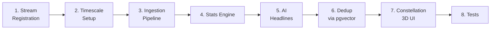

<aside>
📐

**هدف هذا الدليل:** بناء محرك اكتشاف أنماط إحصائي صادق (لا يختلق correlations وهمية) + AI يلخص بدون hallucination + tier 0 privacy.

</aside>

## 🧠 تطوير تنفيذي إضافي — Insight Scientific Integrity Pack

Insights لازم تكون statistically honest: لا causation، لا أرقام مختلقة، ولا raw sensitive data للـ AI.

### Causation Language Guard

```tsx
const CAUSATION_PATTERNS = [/يسبب/i, /يؤدي إلى/i, /سبب مباشر/i, /because of/i, /causes/i]
export function assertCorrelationLanguage(text: string) {
  if (CAUSATION_PATTERNS.some((rx) => rx.test(text))) {
    throw new Error('INSIGHT_CAUSATION_CLAIM_BLOCKED')
  }
}
```

### Candidate Evidence Record

```tsx
export type InsightEvidence = {
  method: 'pearson' | 'spearman' | 'anova' | 'z_score'
  sampleSize: number
  pValue?: number
  correctedPValue?: number
  effectSize?: 'small' | 'medium' | 'large'
  streams: string[]
  generatedAt: string
}
```

### AI Safe Context

```tsx
export function toAiInsightContext(e: InsightEvidence) {
  if (e.streams.some((s) => streamRegistry[s]?.sensitivity === 'vault_only')) {
    throw new Error('VAULT_STREAM_FORBIDDEN')
  }
  return { ...e, rawValues: undefined }
}
```

### Acceptance

- Bonferroni applied.
- n >= 21.
- لا medical advice.
- أسبوعيًا فقط لتجنب noise.

# 🗺️ الخريطة التنفيذية



**المدة:** 4 sprints (8 أسابيع). الـ stats الصحيحة أصعب من الـ visualization.

---

# المرحلة 1️⃣ — Stream Registry & Sensitivity Tiers

## Privacy Tiers (CRITICAL)

| Tier | Example Streams | AI Access | Insight Granularity |
| --- | --- | --- | --- |
| **public** | workout_minutes, water_ml | ✅ full | raw values + correlations |
| **normal** | focus_minutes, habits_completed | ✅ aggregated only | aggregates + correlations |
| **sensitive** | mood_score, anxiety_level | ⚠️ aggregated only | weekly avg only, no raw |
| **vault_only** | journal_sentiment, finance_details | ❌ never | excluded from all insights |

## Stream Definition

```tsx
// lib/insights/streamRegistry.ts
export const STREAM_DEFINITIONS: Record<string, StreamDef> = {
	sleep_hours: { unit: 'hours', sensitivity: 'normal', type: 'continuous', expected_range: [0, 16] },
	focus_minutes: { unit: 'minutes', sensitivity: 'normal', type: 'continuous', expected_range: [0, 600] },
	water_ml: { unit: 'ml', sensitivity: 'public', type: 'continuous', expected_range: [0, 5000] },
	mood_score: { unit: 'scale_1_10', sensitivity: 'sensitive', type: 'discrete', expected_range: [1, 10] },
	workout_minutes: { unit: 'minutes', sensitivity: 'public', type: 'continuous', expected_range: [0, 300] },
	spend_cents: { unit: 'cents', sensitivity: 'sensitive', type: 'continuous', expected_range: [0, 1_000_000_00] },
	habits_completed: { unit: 'count', sensitivity: 'normal', type: 'count', expected_range: [0, 50] },
	journal_word_count: { unit: 'words', sensitivity: 'normal', type: 'count', expected_range: [0, 5000] },
	// NEVER add journal text content or sentiment without going through vault layer
}
```

**Quality Gate 1.1:** أي stream جديد لازم التصنيف يمر بـ privacy review committee.

---

# المرحلة 2️⃣ — TimescaleDB Setup

## Why TimescaleDB وليس ـ Postgres عادي

| Operation | Plain Postgres | TimescaleDB |
| --- | --- | --- |
| Insert 1M points | ~30s | ~3s |
| Time range scan | O(n) full scan | O(log n) chunk pruning |
| Continuous aggregates | manual | built-in + auto refresh |
| Data retention | manual | policy-driven drop_chunks |

## Hypertable + Continuous Aggregates

```sql
-- 4805_continuous_aggregates.sql
CREATE MATERIALIZED VIEW metric_daily_summary
WITH (timescaledb.continuous) AS
SELECT
	stream_id,
	time_bucket('1 day', recorded_at) AS day,
	AVG(value_numeric) AS avg_val,
	MIN(value_numeric) AS min_val,
	MAX(value_numeric) AS max_val,
	STDDEV(value_numeric) AS stddev_val,
	COUNT(*) AS sample_count
FROM metric_points
GROUP BY stream_id, day
WITH NO DATA;

-- Refresh every hour, look back 7 days
SELECT add_continuous_aggregate_policy('metric_daily_summary',
	start_offset => INTERVAL '7 days',
	end_offset => INTERVAL '1 hour',
	schedule_interval => INTERVAL '1 hour'
);

-- Retention: keep raw 1 year, summaries 5 years
SELECT add_retention_policy('metric_points', INTERVAL '1 year');
```

---

# المرحلة 3️⃣ — Ingestion Pipeline (Validated + Deduped)

## Ingestion API

```tsx
// app/api/insights/ingest/route.ts
import { z } from 'zod'
import { STREAM_DEFINITIONS } from '@/lib/insights/streamRegistry'

const IngestSchema = z.object({
	streamKey: z.string().refine(k => k in STREAM_DEFINITIONS),
	value: z.number().or(z.string()),
	recordedAt: z.string().datetime().optional(),
	contextTags: z.array(z.string()).max(10).optional(),
	sourceRef: z.string().optional()
})

export async function POST(req: Request) {
	const ctx = await getAuthContext(req)
	const parsed = IngestSchema.parse(await req.json())
	const def = STREAM_DEFINITIONS[parsed.streamKey]
	
	// Range validation (detect bad sensors / fat fingers)
	if (typeof parsed.value === 'number') {
		const [lo, hi] = def.expected_range
		if (parsed.value < lo || parsed.value > hi) {
			return envelope.error('VALUE_OUT_OF_RANGE', { expected: def.expected_range })
		}
	}
	
	// Get or create stream
	const streamId = await getOrCreateStream(ctx.userId, parsed.streamKey, def)
	
	// Dedup: same stream + same minute = upsert
	const recordedAt = parsed.recordedAt || new Date().toISOString()
	await db.execute(`
		INSERT INTO metric_points(id, workspace_id, stream_id, recorded_at, value_numeric, value_text, context_tags, source_ref)
		VALUES($1, $2, $3, $4, $5, $6, $7, $8)
		ON CONFLICT (stream_id, recorded_at) DO UPDATE
		SET value_numeric = EXCLUDED.value_numeric, value_text = EXCLUDED.value_text
	`, [ulid(), ctx.workspaceId, streamId, recordedAt, 
	    typeof parsed.value === 'number' ? parsed.value : null,
	    typeof parsed.value === 'string' ? parsed.value : null,
	    parsed.contextTags || [], parsed.sourceRef])
	
	return envelope.ok({ streamId })
}
```

## Auto-Backfill from Existing Modules

```tsx
// lib/insights/backfill.ts
// On user opt-in, ingest historical data from existing modules
export async function backfillUserStreams(userId: string) {
	await Promise.all([
		backfillHabits(userId),     // habits_completed counts per day
		backfillFocus(userId),       // focus_minutes from sessions
		backfillSleep(userId),       // sleep_hours from health module
		backfillMood(userId)         // mood_score aggregates only (sensitive)
	])
}
```

---

# المرحلة 4️⃣ — Statistics Engine (لا تخلق correlations وهمية)

<aside>
⚠️

**الخطأ الأكبر:** حساب Pearson بدون p-value + sample size minimum = correlations وهمية تخدع المستخدم.

**الحل:** Multiple-comparison correction + minimum sample size + effect size threshold.

</aside>

## المعايير الإحصائية الإجبارية

```tsx
// lib/insights/stats.ts
import { pearson, spearman, bonferroni } from '@stdlib/stats'

export interface CorrelationResult {
	coef: number          // -1 to +1
	pValue: number        // لازم \< 0.05 بعد bonferroni
	n: number             // sample size, لازم ≥ 21
	effectSize: 'small' | 'medium' | 'large'
	interpretation: string
}

export function computeCorrelation(
	a: number[], 
	b: number[], 
	options: { totalTests: number }
): CorrelationResult | null {
	// Hard requirements
	if (a.length !== b.length) return null
	if (a.length < 21) return null // minimum sample size
	
	// Compute Pearson + Spearman (use Spearman for non-normal data)
	const pearsonResult = pearson(a, b)
	const spearmanResult = spearman(a, b)
	
	// Use the more conservative
	const result = Math.abs(pearsonResult.coef) < Math.abs(spearmanResult.coef)
		? pearsonResult
		: spearmanResult
	
	// Bonferroni correction for multiple testing
	const correctedP = Math.min(1, result.pValue * options.totalTests)
	if (correctedP >= 0.05) return null
	
	// Effect size (Cohen's conventions)
	const absCoef = Math.abs(result.coef)
	if (absCoef < 0.3) return null // too weak to surface
	const effectSize = absCoef < 0.5 ? 'small' : absCoef < 0.7 ? 'medium' : 'large'
	
	return {
		coef: result.coef,
		pValue: correctedP,
		n: a.length,
		effectSize,
		interpretation: result.coef > 0 ? 'positive_correlation' : 'negative_correlation'
	}
}
```

## Weekly Discovery Job

```tsx
// lib/insights/weeklyDiscovery.ts
export async function runWeeklyInsightDiscovery(userId: string) {
	await useAdvisoryLock(`insights:${userId}`, async () => {
		const streams = await getEligibleStreams(userId, ['public', 'normal', 'sensitive'])
		// vault_only streams are EXCLUDED
		
		// Pull last 90 days aligned by day
		const alignedData = await pullAlignedDailyValues(userId, streams, 90)
		
		// Compute pairwise correlations
		const totalTests = (streams.length * (streams.length - 1)) / 2
		const correlations = []
		for (let i = 0; i < streams.length; i++) {
			for (let j = i + 1; j < streams.length; j++) {
				const r = computeCorrelation(
					alignedData[streams[i].id],
					alignedData[streams[j].id],
					{ totalTests }
				)
				if (r) correlations.push({ a: streams[i], b: streams[j], ...r })
			}
		}
		
		// Anomaly detection (z-score on rolling 30d)
		const anomalies = await detectAnomalies(userId, streams)
		
		// Weekday patterns (ANOVA across days of week)
		const weekdayPatterns = await detectWeekdayPatterns(userId, streams)
		
		// Combine + rank by importance
		const candidates = [...correlations, ...anomalies, ...weekdayPatterns]
			.sort((a, b) => b.importance - a.importance)
			.slice(0, 10) // top 10 candidates
		
		// Dedup against historical insights via pgvector
		const novel = await filterAlreadyKnown(userId, candidates)
		
		// Take top 3-5 novel
		const toPersist = novel.slice(0, 5)
		
		// Generate AI headlines for each
		for (const insight of toPersist) {
			const headline = await generateHeadline(insight)
			await persistInsight(userId, insight, headline)
		}
		
		// Push notification
		if (toPersist.length > 0) {
			await sendPush(userId, {
				title: `${toPersist.length} new patterns discovered 🌌`,
				body: 'Tap to explore'
			})
		}
	})
}
```

## Schedule

كل أحد 9am local timezone — ritual أسبوعي متوقع

---

# المرحلة 5️⃣ — AI Headline Generator (بدون hallucination)

## Constrained Generation

```tsx
// lib/insights/headlineGenerator.ts
import { runAIWithQuota } from '@/lib/ai/gateway'
import { z } from 'zod'

const HeadlineSchema = z.object({
	headline: z.string().max(80),
	body_md: z.string().max(400),
	actionable_suggestion: z.string().max(120).optional()
})

export async function generateHeadline(insight: InsightCandidate) {
	// CRITICAL: AI receives ONLY computed stats, NEVER raw user data
	const safeContext = {
		type: insight.type,
		coefficient: insight.coef ? Number(insight.coef.toFixed(2)) : null,
		pValue: Number(insight.pValue.toFixed(4)),
		effectSize: insight.effectSize,
		sampleSize: insight.n,
		streamA: insight.a.stream_key,
		streamB: insight.b.stream_key,
		direction: insight.interpretation
	}
	
	const prompt = `Write a headline for a personal-stats insight, in Arabic.
	Rules:
	- Headline ≤ 80 chars, plain language
	- Body ≤ 400 chars, explain what it means
	- Quote the % effect using the coefficient provided. DO NOT invent numbers.
	- DO NOT recommend medical or psychiatric actions.
	- DO NOT claim causation if it's correlation.
	
	Insight data: ${JSON.stringify(safeContext)}`
	
	const result = await runAIWithQuota({
		sensitivity: 'normal',
		model: 'fast-small',
		operation: 'insight_headline',
		prompt,
		responseSchema: HeadlineSchema,
		timeout: 8000
	})
	
	if (!result.ok) return fallbackHeadline(safeContext)
	
	// Post-validation: الـ headline لازم يحتوي على stream keys (ولو مترجمة)
	if (!validateHeadlineFidelity(result.data, safeContext)) {
		return fallbackHeadline(safeContext)
	}
	
	return result.data
}
```

## Fidelity Validator

```tsx
function validateHeadlineFidelity(headline: GeneratedHeadline, context: SafeContext) {
	// Reject if AI invented numbers not in context
	const numbersInHeadline = (headline.body_md.match(/\d+/g) || []).map(Number)
	const allowedNumbers = [
		Math.round(Math.abs(context.coefficient || 0) * 100),
		context.sampleSize
	]
	for (const n of numbersInHeadline) {
		if (!allowedNumbers.some(a => Math.abs(a - n) < 5)) {
			return false // unexplained number
		}
	}
	return true
}
```

---

# المرحلة 6️⃣ — Semantic Dedup (pgvector)

```tsx
// lib/insights/dedup.ts
import { generateEmbedding } from '@/lib/ai/embeddings'

export async function filterAlreadyKnown(userId: string, candidates: InsightCandidate[]) {
	const novel: InsightCandidate[] = []
	
	for (const c of candidates) {
		// Generate stable signature
		const sig = `${c.type}|${c.a.stream_key}|${c.b?.stream_key}|${c.direction}`
		const embedding = await generateEmbedding(sig)
		
		// Find similar insights in last 90 days
		const similar = await db.queryFirst(`
			SELECT id, 1 - (embedding <=> $1::vector) AS similarity
			FROM insights
			WHERE user_id = $2
			  AND discovered_at > now() - INTERVAL '90 days'
			ORDER BY embedding <=> $1::vector
			LIMIT 1
		`, [embedding, userId])
		
		if (!similar || similar.similarity < 0.85) {
			c.embedding = embedding
			novel.push(c)
		}
	}
	return novel
}
```

---

# المرحلة 7️⃣ — Constellation 3D UI (الـ wow factor)

## Tech Stack

- **Three.js + react-three-fiber** — 3D scene
- **drei** — helpers (OrbitControls, Stars background)
- **Force-directed layout** — streams as nodes, correlations as edges

## Component

```tsx
// components/insights/ConstellationMap.tsx
import { Canvas } from '@react-three/fiber'
import { OrbitControls, Stars, Line, Text } from '@react-three/drei'
import { ForceGraph } from './ForceGraph'

export function ConstellationMap({ userId }: { userId: string }) {
	const { streams, insights } = useInsightsGraph(userId)
	const graph = buildForceGraph(streams, insights)
	
	return (
		<Canvas camera= position: [0, 0, 15]  className="h-[600px]">
			<Stars radius={100} depth={50} count={5000} factor={4} />
			<ambientLight intensity={0.3} />
			<pointLight position={[10, 10, 10]} />
			
			{graph.nodes.map(n => (
				<group key={n.id} position={n.position}>
					<mesh>
						<sphereGeometry args={[0.3, 16, 16]} />
						<meshStandardMaterial color={n.color} emissive={n.color} emissiveIntensity={0.5} />
					</mesh>
					<Text position={[0, -0.6, 0]} fontSize={0.2} color="white">
						{n.label}
					</Text>
				</group>
			))}
			
			{graph.edges.map(e => (
				<Line
					key={e.id}
					points={[e.from, e.to]}
					color={e.coef > 0 ? '#22d3ee' : '#fb7185'}
					lineWidth={Math.abs(e.coef) * 5}
					transparent
					opacity={e.confidence}
				/>
			))}
			
			<OrbitControls enablePan={false} maxDistance={30} minDistance={5} />
		</Canvas>
	)
}
```

## Accessibility Fallback

```tsx
const prefersReducedMotion = useMediaQuery('(prefers-reduced-motion: reduce)')
if (prefersReducedMotion) {
	return <InsightsTableView insights={insights} />
}
```

## Insight Card Component

```tsx
export function InsightCard({ insight }: { insight: Insight }) {
	return (
		<motion.article
			whileHover= scale: 1.02 
			className="rounded-2xl bg-gradient-to-br from-indigo-50 to-purple-50 p-6"
		>
			<header className="flex items-center gap-2">
				<Sparkles className="text-purple-500" />
				<h3 className="font-bold">{insight.headline}</h3>
				{insight.effectSize === 'large' && <Badge>✨ Life-changing</Badge>}
			</header>
			<p className="mt-2 text-gray-700">{insight.body_md}</p>
			<footer className="mt-4 flex gap-2">
				<ReactionButton emoji="🤯" label="Aha!" onClick={() => react('aha')} />
				<ReactionButton emoji="✅" label="Already knew" onClick={() => react('known')} />
				<ReactionButton emoji="🚫" label="Dismiss" onClick={() => react('dismissed')} />
				<button onClick={pin}>📌 Pin</button>
			</footer>
			<details className="mt-3 text-xs text-gray-500">
				<summary>Statistical confidence</summary>
				n={insight.sample_size}, p\<{insight.p_value.toFixed(3)}, r={insight.confidence.toFixed(2)}
			</details>
		</motion.article>
	)
}
```

---

# المرحلة 8️⃣ — Testing

## Statistical Validity Tests

```tsx
describe('Statistics correctness', () => {
	it('rejects correlation with n < 21', async () => {
		const result = computeCorrelation([1,2,3], [4,5,6], { totalTests: 1 })
		expect(result).toBeNull()
	})
	
	it('applies bonferroni correction', async () => {
		// Correlation that's significant alone but not after correction
		const data = generateWeakCorrelation(0.4, 30)
		const alone = computeCorrelation(data.a, data.b, { totalTests: 1 })
		const corrected = computeCorrelation(data.a, data.b, { totalTests: 100 })
		expect(alone).not.toBeNull()
		expect(corrected).toBeNull()
	})
	
	it('rejects coefficient < 0.3', async () => { /* ... */ })
	it('returns conservative when pearson and spearman differ', async () => { /* ... */ })
})
```

## AI Fidelity Tests

```tsx
describe('AI headline fidelity', () => {
	it('rejects headline with invented numbers', async () => {
		const context = { coefficient: 0.6, sampleSize: 45, ... }
		const hallucinatedHeadline = { body_md: 'your focus drops by 73%' }
		expect(validateHeadlineFidelity(hallucinatedHeadline, context)).toBe(false)
	})
	
	it('falls back when AI fails', async () => { /* ... */ })
	it('never claims causation', async () => { /* ... */ })
})
```

## Privacy Tests

```tsx
describe('Privacy', () => {
	it('vault_only streams never reach AI', async () => {
		const aiSpy = vi.spyOn(aiGateway, 'runAIWithQuota')
		await runWeeklyInsightDiscovery(userId)
		for (const call of aiSpy.mock.calls) {
			expect(JSON.stringify(call)).not.toContain('vault_only_stream_key')
			expect(JSON.stringify(call)).not.toMatch(/journal text|password/i)
		}
	})
	
	it('sensitive streams pass only aggregates', async () => { /* ... */ })
})
```

---

# 📊 Observability

```
insights_discovered_total{type, effect_size}
insights_user_reactions{reaction}
insight_discovery_job_duration_seconds
insight_dedup_filtered_ratio
ai_headline_fidelity_failures_total
```

## Alerts

- `headline_fidelity_failures > 10%` → P2 — AI degraded
- `discovery_job_duration_p95 > 60s` → P3 — perf
- `user_dismissal_rate > 60%` → P3 — algorithm tuning needed

---

# 🚨 Anti-Patterns

1. ❌ **حساب Pearson بدون p-value** → garbage insights
2. ❌ **عدم تطبيق Bonferroni** → 100 tests = 5 false positives دائماً
3. ❌ **Sample size < 21** → لا توجد دلالة إحصائية
4. ❌ **Pass raw mood/journal text للـ AI** → privacy violation
5. ❌ **AI يخترع أرقام** → user loses trust
6. ❌ **Claim causation** → "sleep causes focus" غلط، الصح "correlate with"
7. ❌ **Medical/psychiatric recommendations** → legal liability
8. ❌ **Daily insight drop** → saturation = ignoring
9. ❌ **No dedup** → same insight every week = noise
10. ❌ **3D as only view** → a11y failure

---

# 📋 Definition of Done

- [ ]  TimescaleDB + continuous aggregates configured
- [ ]  4 privacy tiers enforced
- [ ]  Bonferroni correction + min n=21 + effect size threshold
- [ ]  Weekly insight discovery cron
- [ ]  AI headline + fidelity validator + fallback
- [ ]  Semantic dedup via pgvector
- [ ]  3D constellation + 2D table fallback
- [ ]  User reactions tracked + feed back into algorithm
- [ ]  Privacy tests in CI (vault_only never reaches AI)
- [ ]  Causation language avoided in all generated text
- [ ]  No medical/psychiatric recommendations
- [ ]  Aha rate > 25% on first 30 days (success metric)
- [ ]  Notification cooldown: max 1/week per user
- [ ]  Data retention policies set
