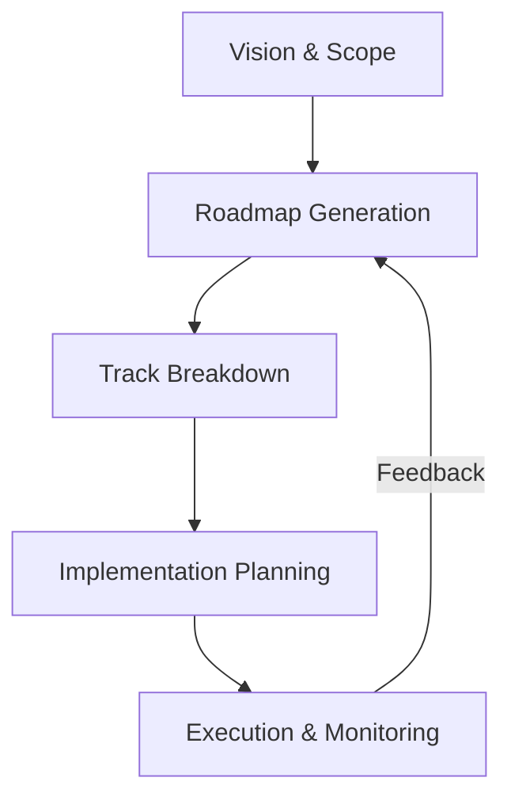

# Project Planner

The Project Planner is a strategic skill designed to transform high-level visions into executable roadmaps and detailed task lists. It follows a refined version of the "Agentic Cycle" with a focus on visual clarity, architectural integrity, and frictionless execution.

## The Strategic Cycle

---

## Phase 1: Vision & Scope
**Goal:** Define the "North Star" and boundary conditions.

1.  **Core Objective:** What is the single most important outcome?
2.  **Success Metrics:** How will we know we've succeeded? (e.g., Performance, UX benchmarks, feature set).
3.  **Constraints:** Budget, tech stack (Antigravity standard by default), deadlines.
4.  **Non-Goals:** What are we EXPLICITLY not doing to avoid scope creep?

**Output:** `docs/strategy/vision.md`

---

## Phase 2: Visual Roadmap Generation
**Goal:** Create a high-level timeline of major milestones.

Use Mermaid `gantt` or `timeline` to visualize the project phases.

**Example Structure:**
- **Phase 0: Foundation** (Setup, Architecture, Design System)
- **Phase 1: Core MVP** (Primary features, basic UI)
- **Phase 2: Polish & "Magic"** (Animations, advanced UX, performance)
- **Phase 3: Production Readiness** (Testing, SEO, Deployment)

**Output:** `docs/strategy/roadmap.md` (Update frequently)

---

## Phase 3: Track Breakdown
**Goal:** Divide phases into parallelizable "Tracks" or "Epics".

For each milestone, define the specific tracks required:
- **Frontend Track:** Component architecture, styling, animations.
- **Backend Track:** API design, database schema, logic.
- **Infrastructure Track:** Deployment, CI/CD, monitoring.

---

## Phase 4: Implementation Planning
**Goal:** Create bite-sized, "Zero Context" tasks for execution.

**MANDATORY SUB-SKILL:** Invoke `writing-plans` to generate these.
Plans must be saved to `docs/plans/YYYY-MM-DD-<feature>.md`.

**Rules for a Great Plan:**
- **Atomic Tasks:** 2-5 minutes per task.
- **Self-Contained:** Include all necessary code snippets and command lines.
- **Verification-First:** Every task must have a test or manual verification step.

---

## Phase 5: Execution & Monitoring
**Goal:** Iterate through the plan and track progress.

**MANDATORY SUB-SKILL:** Invoke `executing-plans` for execution.

- **Checkpoints:** At the end of every task/phase, verify against the `vision.md`.
- **Course Correction:** If the plan is flawed, PAUSE, update the plan, and resume.

---

## Antigravity Standards (Non-Negotiable)
1.  **Visual Excellence:** All frontend plans MUST include specific instructions for premium aesthetics (Gradients, Glassmorphism, Micro-animations).
2.  **Documentation First:** Never code without a plan. Never plan without a vision.
3.  **Frequent Commits:** Every task = one commit.
4.  **Mermaid Over Text:** Use diagrams for architecture and flow whenever possible.

## When to Use
- Starting a repository from scratch.
- Adding a major new feature subsystem.
- When the user says "Give me a roadmap" or "How should we build this?".

## Limitations
- Do not use for trivial tasks (e.g., "Change this color").
- Does not replace domain-specific skills (e.g., `frontend-design`). It orchestrates them.
