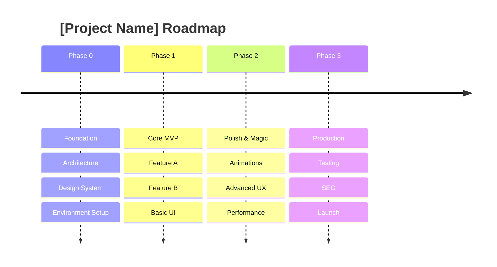

# Project Roadmap: [Project Name]

## Vision Statement
> [One sentence about the project's purpose]

## Strategic Timeline

## Milestones & Tracks

### Milestone 1: [Name]
- **Frontend Track:** [Items]
- **Backend Track:** [Items]
- **Risk:** [High/Med/Low] - [Description]

### Milestone 2: [Name]
- **Frontend Track:** [Items]
- **Backend Track:** [Items]
- **Risk:** [High/Med/Low] - [Description]

---
*Generated by Project Planner Skill*
